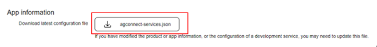
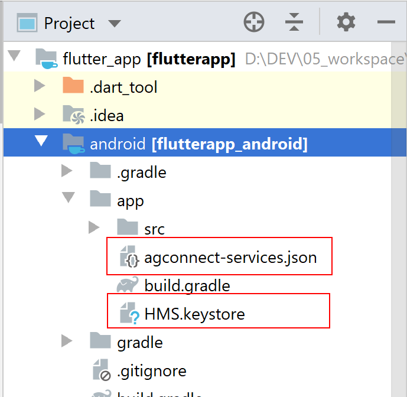

# HUAWEI HMS ANALYTICS KIT FLUTTER PLUGIN

## Table of Contents
* [General Info](#general-info)
* [Use Case](#use-case)
* [Installation Guide](#installation-guide)
* [API Reference](#api-reference)
* [Licensing and Terms](#licensing-and-terms)

## General Info
This plugin enables communication between Huawei Analytics SDK and Flutter platform. 

Analytics Kit offers you a range of preset analytics models so you can gain a deeper insight into your users, products, and content. With this insight, you can take a data-driven approach to market your apps and optimize your products.

##### **With Analytics Kit's on-device data collection SDK, you can:**
------------

- Track and report on custom events.

- Set up to 25 user attributes.

- Automate event collection and session calculation.

- Preset event IDs and parameters.

### Use Case

------------

- Analyze user behavior using both predefined and custom events.

- Use audience building to tailor your marketing activity to your users' behaviors and preferences.

- Use dashboards and analytics to measure your marketing activity and identify areas to improve.

## Installation Guide
1. Download the **Flutter Analytics Plugin**.
2. Open your **pubspec.yaml** file and add '**huawei_analytics**' library to the dependencies.

        dependencies:
                 huawei_analytics:
                   // Replace {library path} with actual library path of Huawei Analytics Kit Flutter Plugin.
                   path: { library path }

**NOTE**

Replace {library path} with actual library path of Huawei Flutter Analytics Kit Plugin. For more details please refere the [Flutter-Using-Packages](https://flutter.dev/docs/development/packages-and-plugins/using-packages#dependencies-on-unpublished-packages "Flutter-Using-Packages") document.
3. Run following command to get dependencies.
```
flutter pub get
```
4. Add maven repository address and AppGallery Connect service dependencies into '**android/build.gradle**' file.

```gradle
buildscript {   
       repositories {   
           google()        
           jcenter()    
           maven {url 'https://developer.huawei.com/repo/'}   
            }   
        }  
allprojects {      
       repositories {       
           google()        
           jcenter()       
           maven {url 'https://developer.huawei.com/repo/'}     
       }    
}
```
5. Open **android\app\src\main\AndroidManifest.xml** file and add following lines.
```gradle
<provider
  android:authorities="${applicationId}.HMSContentProvider"
  android:name="com.huawei.hms.flutter.analytics.AnalyticsContentProvider"/>
```
6. Add agconnect-services.json to **android/app** directory.
- Sign in to [AppGallery Connect](https://developer.huawei.com/consumer/en/service/josp/agc/index.html "AppGallery Connect") and select My apps.
- Find your app from the list, and click the link under Android App in the Mobile phone column.
- Go to Develop > Overview.
- In the App information area, Click agconnect-services.json to download the configuration file.

 

**NOTE**
  - Before obtaining the agconnect-services.json file, ensure that HUAWEI Analytics Kit has been enabled. For details about how to enable HUAWEI Analytics Kit, please refer to **Enabling Required Services**.
 -  If you have made any changes in the development module, such as setting the data storage location and enabling or managing APIs, you need to download the latest agconnect-services.json file and replace the existing file in the app directory.

7. Add signature file to android/app directory. If you have not created a signature file yet, please refer to **Generating a Signing Certificate Fingerprint**.

8. Check whether the agconnect-services.json and signature file are successfully added to your project.



9. Add AppGallery Connect plugin to '**android/app/build.gradle**' file.
          implementation 'com.huawei.agconnect'

10. Add signing configuration to '**android/app/build.gradle**' file.

```gradle
android {
    /*
     * <Other configurations>
     */

    signingConfigs {
        config {
            storeFile file('<keystore_file>.jks')
            storePassword '<keystore_password>'
            keyAlias '<key_alias>'
            keyPassword '<key_password>'
        }
    }

    buildTypes {
        debug {
            signingConfig signingConfigs.config
        }
        release {
            signingConfig signingConfigs.config
        }
    }
}
```
**NOTE**

To get more information about app signing procedure in Flutter, please refer to [App Signing in Flutter](https://flutter.dev/docs/deployment/android "App Signing in Flutter").

## API Referance

### Methods

| Return Type | Method | Description |
| :-: | :-: |:-: |
| Future\<void\>| enableLog() | This API is called to enable the HUAWEI Analytics Kit log function. |
| Future\<void\>| enableLog(int level) | This API is called to enable debug logs and set the minimum log level (minimum level of log records that will be printed). |
| Future\<void\>| setUserId(String id) | This API is called to set user IDs. |
| Future\<void\>| setUserProfile(String name, String value) | This API is called to set user attributes. |
| Future\<void\>| setPushToken(String token) | This API is called to set the push token, which can be obtained from HUAWEI Push Kit. |
| Future\<void\>| setMinActivitySessions(long milliseconds) | This API is called to set the minimum interval between two sessions. |
| Future\<void\>| setSessionDuration(long milliseconds) | This API is called to set the session timeout interval. |
| Future\<void\>| onEvent(String name, Bundle params) | This API is called to record events.|
| Future\<void\>| clearCachedData() | This API is called to delete all collected data cached locally, including cached data that failed to be sent. |
| Future\<String\>| getAAID() | This API is called to obtain the app instance ID from AppGalleryConnect. |
| Future\<Map<String, String\>>| getUserProfiles(bool preDefined) |This API is called to obtain user attributes. |
| Future\<void\>| pageStart(String pageName, String pageClassOverride) | This API is called to customize the screen start event. |
| Future\<void\>| pageEnd(String pageName) | This API is called to customize the screen end event. |

You can read more and get detailed information about the references described above from [developer.huawei.com](https://developer.huawei.com)

## Configuration Description

No.

## Licensing and Terms
Huawei Analytics Kit Flutter Plugin uses the Apache 2.0 license.
