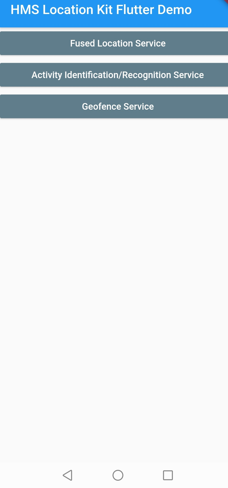

# Huawei Location Kit Flutter Plugin

## Table of Contents
* [Introduction](#introduction)
* [Installation Guide](#installation-guide)
    * [Creating Project in App Gallery Connect](#creating-project-in-app-gallery-connect)
    * [Configuring the Signing Certificate Fingerprint](#configuring-the-signing-certificate-fingerprint)
    * [Integrating the Flutter Location Plugin](#integrating-the-flutter-location-plugin)
* [API Reference](#api-reference)
    * [Overview](#overview)
    * [FusedLocationProviderClient](#fusedlocationproviderclient)
    * [Location](#location)
    * [HWLocation](#hwlocation)
    * [LocationAvailability](#locationavailability)
    * [LocationCallback](#locationcallback)
    * [LocationRequest](#locationrequest)
    * [LocationResult](#locationresult)
    * [LocationSettingsRequest](#locationsettingsrequest)
    * [LocationSettingsStates](#locationsettingsstates)
    * [NavigationResult](#navigationresult)
    * [NavigationRequest](#navigationrequest)
    * [ActivityIdentificationService](#activityidentificationservice)
    * [ActivityConversionData](#activityconversiondata)
    * [ActivityConversionInfo](#activityconversioninfo)
    * [ActivityConversionResponse](#activityconversionresponse)
    * [ActivityIdentificationData](#activityidentificationdata)
    * [ActivityIdentificationResponse](#activityidentificationresponse)
    * [Geofence Service](#geofence-service)
    * [GeofenceData](#geofencedata)
    * [GeofenceRequest](#geofencerequest)
    * [PermissionHandler](#permissionhandler)
    * [HMSLogger](#hmslogger)
   
* [Configuration Description](#configuration-description)
* [Sample Project](#sample-project)
* [Questions or Issues](#questions-or-issues)
* [Licensing and Terms](#licensing-and-terms)

## Introduction

This plugin enables communication between Huawei Location SDK and Flutter platform. Huawei Location Kit combines the GPS, Wi-Fi, and base station locations to help you quickly obtain precise user locations, build up global positioning capabilities, and reach a wide range of users around the globe.Currently, it provides the four main capabilities: fused location, location semantics, activity identification, and geofence. You can call relevant capabilities as needed.

Huawei Location Kit provides the following core capabilities:
- **Fused location**: Provides a set of simple and easy-to-use APIs for you to quickly obtain the device location based on the GPS, Wi-Fi, and base station location data.
- **Activity identification**: Identifies user motion status through the acceleration sensor, cellular network information, and magnetometer, helping you adjust your app based on user behavior.
- **Geofence**: Allows you to set an interested area through an API so that your app can receive a notification when a specified action (such as leaving, entering, or lingering in the area) occurs.

## Installation Guide

- Before you get started, you must register as a HUAWEI developer and complete identity verification on the [HUAWEI Developer](https://developer.huawei.com/consumer/en/) website. For details, please refer to [Register a HUAWEI ID](https://developer.huawei.com/consumer/en/doc/10104).

- Create an app in your project is required in AppGallery Connect in order to communicate with Huawei services. To create an app, perform the following steps:

### Creating Project in App Gallery Connect

**Step 1.** Sign in to [AppGallery Connect](https://developer.huawei.com/consumer/en)  and select My projects.

**Step 2.** Click your project from the project list.

**Step 3.** Go to **Project Setting** > **General information**, and click **Add app**.
If an app exists in the project, and you need to add a new one, expand the app selection area on the top of the page and click **Add app**.

**Step 4.** On the **Add app** page, enter app information, and click **OK**.

- A signing certificate fingerprint is used to verify the authenticity of an app when it attempts to access an HMS Core service through the HMS Core SDK. Before using HMS Core (APK), you must locally generate a signing certificate fingerprint and configure it in AppGallery Connect. Ensure that the JDK has been installed on your computer.

### Configuring the Signing Certificate Fingerprint
**Step 1:** Go to **Project Setting** > **General information**. In the **App information** field, click the  icon next to SHA-256 certificate fingerprint, and enter the obtained **SHA256 certificate fingerprint**.

**Step 2:**  After completing the configuration, click **OK**. (Check mark icon)

### Integrating Flutter Location Plugin

**Step 1:** Sign in [AppGallery Connect](https://developer.huawei.com/consumer/en/service/josp/agc/index.html) to AppGallery Connect and select **My projects**.
 
**Step 2:** Find your app project, and click the desired app name. 
 
**Step 3:** Go to **Project Setting >  > General information**. In the **App information** field, click **agconnect-service.json** to download configuration file. 
 
**Step 4:** Create a Flutter project if you do not have one.
 
**Step 5:** Copy the **agconnect-service.json** file to the **android/app** directory of your Flutter project.

**Step 6:** Copy the signature file that is generated in **Generating a Signature File** to the android/app directory of your Flutter project.
 
**Step 7:** Check whether the **agconnect-services.json** file and signature file are successfully added to the **android/app** directory of the Flutter project.


  
**Step 8:** Open the **build.gradle** file in the **android** directory of your Flutter project.
    - Go to **buildscript** then configure the Maven repository address and agconnect plugin for the  HMS SDK.

  ```gradle
  buildscript {
    repositories {
        google()
        jcenter()
        maven { url 'https://developer.huawei.com/repo/' }
    }

    dependencies {
        /* 
          * <Other dependencies>
          */
        classpath 'com.huawei.agconnect:agcp:1.4.1.300'
    }
  }
  ```

    - Go to **allprojects** then configure the Maven repository address for the HMS SDK.

  ```gradle
  allprojects {
    repositories {
        google()
        jcenter()
        maven { url 'https://developer.huawei.com/repo/' }
    }
  }
  ```

**Step 9:** Open the **build.gradle** file in the **android/app** directory.
- Add `apply plugin: 'com.huawei.agconnect'` line after other `apply` entries.

  ```gradle
  apply plugin: 'com.android.application'
  apply from: "$flutterRoot/packages/flutter_tools/gradle/flutter.gradle"
  apply plugin: 'com.huawei.agconnect'
  ```

    - Set your package name in **defaultConfig** > **applicationId** and set **minSdkVersion** to **19** or **higher**.
        Package name must match with the **package_name** entry in **agconnect-services.json** file.

   ```gradle
  defaultConfig {
      applicationId "<package_name>"
      minSdkVersion 17
      /*
      * <Other configurations>
      */
  }
  ```
    - Copy the signature file that generated in [Generating a Signing Certificate](https://developer.huawei.com/consumer/en/codelab/HMSPreparation/index.html#3) to **android/app** directory.

    - Configure the signature in **android** according to the signature file information.

```gradle
signingConfigs {
    config {
        keyAlias keystoreProperties['keyAlias']
        keyPassword keystoreProperties['keyPassword']
        storeFile keystoreProperties['storeFile'] ? file(keystoreProperties['storeFile']) : null
        storePassword keystoreProperties['storePassword']
    }
}
buildTypes {
    debug {
        signingConfig signingConfigs.config
    }
    release {
        signingConfig signingConfigs.config
    }
}
```

**Step 10:** On your Flutter project directory find and open your **pubspec.yaml** file and add library to dependencies. For more details please refer the [Using packages](https://flutter.dev/docs/development/packages-and-plugins/using-packages#dependencies-on-unpublished-packages) document.

   ```yaml
      dependencies:
        huawei_location:
            # Replace {library path} with actual library path of Huawei Push Kit Location for Flutter.
            path: {library path}
   ```

-**Step 11:** Run following command to update package info.

```
[project_path]> flutter pub get
```

**Step 12:** Run following command to start the app.

```
[project_path]> flutter run
```

## API Reference

### Overview

| Module                           | Description                                         |
|----------------------------------|------------------------------------------------------------------------------------------------|
| FusedLocationProviderClient      | With this module you can check the device location settings, get the last known location information once or continuously, set mock location and others. |
| ActivityIdentificationService    | If your app needs to obtain the activity status of the user's device (for example, walking, running, or bicycling) or your app needs to detect activity status change of a user, you can use this module. |
| GeofenceService                  | If you are interested in a place, you can create a geofence based on the place. When the device enters the geofence or stays for a duration of time, a notification can be sent to your app. |

### FusedLocationProviderClient

#### Public Constructor Summary

| Constructor                      | Description                                         |
|----------------------------------|------------------------------------------------------------------------------------------------
| FusedLocationProviderClient()    | Default constructor. |

#### Public Method Summary

| Method                      						   			 | Return Type     		     | Description |
|------------------------------------------------------------------------------------------------|-----------------------------------|-------------|
| checkLocationSettings(LocationSettingsRequest locationSettingsRequest)   			 | Future\<LocationSettingsStates\>  | This API is used to check location settings of the device. |
| getLastLocation()                					   			 | Future\<Location\>  		     | This API is used to obtain the last requested available location.  This API does not proactively request the location. Instead, it uses the location cached for the last request. |
| getLastLocationWithAddress(LocationRequest locationRequest)              			 | Future\<HWLocation\> 	     | This API is used to obtain the available location of the last request, including the detailed address information. |
| getLocationAvailability()             				   			 | Future\<LocationAvailability\>    | This API is used to check whether the location data is available. |
| setMockMode(bool mockMode)      					   			 | Future\<void\> 		     | This API is used to specify whether the location provider uses the location mock mode. If yes, the GPS or network location is not used and the location set through setMockLocation (Location) is directly returned. |
| setMockLocation(Location location)            			   			 | Future\<void\> 		     | This API is used to set the specific mock location. You must call the setMockMode(boolean) method and set the flag to true before calling this method. |
| requestLocationUpdates(LocationRequest locationRequest)          	   			 | Future\<int\>   		     | This API is used to continuously request location updates. |
| requestLocationUpdatesCb(LocationRequest locationRequest, LocationCallback locationCallback)   | Future\<int\> 		     | This API is used to request location updates using the callback. |
| requestLocationUpdatesExCb(LocationRequest locationRequest, LocationCallback locationCallback) | Future\<int\> 		     | This API is an extended location information service API. It supports high-precision location and is compatible with common location APIs. If the device does not support high-precision location or the app does not request the high-precision location permission, this API returns common location information similar to that returned by the requestLocationUpdates API. |
| removeLocationUpdates(int requestCode)   							 | Future\<void\> 		     | This API is used to remove location updates from the specified requestCode. |
| removeLocationUpdatesCb(int callbackId)   							 | Future\<void\> 		     | This API is used to remove location updates of the specified callbackId. |
| onLocationData   										 | Future\Location\> 		     | This API is used to listen location updates that comes from requestLocationUpdates API method. |
| getNavigationContextState(int type)   							 | Future\<NavigationResult\> 	     | Obtains the requested navigation type. |

#### Public  Constructors

##### FusedLocationProviderClient()

Constructor for *FusedLocationProviderClient* object.

#### Public Methods

##### Future\<LocationSettingsStates\> checkLocationSettings(LocationSettingsRequest locationSettingsRequest) *async*

Checks location settings of the device. 

| Parameter 		  | Description |
|-------------------------|-------------|
| locationSettingsRequest | Location setting request object. |

| Return Type		  	   | Description |
|----------------------------------|-------------|
| Future\<LocationSettingsStates\> | LocationSettingsStates object if the operation is successful; PlatformException otherwise. |

##### Future\<Location\> getLastLocation() *async*

Obtains the available location of the last request. Instead of proactively requesting a location, this method uses the location cached during the last request. 

The value null may be returned in the following scenarios:
- The location function has never been used.
- The location function is disabled.
- The device is restored to factory settings.

If real-time location is required, you are advised to proactively call requestLocationUpdates instead of this method. To receive a location once only, you can set numUpdates in LocationRequest to 1.

| Return Type		  	   | Description |
|----------------------------------|-------------|
| Future\<Location\> 		   | Location object if the operation is successful; PlatformException otherwise. |

##### Future\<HWLocation\> getLastLocationWithAddress(LocationRequest locationRequest) *async*

Obtains the available location of the last request, including the detailed address information. If no location is available, null is returned. 

| Parameter 		  | Description |
|-------------------------|-------------|
| locationRequest 	  | Location request object. |

| Return Type		  	   | Description |
|----------------------------------|-------------|
| Future\<HWLocation\> 		   | HWLocation object if the operation is successful; PlatformException otherwise. |

##### Future\<LocationAvailability\> getLocationAvailability() *async*

Checks whether the location data is available. 

| Return Type		  	   | Description |
|----------------------------------|-------------|
| Future\<LocationAvailability\> | LocationAvailability object if the operation is successful; PlatformException otherwise. |

##### Future\<void\> setMockMode(bool mockMode) *async*

Sets whether the location provider uses the mock mode. If yes, the GPS or network location is not used and the location set through setMockLocation is directly returned. 

| Parameter 		  | Description |
|-------------------------|-------------|
| mockMode	 	  | Indicates whether the location provider uses the mock mode. true: yes; false: no. |

| Return Type		  	   | Description |
|----------------------------------|-------------|
| Future\<void\> 		   | No return value if the operation is successful; PlatformException otherwise. |

##### Future\<void\> setMockLocation(Location location) *async*

Sets whether the location provider uses the mock mode. If yes, the GPS or network location is not used and the location set through setMockLocation is directly returned. 

| Parameter 		  | Description |
|-------------------------|-------------|
| location	 	  | Mock location. |

| Return Type		  	   | Description |
|----------------------------------|-------------|
| Future\<void\> 		   | No return value if the operation is successful; PlatformException otherwise. |

##### Future\<int\> requestLocationUpdates(LocationRequest locationRequest) *async*

Continuously requests location updates. You can call the onLocationData API method to listen for location updates. 

| Parameter 		  | Description |
|-------------------------|-------------|
| locationRequest	  | Location update request. |

| Return Type		  	   | Description |
|----------------------------------|-------------|
| Future\<int\> 		   | Request code if the operation is successful; PlatformException otherwise. The request code can be used to call the removeLocationUpdates method. |

##### Future\<int\> requestLocationUpdatesCb(LocationRequest locationRequest, LocationCallback locationCallback) *async*

Requests location updates using the callback. 

| Parameter 		  | Description |
|-------------------------|-------------|
| locationRequest	  | Location update request. |
| locationCallback 	  | Location update callback.|

| Return Type		  	   | Description |
|----------------------------------|-------------|
| Future\<int\> 		   | Callback ID if the operation is successful; PlatformException otherwise. The callback ID can be used to call the removeLocationUpdatesCb method. |

##### Future\<int\> requestLocationUpdatesExCb(LocationRequest locationRequest, LocationCallback locationCallback) *async*

Continuously requests location updates. This method is an extended location information service API. It supports high-precision location and is compatible with common location APIs. If the device does not support high-precision location or the app does not request the high-precision location, this method returns common location information similar to that returned by the requestLocationUpdatesCb method. 

| Parameter 		  | Description |
|-------------------------|-------------|
| locationRequest	  | Location update request. |
| locationCallback 	  | Location update callback.|

| Return Type		  	   | Description |
|----------------------------------|-------------|
| Future\<int\> 		   | Callback ID if the operation is successful; PlatformException otherwise. The callback ID can be used to call the removeLocationUpdatesCb method. |

##### Future\<void\> removeLocationUpdates(int requestCode) *async*

Removes location updates based on the specified request code. 

| Parameter 		  | Description |
|-------------------------|-------------|
| requestCode	  	  | Request code returned by the requestLocationUpdates method. |

| Return Type		  	   | Description |
|----------------------------------|-------------|
| Future\<void\> 		   | No return value if the operation is successful; PlatformException otherwise. |

##### Future\<void\> removeLocationUpdatesCb(int callbackId) *async*

Removes location updates based on the specified callback ID. 

| Parameter 		  | Description |
|-------------------------|-------------|
| callbackId	  	  | Callback ID returned by the requestLocationUpdatesCb or requestLocationUpdatesExCb method. |

| Return Type		  	   | Description |
|----------------------------------|-------------|
| Future\<void\> 		   | No return value if the operation is successful; PlatformException otherwise. |

##### Stream\<Location\> onLocationData 

Listens for location updates that come from the requestLocationUpdates method. 

| Return Type		  	   | Description |
|----------------------------------|-------------|
| Stream\<Location\> 		   | Stream of Location object. You can call the .listen() method to subscribe to this stream and listen for updates. |

##### Future\<NavigationResult\> getNavigationContextState(int type) *async*

Removes location updates based on the specified callback ID. 

| Parameter 		  | Description |
|-------------------------|-------------|
| type  	  	  | Requested navigation type. |

| Return Type		  	   | Description |
|----------------------------------|-------------|
| Future\<NavigationResult\> 		   | NavigationResult object if the operation is successful; PlatformException otherwise. |

### Location

#### Public Properties

| Properties                   | Type   | Description                                                                                                             |
|------------------------------|--------|-------------------------------------------------------------------------------------------------------------------------|
| provider                     | String | Location provider, such as network location, GPS, Wi-Fi, and Bluetooth.                                                 |
| latitude                     | double | Latitude of a location. If no latitude is available, 0.0 is returned.                                                   |
| longitude                    | double | Longitude of a location. If no longitude is available, 0.0 is returned.                                                 |
| altitude                     | double | Altitude of a location. If no altitude is available, 0.0 is returned.                                                   |
| speed                        | double | Speed of a device at the current location, in meters per second. If no speed is available, 0.0 is returned.             |
| bearing                      | double | Bearing of a device at the current location, in degrees. If no bearing is available, 0.0 is returned.                   |
| horizontalAccuracyMeters     | double | Horizontal error of a location, in meters. If no horizontal error is available, 0.0 is returned.                        |
| verticalAccuracyMeters       | double | Vertical error of a location, in meters. If no vertical error is available, 0.0 is returned.                            |
| speedAccuracyMetersPerSecond | double | Speed error of a device at the current location, in meters per second. If no speed error is available, 0.0 is returned. |
| bearingAccuracyDegrees       | double | Bearing error of the current location, in degrees. If no bearing error is available, 0.0 is returned.                   |
| time                         | int    | Current timestamp, in milliseconds.                                                                                     |
| elapsedRealtimeNanos         | int    | Time elapsed since the system was started, in nanoseconds                                                               |

#### Public Constructor Summary

| Constructor                      																															| Description                                         |
|---------------------------------------------------------------------------------------------------------------------------------------------------------------------------------------------------------------------------------------------------------------------------------------|----------------------|
| Location({String provider, double latitude, double longitude, double altitude, double speed, double bearing, double horizontalAccuracyMeters, double verticalAccuracyMeters, double speedAccuracyMetersPerSecond, double bearingAccuracyDegrees, int time, int elapsedRealtimeNanos}) | Default constructor. |
| Location.fromMap(Map\<dynamic, dynamic\> map)    | Creates a Location object from a map. |
| Location.fromJson(String source)                  | Creates a Location object from a JSON string. |

#### Public Constructors

##### Location({String provider, double latitude, double longitude, double altitude, double speed, double bearing, double horizontalAccuracyMeters, double verticalAccuracyMeters, double speedAccuracyMetersPerSecond, double bearingAccuracyDegrees, int time, int elapsedRealtimeNanos})

Constructor for Location object.

| Parameter                    | Type   | Description                                                                                                             |
|------------------------------|--------|-------------------------------------------------------------------------------------------------------------------------|
| provider                     | String | Location provider, such as network location, GPS, Wi-Fi, and Bluetooth.                                                 |
| latitude                     | double | Latitude of a location. If no latitude is available, 0.0 is returned.                                                   |
| longitude                    | double | Longitude of a location. If no longitude is available, 0.0 is returned.                                                 |
| altitude                     | double | Altitude of a location. If no altitude is available, 0.0 is returned.                                                   |
| speed                        | double | Speed of a device at the current location, in meters per second. If no speed is available, 0.0 is returned.             |
| bearing                      | double | Bearing of a device at the current location, in degrees. If no bearing is available, 0.0 is returned.                   |
| horizontalAccuracyMeters     | double | Horizontal error of a location, in meters. If no horizontal error is available, 0.0 is returned.                        |
| verticalAccuracyMeters       | double | Vertical error of a location, in meters. If no vertical error is available, 0.0 is returned.                            |
| speedAccuracyMetersPerSecond | double | Speed error of a device at the current location, in meters per second. If no speed error is available, 0.0 is returned. |
| bearingAccuracyDegrees       | double | Bearing error of the current location, in degrees. If no bearing error is available, 0.0 is returned.                   |
| time                         | int    | Current timestamp, in milliseconds.                                                                                     |
| elapsedRealtimeNanos         | int    | Time elapsed since the system was started, in nanoseconds                                                               |

##### Location.fromMap(Map\<dynamic, dynamic\> map)

Creates a Location object from a map.

| Parameter                    | Type   	      | Description                                                                                                             |
|------------------------------|----------------------|-------------------------------------------------------------------------------------------------------------------------|
| map                          | Map\<dynamic, dynamic\>| Map as a source.                                                 |

##### Location.fromJson(String source)

Creates a Location object from a JSON string.

| Parameter                    | Type   	      | Description                                                                                                             |
|------------------------------|----------------------|-------------------------------------------------------------------------------------------------------------------------|
| source                       | String	              | JSON string as a source.                                                 |


### HWLocation

#### Public Properties

| Properties                   | Type                   | Description                                                                                                             |
|------------------------------|------------------------|-------------------------------------------------------------------------------------------------------------------------|
| provider                     | String                 | Location provider, such as network location, GPS, Wi-Fi, and Bluetooth.                                                 |
| latitude                     | double                 | Latitude of a location. If no latitude is available, 0.0 is returned.                                                   |
| longitude                    | double                 | Longitude of a location. If no longitude is available, 0.0 is returned.                                                 |
| altitude                     | double                 | Altitude of a location. If no altitude is available, 0.0 is returned.                                                   |
| speed                        | double                 | Speed of a device at the current location, in meters per second. If no speed is available, 0.0 is returned.             |
| bearing                      | double                 | Bearing of a device at the current location, in degrees. If no bearing is available, 0.0 is returned.                   |
| horizontalAccuracyMeters     | double                 | Horizontal error of a location, in meters. If no horizontal error is available, 0.0 is returned.                        |
| verticalAccuracyMeters       | double                 | Vertical error of a location, in meters. If no vertical error is available, 0.0 is returned.                            |
| speedAccuracyMetersPerSecond | double                 | Speed error of a device at the current location, in meters per second. If no speed error is available, 0.0 is returned. |
| bearingAccuracyDegrees       | double                 | Bearing error of the current location, in degrees. If no bearing error is available, 0.0 is returned.                   |
| time                         | int                    | Current timestamp, in milliseconds.                                                                                     |
| elapsedRealtimeNanos         | int                    | Time elapsed since the system was started, in nanoseconds                                                               |
| countryCode                  | String                 | Country code. The value is a two-letter code complying with the ISO 3166-1 standard.                                    |
| countryName                  | String                 | Country name.                                                                                                           |
| state                        | String                 | Administrative region.                                                                                                  |
| city                         | String                 | City of the current location.                                                                                           |
| county                       | String                 | County of the current location.                                                                                         |
| street                       | String                 | Street of the current location.                                                                                         |
| featureName                  | String                 | Landmark building at the current location.                                                                              |
| postalCode                   | String                 | Postal code of the current location.                                                                                    |
| phone                        | String                 | Phone number of the landmark building (such as a store or company) at the current location.                             |
| url                          | String                 | Website of the landmark building (such as a store or company) at the current location.                                  |
| extraInfo                    | Map\<String, dynamic\> | Additional information, which is a key-value pair.                                                                      |


#### Public Constructor Summary

| Constructor                      																																																							  | Description                                         |
|-----------------------------------------------------------------------------------------------------------------------------------------------------------------------------------------------------------------------------------------------------------------------------------------------------------------------------------------------------------------------------------------------------------------------------------------------------------------------------------------|----------------------|
| HWLocation({String provider, double latitude, double longitude, double altitude, double speed, double bearing, double horizontalAccuracyMeters, double verticalAccuracyMeters, double speedAccuracyMetersPerSecond, double bearingAccuracyDegrees, int time, int elapsedRealtimeNanos, String countryCode, String countryName, String state, String city, String county, String street, String featureName, String postalCode, String phone, String url, Map<String, dynamic> extraInfo}) | Default constructor. |
| HWLocation.fromMap(Map\<dynamic, dynamic\> map)    																																																					  | Creates a HWLocation object from a map. |
| HWLocation.fromJson(String source)                  																																																					  | Creates a HWLocation object from a JSON string. |

#### Public Constructors

##### HwLocation({String provider, double latitude, double longitude, double altitude, double speed, double bearing, double horizontalAccuracyMeters, double verticalAccuracyMeters, double speedAccuracyMetersPerSecond, double bearingAccuracyDegrees, int time, int elapsedRealtimeNanos})

Constructor for Location object.

| Parameter                    | Type                   | Description                                                                                                             |
|------------------------------|------------------------|-------------------------------------------------------------------------------------------------------------------------|
| provider                     | String                 | Location provider, such as network location, GPS, Wi-Fi, and Bluetooth.                                                 |
| latitude                     | double                 | Latitude of a location. If no latitude is available, 0.0 is returned.                                                   |
| longitude                    | double                 | Longitude of a location. If no longitude is available, 0.0 is returned.                                                 |
| altitude                     | double                 | Altitude of a location. If no altitude is available, 0.0 is returned.                                                   |
| speed                        | double                 | Speed of a device at the current location, in meters per second. If no speed is available, 0.0 is returned.             |
| bearing                      | double                 | Bearing of a device at the current location, in degrees. If no bearing is available, 0.0 is returned.                   |
| horizontalAccuracyMeters     | double                 | Horizontal error of a location, in meters. If no horizontal error is available, 0.0 is returned.                        |
| verticalAccuracyMeters       | double                 | Vertical error of a location, in meters. If no vertical error is available, 0.0 is returned.                            |
| speedAccuracyMetersPerSecond | double                 | Speed error of a device at the current location, in meters per second. If no speed error is available, 0.0 is returned. |
| bearingAccuracyDegrees       | double                 | Bearing error of the current location, in degrees. If no bearing error is available, 0.0 is returned.                   |
| time                         | int                    | Current timestamp, in milliseconds.                                                                                     |
| elapsedRealtimeNanos         | int                    | Time elapsed since the system was started, in nanoseconds                                                               |
| countryCode                  | String                 | Country code. The value is a two-letter code complying with the ISO 3166-1 standard.                                    |
| countryName                  | String                 | Country name.                                                                                                           |
| state                        | String                 | Administrative region.                                                                                                  |
| city                         | String                 | City of the current location.                                                                                           |
| county                       | String                 | County of the current location.                                                                                         |
| street                       | String                 | Street of the current location.                                                                                         |
| featureName                  | String                 | Landmark building at the current location.                                                                              |
| postalCode                   | String                 | Postal code of the current location.                                                                                    |
| phone                        | String                 | Phone number of the landmark building (such as a store or company) at the current location.                             |
| url                          | String                 | Website of the landmark building (such as a store or company) at the current location.                                  |
| extraInfo                    | Map\<String, dynamic\> | Additional information, which is a key-value pair.                                                                      |

##### HWLocation.fromMap(Map<dynamic, dynamic> map)

Creates a HWLocation object from a map.

| Parameter                    | Type   	      | Description                                                                                                             |
|------------------------------|----------------------|-------------------------------------------------------------------------------------------------------------------------|
| map                          | Map\<dynamic, dynamic\>| Map as a source.                                                 |

##### HWLocation.fromJson(String source)

Creates a HWLocation object from a JSON string.

| Parameter                    | Type   	      | Description                                                                                                             |
|------------------------------|----------------------|-------------------------------------------------------------------------------------------------------------------------|
| source                       | String	              | JSON string as a source.                                                 |

### LocationAvailability

Device location availability.

#### Public Properties

| Properties        | Type | Description                                                                                               |
|-------------------|------|-----------------------------------------------------------------------------------------------------------|
| cellStatus        | int  | Availability status code of cell location. Currently not provided. Value is always **0**.                 |
| wifiStatus        | int  | Availability status code of wifi location. Currently not provided. Value is always **0**.                 |
| elapsedRealtimeNs | int  | Time elapsed since the system was started, in nanoseconds. Currently not provided. Value is always **0**. |
| locationStatus    | int  | Location status code. If the value of smaller than 1000, then device location is available.               |

**NOTE:**

Currently, cellStatus, wifiStatus and elapsedRealtimeNs are not provided and have a fixed value of 0.

#### Public Constructor Summary

| Constructor                      																															| Description                                         |
|---------------------------------------------------------------------------------------------------|----------------------|
| LocationAvailability({int cellStatus, int wifiStatus, int elapsedRealtimeNs, int locationStatus}) | Default constructor. |
| LocationAvailability.fromMap(Map\<dynamic, dynamic\> map)    					    | Creates a LocationAvailability object from a map. |
| LocationAvailability.fromJson(String source)                  				    | Creates a LocationAvailability object from a JSON string. |

#### Public Method Summary

| Methods             | Return Type | Description                                    |
|---------------------|-------------|------------------------------------------------|
| isLocationAvailable | bool        | Indicates if the location is available or not. |

#### Public Constructors

##### LocationAvailability({int cellStatus, int wifiStatus, int elapsedRealtimeNs, int locationStatus})

Constructor for LocationAvailability object.

| Parameter         | Type | Description                                                                                               |
|-------------------|------|-----------------------------------------------------------------------------------------------------------|
| cellStatus        | int  | Availability status code of cell location. Currently not provided. Value is always **0**.                 |
| wifiStatus        | int  | Availability status code of wifi location. Currently not provided. Value is always **0**.                 |
| elapsedRealtimeNs | int  | Time elapsed since the system was started, in nanoseconds. Currently not provided. Value is always **0**. |
| locationStatus    | int  | Location status code. If the value of smaller than 1000, then device location is available.               |

##### LocationAvailability.fromMap(Map\<dynamic, dynamic\> map)

Creates a LocationAvailability object from a map.

| Parameter                    | Type   	      | Description                                                                                                             |
|------------------------------|----------------------|-------------------------------------------------------------------------------------------------------------------------|
| map                          | Map\<dynamic, dynamic\>| Map as a source.                                                 |

##### LocationAvailability.fromJson(String source)

Creates a LocationAvailability object from a JSON string.

| Parameter                    | Type   	      | Description                                                                                                             |
|------------------------------|----------------------|-------------------------------------------------------------------------------------------------------------------------|
| source                       | String	              | JSON string as a source.                                                 |

#### Public Methods

##### bool isLocationAvaible

Checks whether the device location is available. If yes, the value true is returned. A number of causes may result in failure to determine the location, such as that the location function is disabled or sensor data cannot be obtained from the device.

| Return Type   	       | Description |
|------------------------------|----------------------|
| String	               | JSON string as a source. |

### LocationCallback

#### Public Properties

| Properties             | Type                                                     | Description                                                |
|------------------------|----------------------------------------------------------|------------------------------------------------------------|
| onLocationAvailability | void Function(LocationAvailability locationAvailability) | Callback function to listen location availability changes. |
| onLocationResult       | void Function(LocationResult locationResult)             | Callback function to listen location updates.              |

#### Public Constructor Summary

| Constructor      				 					   | Description                                         |
|------------------------------------------------------------------------------------------|----------------------|
| LocationCallback({void Function onLocationResult, void Function onLocationAvailability}) | Default constructor. |

#### Public Constructors

##### LocationCallback({void Function onLocationResult, void Function onLocationAvailability})

Constructor for LocationCallback object.

| Parameter                    | Type          | Description                                                                                                             |
|------------------------------|---------------|-------------------------------------------------------------------------------------------------------------------------|
| onLocationResult             | void Function | Callback function to trigger when the device location is available.                                                 |
| onLocationAvailability       | void Function | Callback function to trigger when the device location availability changes.                                                  |

### LocationRequest

Location request class.

#### Public Properties

| Properties           | Type   | Description                                                                                                                                                                                                  |
|----------------------|--------|--------------------------------------------------------------------------------------------------------------------------------------------------------------------------------------------------------------|
| priority             | int    | Request priority. The default value is 100.                                                                                                                                                                  |
| interval             | int    | Request interval, in milliseconds. The default value is 3600000.                                                                                                                                             |
| fastestInterval      | int    | Shortest request interval, in milliseconds. The default value is 600000. If another app initiates a location request, the location is also reported to the app at the interval specified in fastestInterval. |
| expirationTime       | int    | Request expiration time, in milliseconds.                                                                                                                                                                    |
| numUpdates           | int    | Number of requested location updates.                                                                                                                                                                        |
| smallestDisplacement | double | Minimum displacement between location updates, in meters.                                                                                                                                                    |
| maxWaitTime          | int    | Maximum waiting timeIndicates whether to return the address information. The default value is false.                                                                                                         |
| needAddress          | bool   | Indicates whether to return the address information. The default value is false.                                                                                                                             |
| language             | String | Language. The value consists of two letters and complies with the ISO 639-1 international standard. By default, the value is empty.                                                                          |
| countryCode          | String | Country code. The value consists of two letters and complies with the ISO 3166-1 international standard. By default, the value is empty.                                                                     |

#### Public Constants

| Constants                        | Type | Value | Description                                                                                                                                  |
|----------------------------------|------|-------|----------------------------------------------------------------------------------------------------------------------------------------------|
| PRIORITY_HIGH_ACCURACY           | int  | 100   | Used to request the most accurate location.                                                                                                  |
| PRIORITY_BALANCED_POWER_ACCURACY | int  | 102   | Used to request the block-level location.                                                                                                    |
| PRIORITY_LOW_POWER               | int  | 104   | Used to request the city-level location.                                                                                                     |
| PRIORITY_NO_POWER                | int  | 105   | Used to request the location with the optimal accuracy without additional power consumption.                                                 |
| PRIORITY_HD_ACCURACY             | int  | 200   | Used to request the high-precision location information. Currently, this parameter is available only for the requestLocationUpdatesExCb API. |

#### Public Constructor Summary

| Constructor      				 	| Description                                         |
|-------------------------------------------------------|----------------------|
| LocationRequest()          		 		| Default constructor. |
| LocationRequest.fromMap(Map\<dynamic, dynamic\> map)    | Creates a Location object from a map. |
| LocationRequest.fromJson(String source)               | Creates a Location object from a JSON string. |

#### Public Method Summary

| Return Type     | Method  			   | Description |
|-----------------|--------------------------------|-------------|
| bool            | isFastestIntervalExplicitlySet | Indicates whether the fastest interval explicitly set or default value is being used. |


#### Public Constructors

##### LocationRequest()

Constructor for Location object.

##### LocationRequest.fromMap(Map\<dynamic, dynamic\> map)

Creates a Location object from a map.

| Parameter                    | Type   	      | Description                                                                                                             |
|------------------------------|----------------------|-------------------------------------------------------------------------------------------------------------------------|
| map                          | Map\<dynamic, dynamic\>| Map as a source.                                                 |

##### LocationRequest.fromJson(String source)

Creates a Location object from a JSON string.

| Parameter                    | Type   	      | Description                                                                                                             |
|------------------------------|----------------------|-------------------------------------------------------------------------------------------------------------------------|
| source                       | String	              | JSON string as a source.                                                 |

#### Public Methods

##### bool isFastestIntervalExplicitlySet

Checks whether the shortest interval is used.

| Methods                        | Return Type | Description                                                                           |
|--------------------------------|-------------|---------------------------------------------------------------------------------------|
| isFastestIntervalExplicitlySet | bool        | Indicates whether the fastest interval explicitly set or default value is being used. |

### LocationResult

Location data information class.

#### Public Properties

| Properties     | Type               | Description                                                                                           |
|----------------|--------------------|-------------------------------------------------------------------------------------------------------|
| locations      | List\<Location\>   | Available locations, which are ordered from oldest to newest.                                         |
| hwLocations    | List\<HWLocation\> | List of available locations sorted from oldest to newest, including the detailed address information. |
| lastLocation   | Location           | Available location of the last request.                                                               |
| lastHWLocation | HWLocation         | Available location of the last request, including the detailed address information.                   |

#### Public Constructor Summary

| Constructor      				 									     | Description                                         |
|----------------------------------------------------------------------------------------------------------------------------|----------------------|
| LocationResult({List<Location> locations, List<HWLocation> hwLocations, Location lastLocation, HWLocation lastHWLocation}) | Default constructor. |
| LocationResult.fromMap(Map\<dynamic, dynamic\> map)   								     | Creates a Location object from a map. |
| LocationResult.fromJson(String source)               									     | Creates a Location object from a JSON string. |

#### Public Constructors

##### LocationResult({List<Location> locations, List<HWLocation> hwLocations, Location lastLocation, HWLocation lastHWLocation})

Constructor for LocationResult object.

| Parameter                    | Type   	    | Description                                                                                                             |
|------------------------------|--------------------|-------------------------------------------------------------------------------------------------------------------------|
| locations                    | List\<Location\>   | Available locations, which are sorted from oldest to newest.                                                 |
| hwLocations                  | List\<HWLocation\> | List of available locations sorted from oldest to newest, including the detailed address.  |
| lastLocation                 | Location   	    | Available location of the last request.                                                 |
| lastHWLocation               | HWLocation   	    | Available location of the last request, including the detailed address.                                                 |


##### LocationResult.fromMap(Map\<dynamic, dynamic\> map)

Creates a LocationResult object from a map.

| Parameter                    | Type   	      | Description                                                                                                             |
|------------------------------|----------------------|-------------------------------------------------------------------------------------------------------------------------|
| map                          | Map\<dynamic, dynamic\>| Map as a source.                                                 |

##### LocationResult.fromJson(String source)

Creates a LocationResult object from a JSON string.

| Parameter                    | Type   	      | Description                                                                                                             |
|------------------------------|----------------------|-------------------------------------------------------------------------------------------------------------------------|
| source                       | String	              | JSON string as a source.                                                 |


### LocationSettingsRequest

Class for specifying the location service types and checking the location settings to obtain optimal functionality of all requested services.

#### Public Properties

| Properties | Type                    | Description                                                                                                  |
|------------|-------------------------|--------------------------------------------------------------------------------------------------------------|
| requests   | List\<LocationRequest\> | Collection of LocationRequest object.                                                                        |
| alwaysShow | bool                    | Indicates whether BLE scanning needs to be enabled. The options are true (yes) and false (no).               |
| needBle    | bool                    | Indicates whether a location is required for the app to continue. The options are true (yes) and false (no). |

#### Public Constructor Summary

| Constructor      				 					     | Description                                         |
|--------------------------------------------------------------------------------------------|----------------------|
| LocationSettingsRequest({List\<LocationRequest\> requests, bool alwaysShow, bool needBle}) | Default constructor. |
| LocationSettingsRequest.fromMap(Map\<dynamic, dynamic\> map)    			     | Creates a LocationSettingsRequest object from a map. |
| LocationSettingsRequest.fromJson(String source)               			     | Creates a LocationSettingsRequest object from a JSON string. |

#### Public Constructors

##### LocationSettingsRequest({List\<LocationRequest\> requests, bool alwaysShow, bool needBle})

Constructor for LocationSettingsRequest object.

| Parameter                   | Type   | Description                                                                                                             |
|-----------------------------|-------------------------|-------------------------------------------------------------------------------------------------------------------------|
| requests                    | List\<LocationRequest\> | Collection of LocationRequest objects.                                                 |
| alwaysShow                  | bool 			| Indicates whether BLE scanning needs to be enabled. The options are true (yes) and false (no).  |
| needBle                     | bool 			| Indicates whether a location is required for the app to continue. The options are true (yes) and false (no).  |

##### LocationSettingsRequest.fromMap(Map\<dynamic, dynamic\> map)

Creates a LocationSettingsRequest object from a map.

| Parameter                    | Type   	      | Description                                                                                                             |
|------------------------------|----------------------|-------------------------------------------------------------------------------------------------------------------------|
| map                          | Map\<dynamic, dynamic\>| Map as a source.                                                 |

##### LocationSettingsRequest.fromJson(String source)

Creates a LocationSettingsRequest object from a JSON string.

| Parameter                    | Type   	      | Description                                                                                                             |
|------------------------------|----------------------|-------------------------------------------------------------------------------------------------------------------------|
| source                       | String	              | JSON string as a source.                                                 |

### LocationSettingsStates

Current location-related setting status.

#### Public Properties

| Properties             | Type | Description                                                                            |
|------------------------|------|----------------------------------------------------------------------------------------|
| blePresent             | bool | Indicates whether the BLE exists on the device.                                        |
| bleUsable              | bool | Indicates whether the BLE is enabled and can be used by the app.                       |
| gpsPresent             | bool | Indicates whether the GPS provider exists on the device.                               |
| gpsUsable              | bool | Indicates whether the GPS provider is enabled and can be used by the app.              |
| locationPresent        | bool | Indicates whether the location provider exists on the device.                          |
| locationUsable         | bool | Indicates whether the location provider is enabled and can be used by the app.         |
| networkLocationPresent | bool | Indicates whether the network location provider exists on the device.                  |
| networkLocationUsable  | bool | Indicates whether the network location provider is enabled and can be used by the app. |

#### Public Constructor Summary

| Constructor      				 																		 | Description |
|------------------------------------------------------------------------------------------------------------------------------------------------------------------------------------------------|----------------------|
| LocationSettingsStates({bool blePresent, bool bleUsable, bool gpsPresent, bool gpsUsable, bool locationPresent, bool locationUsable, bool networkLocationPresent, bool networkLocationUsable}) | Default constructor. |
| LocationSettingsStates.fromMap(Map\<dynamic, dynamic\> map)    																 | Creates a LocationSettingsStates object from a map. |
| LocationSettingsStates.fromJson(String source)               																	 | Creates a LocationSettingsStates object from a JSON string. |

#### Public Constructors

##### LocationSettingsStates({bool blePresent, bool bleUsable, bool gpsPresent, bool gpsUsable, bool locationPresent, bool locationUsable, bool networkLocationPresent, bool networkLocationUsable})

Constructor for LocationSettingsStates object.

| Parameter              | Type | Description                                                                            |
|------------------------|------|----------------------------------------------------------------------------------------|
| blePresent             | bool | Indicates whether the BLE exists on the device.                                        |
| bleUsable              | bool | Indicates whether the BLE is enabled and can be used by the app.                       |
| gpsPresent             | bool | Indicates whether the GPS provider exists on the device.                               |
| gpsUsable              | bool | Indicates whether the GPS provider is enabled and can be used by the app.              |
| locationPresent        | bool | Indicates whether the location provider exists on the device.                          |
| locationUsable         | bool | Indicates whether the location provider is enabled and can be used by the app.         |
| networkLocationPresent | bool | Indicates whether the network location provider exists on the device.                  |
| networkLocationUsable  | bool | Indicates whether the network location provider is enabled and can be used by the app. |

##### LocationSettingsStates.fromMap(Map\<dynamic, dynamic\> map)

Creates a Location object from a map.

| Parameter                    | Type   	      | Description                                                                                                             |
|------------------------------|----------------------|-------------------------------------------------------------------------------------------------------------------------|
| map                          | Map\<dynamic, dynamic\>| Map as a source.                                                 |

##### LocationSettingsStates.fromJson(String source)

Creates a Location object from a JSON string.

| Parameter                    | Type   	      | Description                                                                                                             |
|------------------------------|----------------------|-------------------------------------------------------------------------------------------------------------------------|
| source                       | String	              | JSON string as a source.                                                 |

### NavigationResult

#### Public Properties

| Methods           | Return Type | Description                                                    |
|-------------------|-------------|----------------------------------------------------------------|
|  possibility      | int 	  | Obtains the confidence of the status information. The value ranges from 0 to 100. A larger value indicates more reliable result authenticity. |
|  state            | int 	  | Status information.If the navigation type is IS_SUPPORT_EX, the return values are described as follows: 11: The user device supports high-precision location.12: The user device does not support high-precision location. |

#### Public Constructor Summary

| Constructor      				 	| Description                                         |
|-------------------------------------------------------|----------------------|
| NavigationResult({state, possibility})         	| Default constructor. |
| NavigationResult.fromMap(Map\<dynamic, dynamic\> map) | Creates a NavigationResult object from a map. |
| NavigationResult.fromJson(String source)              | Creates a NavigationResult object from a JSON string. |


#### Public Constructors

##### NavigationResult({state, possibility}) 

Constructor for NavigationResult object.

| Parameter         | Return Type | Description                                                    |
|-------------------|-------------|----------------------------------------------------------------|
|  possibility      | int 	  | Obtains the confidence of the status information. The value ranges from 0 to 100. A larger value indicates more reliable result authenticity. |
|  state            | int 	  | Status information.If the navigation type is IS_SUPPORT_EX, the return values are described as follows: 11: The user device supports high-precision location.12: The user device does not support high-precision location. |


##### NavigationResult.fromMap(Map\<dynamic, dynamic\> map)

Creates a NavigationResult object from a map.

| Parameter                    | Type   	      | Description                                                                                                             |
|------------------------------|----------------------|-------------------------------------------------------------------------------------------------------------------------|
| map                          | Map\<dynamic, dynamic\>| Map as a source.                                                 |

##### NavigationResult.fromJson(String source)

Creates a NavigationResult object from a JSON string.

| Parameter                    | Type   	      | Description                                                                                                             |
|------------------------------|----------------------|-------------------------------------------------------------------------------------------------------------------------|
| source                       | String	              | JSON string as a source.                                                 |

### NavigationRequest

#### Public Properties

| Properties               | Type           | Description                                |
|--------------------------|----------------|--------------------------------------------|
| type                     | int            | Requested navigation type.                 |

#### Public Constants 

| Constants                 | Type | Value | Description                                                                                |
|---------------------------|------|-------|-----------------------------------------------------                                       |
| IS_SUPPORT_EX             | int  | 2     | Used to check whether the device supports high-precision location.                         |

### ActivityIdentificationService

Interaction access point of activity identification.

#### Public Constructor Summary

| Constructor      				 | Description                                         |
|------------------------------------------------|----------------------|
| ActivityIdentificationService()           	 | Default constructor. |

#### Public Method Summary

| Return Type                              | Method                                                                              | Description                                                                                                                                                                                      |
|------------------------------------------|-------------------------------------------------------------------------------------|--------------------------------------------------------------------------------------------------------------------------------------------------------------------------------------------------|
| Future\<int\>                            | createActivityIdentificationUpdates(int detectionIntervalMillis)                    | This API is used to register for activity identification updates.                                                                                                                                |
| Future\<int\>                            | createActivityConversionUpdates(List\<ActivityConversionInfo\> activityConversions) | This API is used to activity conversions (entering and exit), for example, detecting user status change from walking to bicycling.The Conversion API supports the following activity parameters. |
| Future\<void\>                           | deleteActivityIdentificationUpdates(int requestCode)                                | This API is used to remove all activity identification updates from the specified  **requestCode**.                                                                                              |
| Future\<void\>                           | deleteActivityConversionUpdates(int requestCode)                                    | This API is used to remove all activity conversion updates from the specified  **requestCode**.                                                                                                  |
| Stream\<ActivityIdentificationResponse\> | onActivityIdentification                                                            | This API is used to listen activity identification updates that comes from createActivityIdentificationUpdates API method.                                                                       |
| Stream\<ActivityConversionResponse\>     | onActivityConversion                                                                | This API is used to listen activity conversion updates that comes from createActivityConversionUpdates API method.                                                                               |


#### Public Constructors

##### ActivityIdentificationService()

Constructor for ActivityIdentificationService object.

#### Public Methods

##### Future\<int\> createActivityIdentificationUpdates(int detectionIntervalMillis) *async*

Registers for activity identification updates.

| Parameter 		  | Description |
|-------------------------|-------------|
| detectionIntervalMillis | Interval for activity identification updates, in milliseconds. A larger value will result in a lower activity identification frequency, while a smaller value will result in a higher activity identification frequency. |

| Return Type		  	   | Description |
|----------------------------------|-------------|
| Future\<int\> 		   | Request code if the operation is successful; PlatformException otherwise. The request code can be used to call the deleteActivityIdentificationUpdates method. |

##### Future\<int\> createActivityConversionUpdates(List\<ActivityConversionInfo\> activityConversions) *async*

Registers for activity conversion updates (entering and exit), for example, detecting user status change from walking to bicycling.

| Parameter           | Description |
|---------------------|-------------|
| activityConversions | Activity conversion list. |

| Return Type		  	   | Description |
|----------------------------------|-------------|
| Future\<int\> 		   | Request code if the operation is successful; PlatformException otherwise. The request code can be used to call the deleteActivityConversionUpdates method. |

##### Future\<void\> deleteActivityIdentificationUpdates(int requestCode) *async*

Removes activity identification updates based on the specified request code.

| Parameter   | Description |
|-------------|-------------|
| requestCode | Request code returned by the createActivityIdentificationUpdates method. |

| Return Type		  	   | Description |
|----------------------------------|-------------|
| Future\<void\> 		   | No return value if the operation is successful; PlatformException otherwise. |

##### Future\<void\> deleteActivityConversionUpdates(int requestCode) *async*

Removes activity conversion updates based on the specified request code.

| Parameter   | Description |
|-------------|-------------|
| requestCode | Request code returned by the createActivityConversionUpdates method. |

| Return Type		  	   | Description |
|----------------------------------|-------------|
| Future\<void\> 		   | No return value if the operation is successful; PlatformException otherwise. |

##### Stream\<ActivityIdentificationResponse\> onActivityIdentification

Listens for activity identification updates that come from the createActivityIdentificationUpdates method.

| Return Type		  	   	   | Description |
|------------------------------------------|-------------|
| Stream\<ActivityIdentificationResponse\> | Stream of ActivityIdentificationResponse object. You can call the .listen() method to subscribe to this stream and listen for updates. |

##### Stream\<ActivityConversionResponse\> onActivityConversion

Listens for activity conversion updates that come from the createActivityConversionUpdates method.

| Return Type		  	       | Description |
|--------------------------------------|-------------|
| Stream\<ActivityConversionResponse\> | Stream of ActivityConversionResponse object. You can call the .listen() method to subscribe to this stream and listen for updates. |

### ActivityConversionData

Activity conversion event.

#### Public Properties

| Properties            | Type | Description                                                                                                                                            |
|-----------------------|------|--------------------------------------------------------------------------------------------------------------------------------------------------------|
| activityType          | int  | Activity type of the conversion. The value is one of the activity types defined in ActivityIdentificationData.                                         |
| conversionType        | int  | Activity conversion information. The options are ActivityConversionInfo.ENTER_ACTIVITY_CONVERSION and ActivityConversionInfo.EXIT_ACTIVITY_CONVERSION. |
| elapsedTimeFromReboot | int  | Elapsed real time (in milliseconds) of this conversion since boot.                                                                                     |

#### Public Constructor Summary

| Constructor      				 					    | Description                                         |
|-------------------------------------------------------------------------------------------|----------------------|
| ActivityConversionData({int activityType, int conversionType, int elapsedTimeFromReboot}) | Default constructor. |
| ActivityConversionData.fromMap(Map\<dynamic, dynamic\> map)    			    | Creates a ActivityConversionData object from a map. |
| ActivityConversionData.fromJson(String source)               				    | Creates a ActivityConversionData object from a JSON string. |

#### Public Constructors

##### ActivityConversionData({int activityType, int conversionType, int elapsedTimeFromReboot})

Constructor for ActivityConversionData object.

| Parameter             | Type | Description                                                                                                                                            |
|-----------------------|------|--------------------------------------------------------------------------------------------------------------------------------------------------------|
| activityType          | int  | Activity type of the conversion. The value is one of the activity types defined in ActivityIdentificationData.                                         |
| conversionType        | int  | Activity conversion information. The options are ActivityConversionInfo.ENTER_ACTIVITY_CONVERSION and ActivityConversionInfo.EXIT_ACTIVITY_CONVERSION. |
| elapsedTimeFromReboot | int  | Elapsed real time (in milliseconds) of this conversion since boot.                                                                                     |

##### ActivityConversionData.fromMap(Map\<dynamic, dynamic\> map)

Creates a ActivityConversionData object from a map.

| Parameter                    | Type   	      | Description                                                                                                             |
|------------------------------|----------------------|-------------------------------------------------------------------------------------------------------------------------|
| map                          | Map\<dynamic, dynamic\>| Map as a source.                                                 |

##### ActivityConversionData.fromJson(String source)

Creates a ActivityConversionData object from a JSON string.

| Parameter                    | Type   	      | Description                                                                                                             |
|------------------------------|----------------------|-------------------------------------------------------------------------------------------------------------------------|
| source                       | String	              | JSON string as a source.                                                 |

### ActivityConversionInfo

Activity conversion information.

#### Public Properties

| Properties     | Type | Description                                                                                                                                             |
|----------------|------|---------------------------------------------------------------------------------------------------------------------------------------------------------|
| activityType   | int  | Activity type of the conversion. The value is one of the activity types defined in ActivityIdentificationData.                                          |
| conversionType | int  | Activity conversion information. The options are  ActivityConversionInfo.ENTER_ACTIVITY_CONVERSION and ActivityConversionInfo.EXIT_ACTIVITY_CONVERSION. |

#### Public Constants

| Constants                 | Type | Value | Description                       |
|---------------------------|------|-------|-----------------------------------|
| ENTER_ACTIVITY_CONVERSION | int  | 0     | A user enters the given activity. |
| EXIT_ACTIVITY_CONVERSION  | int  | 1     | A user exits the given activity.  |

#### Public Constructor Summary

| Constructor      				 		 | Description                                         |
|----------------------------------------------------------------|----------------------|
| ActivityConversionInfo({int activityType, int conversionType}) | Default constructor. |
| ActivityConversionInfo.fromMap(Map\<dynamic, dynamic\> map)    | Creates a ActivityConversionInfo object from a map. |
| ActivityConversionInfo.fromJson(String source)                 | Creates a ActivityConversionInfo object from a JSON string. |

#### Public Constructors

##### ActivityConversionInfo({int activityType, int conversionType})

Constructor for ActivityConversionInfo object.

| Properties     | Type | Description                                                                                                                                             |
|----------------|------|---------------------------------------------------------------------------------------------------------------------------------------------------------|
| activityType   | int  | Activity type of the conversion. The value is one of the activity types defined in ActivityIdentificationData.                                          |
| conversionType | int  | Activity conversion information. The options are  ActivityConversionInfo.ENTER_ACTIVITY_CONVERSION and ActivityConversionInfo.EXIT_ACTIVITY_CONVERSION. |

##### ActivityConversionInfo.fromMap(Map\<dynamic, dynamic\> map)

Creates a ActivityConversionInfo object from a map.

| Parameter                    | Type   	      | Description                                                                                                             |
|------------------------------|----------------------|-------------------------------------------------------------------------------------------------------------------------|
| map                          | Map\<dynamic, dynamic\>| Map as a source.                                                 |

##### ActivityConversionInfo.fromJson(String source)

Creates a ActivityConversionInfo object from a JSON string.

| Parameter                    | Type   	      | Description                                                                                                             |
|------------------------------|----------------------|-------------------------------------------------------------------------------------------------------------------------|
| source                       | String	              | JSON string as a source.                                                 |

### ActivityConversionResponse

Activity conversion result.

#### Public Properties

| Properties              | Type                           | Description                                                                                                       |
|-------------------------|--------------------------------|-------------------------------------------------------------------------------------------------------------------|
| activityConversionDatas | List\<ActivityConversionData\> | All activity conversion events in the result. The obtained activity events are sorted by time in ascending order. |

#### Public Constructor Summary

| Constructor      				 				       | Description                                         |
|--------------------------------------------------------------------------------------|----------------------|
| ActivityConversionResponse({List\<ActivityConversionData\> activityConversionDatas}) | Default constructor. |
| ActivityConversionResponse.fromMap(Map\<dynamic, dynamic\> map)    		       | Creates a ActivityConversionResponse object from a map. |
| ActivityConversionResponse.fromJson(String source)               	  	       | Creates a ActivityConversionResponse object from a JSON string. |

#### Public Constructors

##### ActivityConversionResponse({List\<ActivityConversionData\> activityConversionDatas})

Constructor for ActivityConversionResponse object.

| Parameter                    | Type   			| Description                                                                                                             |
|------------------------------|--------------------------------|-------------------------------------------------------------------------------------------------------------------------|
| activityConversionDatas      | List\<ActivityConversionData\> | All activity conversion events in the result. The obtained activity events are sorted by time in ascending order. |


##### ActivityConversionResponse.fromMap(Map\<dynamic, dynamic\> map)

Creates a ActivityConversionResponse object from a map.

| Parameter                    | Type   	      | Description                                                                                                             |
|------------------------------|----------------------|-------------------------------------------------------------------------------------------------------------------------|
| map                          | Map\<dynamic, dynamic\>| Map as a source.                                                 |

##### ActivityConversionResponse.fromJson(String source)

Creates a ActivityConversionResponse object from a JSON string.

| Parameter                    | Type   	      | Description                                                                                                             |
|------------------------------|----------------------|-------------------------------------------------------------------------------------------------------------------------|
| source                       | String	              | JSON string as a source.                                                 |

### ActivityIdentificationData

Class for detecting the activity.

#### Public Properties

| Properties             | Type | Description                                                                                                                                             |
|------------------------|------|---------------------------------------------------------------------------------------------------------------------------------------------------------|
| identificationActivity | int  | Type of the detected activity.                                                                                                                          |
| possibility            | int  | The confidence for the user to execute the activity. The confidence ranges from 0 to 100. A larger value indicates more reliable activity authenticity. |

#### Public Constants

| Constants | Type | Value | Description                                                     |
|-----------|------|-------|-----------------------------------------------------------------|
| VEHICLE   | int  | 100   | The device is in a vehicle, such as a car.                      |
| BIKE      | int  | 101   | The device is on a bicycle.                                     |
| FOOT      | int  | 102   | The device user is walking or running.                          |
| STILL     | int  | 103   | The device is still.                                            |
| OTHERS    | int  | 104   | The current activity cannot be detected.                        |
| TILTING   | int  | 105   | The device has an obvious tilt change.                          |
| WALKING   | int  | 107   | The user of the device is walking,it is a sub-activity of FOOT. |
| RUNNING   | int  | 108   | The user of the device is running,it is a sub-activity of FOOT. |

#### Public Constructor Summary

| Constructor      				 		  | Description                                         |
|-----------------------------------------------------------------|----------------------|
| ActivityIdentificationData({int identificationActivity, int possibility}) | Default constructor. 		  |
| ActivityIdentificationData.fromMap(Map\<dynamic, dynamic\> map) | Creates a ActivityIdentificationData object from a map. |
| ActivityIdentificationData.fromJson(String source)              | Creates a ActivityIdentificationData object from a JSON string. |

#### Public Method Summary

| Methods                      | Return Type | Description                                                    |
|------------------------------|-------------|----------------------------------------------------------------|
| static isValidType(int type) | bool        | Checks that given activity type is one of the valid constants. |

#### Public Constructors

##### ActivityIdentificationData({int identificationActivity, int possibility})

Constructor for ActivityIdentificationData object.

| Parameter              | Type | Description                                                                                                                                             |
|------------------------|------|---------------------------------------------------------------------------------------------------------------------------------------------------------|
| identificationActivity | int  | Type of the detected activity.                                                                                                                          |
| possibility            | int  | The confidence for the user to execute the activity. The confidence ranges from 0 to 100. A larger value indicates more reliable activity authenticity. |

##### ActivityIdentificationData.fromMap(Map\<dynamic, dynamic\> map)

Creates a ActivityIdentificationData object from a map.

| Parameter                    | Type   	      | Description                                                                                                             |
|------------------------------|----------------------|-------------------------------------------------------------------------------------------------------------------------|
| map                          | Map\<dynamic, dynamic\>| Map as a source.                                                 |

##### ActivityIdentificationData.fromJson(String source)

Creates a ActivityIdentificationData object from a JSON string.

| Parameter                    | Type   	      | Description                                                                                                             |
|------------------------------|----------------------|-------------------------------------------------------------------------------------------------------------------------|
| source                       | String	              | JSON string as a source.                                                 |

#### Public Methods

##### bool isValidType

Checks whether the specified activity type is a valid constant.

| Return Type	  | Description |
|-----------------|-------------|
| bool		  | true if the specified activity type is a valid constant; false otherwise. |

### ActivityIdentificationResponse

Activity identification result.

#### Public Properties

| Properties                  | Type                               | Description                                                                                                     |
|-----------------------------|------------------------------------|-----------------------------------------------------------------------------------------------------------------|
| time                        | int                                | Time of this identification, which is in milliseconds since January 1, 1970.                                    |
| elapsedTimeFromReboot       | int                                | Elapsed real time (in milliseconds) of this identification since boot.                                          |
| activityIdentificationDatas | List\<ActivityIdentificationData\> | List of activitiy identification list. The activity identifications are sorted by most probable activity first. |

#### Public Constructor Summary

| Constructor      				 											| Description                                         |
|---------------------------------------------------------------------------------------------------------------------------------------|----------------------|
| ActivityIdentificationResponse({int time, int elapsedTimeFromReboot, List\<ActivityIdentificationData\> activityIdentificationDatas}) | Default constructor. |
| ActivityIdentificationResponse.fromMap(Map\<dynamic, dynamic\> map)    								| Creates a ActivityIdentificationResponse object from a map. |
| ActivityIdentificationResponse.fromJson(String source)               									| Creates a ActivityIdentificationResponse object from a JSON string. |

#### Public Method Summary

| Methods                                  | Return Type                | Description                                                                       |
|------------------------------------------|----------------------------|-----------------------------------------------------------------------------------|
| mostActivityIdentification               | ActivityIdentificationData | This API is used to obtain the most probable activity identification of the user. |
| getActivityPossibility(int activityType) | int                        | This API is used to obtain the confidence of an activity type.                    |

#### Public Constructors

##### ActivityIdentificationResponse({int time, int elapsedTimeFromReboot, List\<ActivityIdentificationData\> activityIdentificationDatas})

Constructor for ActivityIdentificationResponse object.

| Parameter                   | Type                               | Description                                                                                                     |
|-----------------------------|------------------------------------|-----------------------------------------------------------------------------------------------------------------|
| time                        | int                                | Time of this identification, which is in milliseconds since January 1, 1970.                                    |
| elapsedTimeFromReboot       | int                                | Elapsed real time (in milliseconds) of this identification since boot.                                          |
| activityIdentificationDatas | List\<ActivityIdentificationData\> | List of activitiy identification list. The activity identifications are sorted by most probable activity first. |

##### ActivityIdentificationResponse.fromMap(Map\<dynamic, dynamic\> map)

Creates a ActivityIdentificationResponse object from a map.

| Parameter                    | Type   	      | Description                                                                                                             |
|------------------------------|----------------------|-------------------------------------------------------------------------------------------------------------------------|
| map                          | Map\<dynamic, dynamic\>| Map as a source.                                                 |

##### ActivityIdentificationResponse.fromJson(String source)

Creates a Location object from a JSON string.

| Parameter                    | Type   	      | Description                                                                                                             |
|------------------------------|----------------------|-------------------------------------------------------------------------------------------------------------------------|
| source                       | String	              | JSON string as a source.                                                 |

#### Public Methods

##### ActivityIdentificationData mostActivityIdentification

Obtains the most possible activity of a user.

| Return Type		  	   | Description |
|----------------------------------|-------------|
| ActivityIdentificationData 	   | Identified activity. |

##### int getActivityPossibility 

Obtains the confidence of an activity type.

| Parameter 		  | Description |
|-------------------------|-------------|
| activityType	  	  | Activity type. |

| Return Type		  	   | Description |
|----------------------------------|-------------|
| int 		  		   | Confidence of the activity type. |

### Geofence Service

Interaction access point of geofence.

#### Public Constructor Summary

| Constructor      			 | Description |
|----------------------------------------|----------------------|
| GeofenceService()          		 | Default constructor. |

#### Public  Method Summary

| Return Type            | Method                                                | Description                                                                                                                            |
|------------------------|-------------------------------------------------------|----------------------------------------------------------------------------------------------------------------------------------------|
| Future\<int\>          | createGeofenceList(GeofenceRequest geofenceRequest)   | This API is used to add geofences. When a geofence is triggered, a notification can be listened through **onGeofenceData** API method. |
| Future\<void\>         | deleteGeofenceList(int requestCode)                   | This API is used to remove geofences associated with a **requestCode**.                                                                |
| Future\<void\>         | deleteGeofenceListWithIds(List\<String\> geofenceIds) | This API is used to remove geofences by their unique IDs.                                                                              |
| Stream\<GeofenceData\> | onGeofenceData                                        | This API is used to listen geofence updates that comes from createGeofenceList API method.                                             |

#### Public Constructors

##### GeofenceService()

Constructor for GeofenceService object.

#### Public Methods

##### Future\<int\> createGeofenceList(GeofenceRequest geofenceRequest) *async*

Adds geofences. When a geofence is triggered, the onGeofenceData method can listen for a notification. 

| Parameter 		  | Description |
|-------------------------|-------------|
| geofenceRequest	  | Geofence request object. |

| Return Type		  	   | Description |
|----------------------------------|-------------|
| Future\<int\> 		   | Request code if the operation is successful; PlatformException otherwise. The request code can be used to call the deleteGeofenceList method. |

##### Future\<void\> deleteGeofenceList(int requestCode) *async*

Removes geofences associated with a request code.  

| Parameter 		  | Description |
|-------------------------|-------------|
| requestCode	          | Request code returned by the createGeofenceList method. |

| Return Type		  	   | Description |
|----------------------------------|-------------|
| Future\<void\> 		   | No return value if the operation is successful; PlatformException otherwise. |

##### Future\<void\> deleteGeofenceListWithIds(List\<String\> geofenceIds) *async*

Removes geofences by their unique IDs.   

| Parameter 		  | Description |
|-------------------------|-------------|
| geofenceIds	          | Unique IDs of geofences to be removed. |

| Return Type		  	   | Description |
|----------------------------------|-------------|
| Future\<void\> 		   | No return value if the operation is successful; PlatformException otherwise. |

##### Stream\<GeofenceData\> onGeofenceData

Listens for geofence updates that come from the createGeofenceList method.   

| Parameter 		  | Description |
|-------------------------|-------------|
| geofenceIds	          | Unique IDs of geofences to be removed. |

| Return Type		  	   | Description |
|----------------------------------|-------------|
| Stream\<GeofenceData\> 	   | Stream of GeofenceData object. You can call the .listen() method to subscribe to this stream and listen for updates. |

### Geofence

Class that contains information about geofences.

#### Public Properties

| Properties           | Type   | Description                                                                                                                                                                                |
|----------------------|--------|--------------------------------------------------------------------------------------------------------------------------------------------------------------------------------------------|
| uniqueId             | String | Unique ID. If the unique ID already exists, the new geofence will overwrite the old one.                                                                                                   |
| conversions          | int    | Geofence conversions. The bitwise-OR operation is supported.                                                                                                                               |
| validDuration        | int    | Geofence timeout interval, in milliseconds. The geofence will be automatically deleted after this amount of time.                                                                          |
| latitude             | double | Latitude. The value range is [-90,90].                                                                                                                                                     |
| longitude            | double | Longitude. The value range is [-180,180].                                                                                                                                                  |
| radius               | double | Radius, in meters.                                                                                                                                                                         |
| notificationInterval | int    | Notification response capability. The default value is **0**. Setting it to a larger value can reduce power consumption accordingly. However, reporting of geofence events may be delayed. |
| dwellDelayTime       | int    | Lingering duration for converting a geofence event, in milliseconds. A geofence event is converted when a user lingers in a geofence for this amount of time.                              |

#### Public Constants

| Constants                 | Type | Value | Description                                         |
|---------------------------|------|-------|-----------------------------------------------------|
| ENTER_GEOFENCE_CONVERSION | int  | 1     | A user enters the geofence.                         |
| EXIT_GEOFENCE_CONVERSION  | int  | 2     | A user exits the geofence.                          |
| DWELL_GEOFENCE_CONVERSION | int  | 4     | A user lingers in the geofence.                     |
| GEOFENCE_NEVER_EXPIRE     | int  | -1    | No timeout interval is configured for the geofence. |

#### Public Constructor Summary

| Constructor      																		  | Description                                         |
|-----------------------------------------------------------------------------------------------------------------------------------------------------------------|----------------------|
| Geofence({String uniqueId, int conversions, int validDuration, double latitude, double longitude, double radius, int notificationInterval, int dwellDelayTime}) | Default constructor. |
| Geofence.fromMap(Map\<dynamic, dynamic\> map)    														  | Creates a Geofence object from a map. |
| Geofence.fromJson(String source)               														  | Creates a Geofence object from a JSON string. |

### Public Constructors

##### Geofence({String uniqueId, int conversions, int validDuration, double latitude, double longitude, double radius, int notificationInterval, int dwellDelayTime})

Constructor for Geofence object.

| Parameter            | Type   | Description                                                                                                                                                                                |
|----------------------|--------|--------------------------------------------------------------------------------------------------------------------------------------------------------------------------------------------|
| uniqueId             | String | Unique ID. If the unique ID already exists, the new geofence will overwrite the old one.                                                                                                   |
| conversions          | int    | Geofence conversions. The bitwise-OR operation is supported.                                                                                                                               |
| validDuration        | int    | Geofence timeout interval, in milliseconds. The geofence will be automatically deleted after this amount of time.                                                                          |
| latitude             | double | Latitude. The value range is [-90,90].                                                                                                                                                     |
| longitude            | double | Longitude. The value range is [-180,180].                                                                                                                                                  |
| radius               | double | Radius, in meters.                                                                                                                                                                         |
| notificationInterval | int    | Notification response capability. The default value is **0**. Setting it to a larger value can reduce power consumption accordingly. However, reporting of geofence events may be delayed. |
| dwellDelayTime       | int    | Lingering duration for converting a geofence event, in milliseconds. A geofence event is converted when a user lingers in a geofence for this amount of time.                              |

##### Geofence.fromMap(Map\<dynamic, dynamic\> map)

Creates a Geofence object from a map.

| Parameter                    | Type   	      | Description                                                                                                             |
|------------------------------|----------------------|-------------------------------------------------------------------------------------------------------------------------|
| map                          | Map\<dynamic, dynamic\>| Map as a source.                                                 |

##### Geofence.fromJson(String source)

Creates a Geofence object from a JSON string.

| Parameter                    | Type   	      | Description                                                                                                             |
|------------------------------|----------------------|-------------------------------------------------------------------------------------------------------------------------|
| source                       | String	              | JSON string as a source.                                                 |

### GeofenceData

Geofence event.

#### Public Properties

| Properties               | Type           | Description                                |
|--------------------------|----------------|--------------------------------------------|
| errorCode                | int            | Error code.                                |
| conversion               | int            | Geofence convert type.                     |
| convertingGeofenceIdList | List\<String\> | List of converted geofence unique IDs.     |
| convertingLocation       | Location       | The location when a geofence is converted. |

#### Public Constructor Summary

| Constructor      				 								    | Description                                         |
|-------------------------------------------------------------------------------------------------------------------|----------------------|
| GeofenceData({int errorCode, int conversion, List<String> convertingGeofenceIdList, Location convertingLocation}) | Default constructor. |
| GeofenceData.fromMap(Map\<dynamic, dynamic\> map)    								    | Creates a GeofenceData object from a map. |
| GeofenceData.fromJson(String source)               								    | Creates a GeofenceData object from a JSON string. |

#### Public Constructors

##### GeofenceData({int errorCode, int conversion, List<String> convertingGeofenceIdList, Location convertingLocation})

Constructor for GeofenceData object.

| Properties               | Type           | Description                                |
|--------------------------|----------------|--------------------------------------------|
| errorCode                | int            | Error code.                                |
| conversion               | int            | Geofence convert type.                     |
| convertingGeofenceIdList | List\<String\> | List of converted geofence unique IDs.     |
| convertingLocation       | Location       | The location when a geofence is converted. |

##### GeofenceData.fromMap(Map\<dynamic, dynamic\> map)

Creates a GeofenceData object from a map.

| Parameter                    | Type   	      | Description                                                                                                             |
|------------------------------|----------------------|-------------------------------------------------------------------------------------------------------------------------|
| map                          | Map\<dynamic, dynamic\>| Map as a source.                                                 |

##### GeofenceData.fromJson(String source)

Creates a GeofenceData object from a JSON string.

| Parameter                    | Type   	      | Description                                                                                                             |
|------------------------------|----------------------|-------------------------------------------------------------------------------------------------------------------------|
| source                       | String	              | JSON string as a source.                                                 |

### GeofenceRequest

Geofence request class.

#### Public Properties

| Properties      | Type             | Description                                                                                                                                                                     |
|-----------------|------------------|---------------------------------------------------------------------------------------------------------------------------------------------------------------------------------|
| geofenceList    | List\<Geofence\> | List of geofences to be monitored.                                                                                                                                              |
| initConversions | int              | Initial  conversion type. This parameter is invalid if it is set to 0. The default value is GeofenceRequest.ENTER_INIT_CONVERSION &#124; GeofenceRequest.DWELL_INIT_CONVERSION. |
| coordinateType  | int              | Coordinate type of geofences. Defaults to GeofenceRequest.COORDINATE_TYPE_WGS_84.                                                                                               |

#### Public Constants

| Constants              | Type | Value | Description                                                                                                                                                                   |
|------------------------|------|-------|-------------------------------------------------------------------------------------------------------------------------------------------------------------------------------|
| ENTER_INIT_CONVERSION  | int  | 1     | ENTER_INIT_CONVERSION is converted immediately when a request is initiated to add the geofence where a user device has already entered.                                       |
| EXIT_INIT_CONVERSION   | int  | 2     | EXIT_INIT_CONVERSION is converted immediately when a request is initiated to add the geofence where a user device has already exit.                                           |
| DWELL_INIT_CONVERSION  | int  | 4     | DWELL_INIT_CONVERSION is converted immediately when a request is initiated to add the geofence where a user device has already entered and stayed for the specified duration. |
| COORDINATE_TYPE_WGS_84 | int  | 1     | WGS_84 coordinate system.                                                                                                                                                     |
| COORDINATE_TYPE_GCJ_02 | int  | 0     | GCJ-02 coordinate system.                                                                                                                                                     |

#### Public Constructor Summary

| Constructor      				 					    | Description                                         |
|-------------------------------------------------------------------------------------------|----------------------|
| GeofenceRequest({List\<Geofence\> geofenceList, int initConversions, int coordinateType}) | Default constructor. |
| GeofenceRequest.fromMap(Map\<dynamic, dynamic\> map)    				    | Creates a GeofenceRequest object from a map. |
| GeofenceRequest.fromJson(String source)               				    | Creates a GeofenceRequest object from a JSON string. |

#### Public Constructors

##### GeofenceRequest({List\<Geofence\> geofenceList, int initConversions, int coordinateType})

Constructor for GeofenceRequest object.

| Properties      | Type             | Description                                                                                                                                                                     |
|-----------------|------------------|---------------------------------------------------------------------------------------------------------------------------------------------------------------------------------|
| geofenceList    | List\<Geofence\> | List of geofences to be monitored.                                                                                                                                              |
| initConversions | int              | Initial  conversion type. This parameter is invalid if it is set to 0. The default value is GeofenceRequest.ENTER_INIT_CONVERSION &#124; GeofenceRequest.DWELL_INIT_CONVERSION. |
| coordinateType  | int              | Coordinate type of geofences. Defaults to GeofenceRequest.COORDINATE_TYPE_WGS_84.                                                                                               |

##### GeofenceRequest.fromMap(Map\<dynamic, dynamic\> map)

Creates a GeofenceRequest object from a map.

| Parameter                    | Type   	      | Description                                                                                                             |
|------------------------------|----------------------|-------------------------------------------------------------------------------------------------------------------------|
| map                          | Map\<dynamic, dynamic\>| Map as a source.                                                 |

##### GeofenceRequest.fromJson(String source)

Creates a GeofenceRequest object from a JSON string.

| Parameter                    | Type   	      | Description                                                                                                             |
|------------------------------|----------------------|-------------------------------------------------------------------------------------------------------------------------|
| source                       | String	              | JSON string as a source.                                                 |

### PermissionHandler

Checks or requests required permissions.

#### Public Constructor Summary

| Constructor      				 | Description                                         |
|------------------------------------------------|----------------------|
| PermissionHandler()           		 | Default constructor. |

#### Public Method Summary

| Return Type    | Method                                 | Description                                                                                                             |
|----------------|----------------------------------------|-------------------------------------------------------------------------------------------------------------------------|
| Future\<bool\> | hasLocationPermission()                | This API is used to check location permission is available or not.                                                      |
| Future\<bool\> | hasBackgroundLocationPermission()      | This API is used to check background location permission is available or not.                                           |
| Future\<bool\> | hasActivityRecognitionPermission()     | This API is used to check activity permission is available or not.                                                      |
| Future\<bool\> | requestLocationPermission()            | This API is used to request location permission. Returns true if permission is granted, else returns false.             |
| Future\<bool\> | requestBackgroundLocationPermission()  | This API is used to request background location permission. Returns true if permission is granted, else returns false.  |
| Future\<bool\> | requestActivityRecognitionPermission() | This API is used to request activity recognition permission. Returns true if permission is granted, else returns false. |

#### Public Constructors

##### PermissionHandler()

Constructor for PermissionHandler object.

#### Public Methods

##### Future\<bool\> hasLocationPermission() *async*

Checks whether the location permission is available. 

| Return Type		  	   | Description |
|----------------------------------|-------------|
| Future\<bool\> 		   | true or false if the operation is successful; PlatformException otherwise. |

##### Future\<bool\> hasBackgroundLocationPermission() *async*

Checks whether the background location permission is available.

| Return Type		  	   | Description |
|----------------------------------|-------------|
| Future\<bool\> 		   | true or false if the operation is successful; PlatformException otherwise. |

##### Future\<bool\> hasActivityRecognitionPermission() *async*

Checks whether the activity permission is available.

| Return Type		  	   | Description |
|----------------------------------|-------------|
| Future\<bool\> 		   | true or false if the operation is successful; PlatformException otherwise. |

##### Future\<bool\> requestLocationPermission() *async*

Requests the location permission. The value true is returned if the permission is granted. Otherwise, false is returned.

| Return Type		  	   | Description |
|----------------------------------|-------------|
| Future\<bool\> 		   | true or false if the operation is successful; PlatformException otherwise. |

##### Future\<bool\> requestBackgroundLocationPermission() *async*

Requests the background location permission. The value true is returned if the permission is granted. Otherwise, false is returned

| Return Type		  	   | Description |
|----------------------------------|-------------|
| Future\<bool\> 		   | true or false if the operation is successful; PlatformException otherwise. |

##### Future\<bool\> requestActivityRecognitionPermission() *async*

Requests the activity permission. The value true is returned if the permission is granted. Otherwise, false is returned.

| Return Type		  	   | Description |
|----------------------------------|-------------|
| Future\<bool\> 		   | true or false if the operation is successful; PlatformException otherwise. |

### HMSLogger

#### Public Method Summary

| Return Type    | Method                                 | Description                                                                                                             |
|----------------|----------------------------------------|-------------------------------------------------------------------------------------------------------------------------|
| Future\<bool\> | enableLogger()               	  | This method enables the HMSLogger capability which is used for sending usage analytics of Location SDK's methods to improve the service quality..                                                      				    |
| Future\<bool\> | disableLogger()      		  | This method disables the HMSLogger capability which is used for sending usage analytics of Location SDK's methods to improve the service quality.                                           					    |

#### Public Methods

##### Future\<bool\> enableLogger() *async*

This method enables the HMSLogger capability which is used for sending usage analytics of Location SDK's methods to improve the service quality. HMSLogger is enabled by default, it can be disabled with the disableLogger method.

| Return Type		  	   | Description |
|----------------------------------|-------------|
| Future\<bool\> 		   | Future result of an execution that returns no value. |

##### Future\<bool\> disableLogger() *async*

This method disables the HMSLogger capability which is used for sending usage analytics of Location SDK's methods to improve the service quality.

| Return Type		  	   | Description |
|----------------------------------|-------------|
| Future\<bool\> 		   | Future result of an execution that returns no value. |


## Configuration Description


### Preparing for Release

Before building a release version of your app you may need to customize the <span>**proguard-rules</span>.pro** obfuscation configuration file to prevent the HMS Core SDK from being obfuscated. Add the configurations below to exclude the HMS Core SDK from obfuscation. For more information on this topic refer to [this Android developer guide](https://developer.android.com/studio/build/shrink-code).

**<flutter_project>/android/app/proguard-rules&#46; pro**

```
-ignorewarnings
-keepattributes *Annotation*
-keepattributes Exceptions
-keepattributes InnerClasses
-keepattributes Signature
-keepattributes SourceFile,LineNumberTable
-keep class com.hianalytics.android.**{*;}
-keep class com.huawei.updatesdk.**{*;}
-keep class com.huawei.hms.**{*;}

```

**<flutter_project>/android/app/build.gradle**

```gradle
buildTypes {
    debug {
        signingConfig signingConfigs.config
    }
    release {
        
        // Enables code shrinking, obfuscation and optimization for release builds
        minifyEnabled true
        // Unused resources will be removed, resources defined in the res/raw/keep.xml will be kept.
        shrinkResources true
        proguardFiles getDefaultProguardFile('proguard-android.txt'), 'proguard-rules.pro'
	
	signingConfig signingConfigs.config
    }
}
```


## Sample Project
This plugin includes a demo project in the **example** folder, there you can find more usage examples.



## Questions or Issues

If you have questions about how to use HMS samples, try the following options:

- [Stack Overflow](https://stackoverflow.com/questions/tagged/huawei-mobile-services) is the best place for any programming questions. Be sure to tag your question with **huawei-mobile-services**.
- [Github](https://github.com/HMS-Core/hms-flutter-plugin) is the official repository for these plugins, You can open an issue or submit your ideas.
- [Huawei Developer Forum](https://forums.developer.huawei.com/forumPortal/en/home?fid=0101187876626530001) HMS Core Module is great for general questions, or seeking recommendations and opinions.
- [Huawei Developer Docs](https://developer.huawei.com/consumer/en/doc/overview/HMS-Core-Plugin) is place to official documentation for all HMS Core Kits, you can find detailed documentations in there.

If you run into a bug in our samples, please submit an issue to the Github Repository.


## Licensing and Terms

Huawei Location Kit Flutter Plugin uses the Apache 2.0 license.