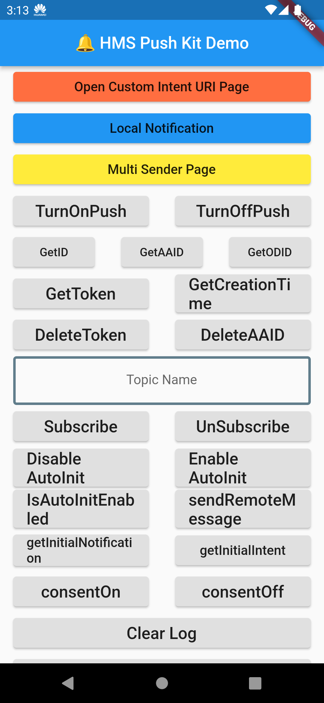

 #   Huawei Push Kit Flutter Plugin

---

## Contents
  - [1. Introduction](#1-introduction)
  - [2. Installation Guide](#2-installation-guide)
    - [Creating a Project in App Gallery Connect](#creating-a-project-in-appgallery-connect)
    - [Configuring the Signing Certificate Fingerprint](#configuring-the-signing-certificate-fingerprint)
    - [Integrating the Flutter Push Plugin](#integrating-the-flutter-push-plugin)
  - [3. API Reference](#3-api-reference)
    - [HmsInstanceId](#hmsinstanceid)
    - [HmsMessaging](#hmsmessaging)
    - [HmsPushOpenDevice](#hmspushopendevice)
    - [HmsLocalNotification](#hmslocalnotification)
    - [RemoteMessaging](#remotemessage)
    - [PushStreams](#push-streams)
    - [HMSLogger](#hmslogger)
    - [Result Codes](#result-codes)
  - [4. Configuration and Description](#4-configuration-and-description)
    - [Receiving Custom Intent URI](#receiving-custom-intent-uri)
    - [Auto-Initialization](#auto-initialization)
    - [Local Notification Configurations](#local-notification-configurations)
    - [Preparing for Release](#preparing-for-release)
  - [5. Sample Project](#5-sample-project)
  - [6. Questions or Issues](#6-questions-or-issues)
  - [7. Licencing and Terms](#7-licencing-and-terms)

---

## 1. Introduction

**HUAWEI Push Kit** is a messaging service provided by Huawei. It establishes a messaging channel from the cloud to devices. By integrating Push Kit, you can send messages to your apps on users' devices in real time. This helps you maintain closer ties with users and increases user awareness and engagement with your apps. 

This module enables communication between HUAWEI Push Kit SDK and Flutter platform. It exposes all functionality provided by HUAWEI Push Kit SDK.

---

## 2. Installation Guide
Before you get started, you must register as a HUAWEI Developer and complete identity verification on the [HUAWEI Developer](https://developer.huawei.com/consumer/en/) website. For details, please refer to [Register a HUAWEI ID](https://developer.huawei.com/consumer/en/doc/10104).

### Creating a Project in AppGallery Connect
Creating an app in AppGallery Connect is required in order to communicate with the Huawei services. To create an app, perform the following steps:

**Step 1.** Sign in to [AppGallery Connect](https://developer.huawei.com/consumer/en/service/josp/agc/index.html)  and select **My projects**.

**Step 2.** Select your project from the project list or create a new one by clicking the **Add Project** button.

**Step 3.** Go to **Project Setting** > **General information**, and click **Add app**.
If an app exists in the project and you need to add a new one, expand the app selection area on the top of the page and click **Add app**.

**Step 4.** On the **Add app** page, enter the app information, and click **OK**.

### Configuring the Signing Certificate Fingerprint

A signing certificate fingerprint is used to verify the authenticity of an app when it attempts to access an HMS Core (APK) through the HMS SDK. Before using the HMS Core (APK), you must locally generate a signing certificate fingerprint and configure it in the **AppGallery Connect**. You can refer to 3rd and 4th steps of [Generating a Signing Certificate](https://developer.huawei.com/consumer/en/codelab/HMSPreparation/index.html#2) codelab tutorial for the certificate generation. Perform the following steps after you have generated the certificate.

**Step 1:** Sign in to [AppGallery Connect](https://developer.huawei.com/consumer/en/service/josp/agc/index.html) and select your project from **My Projects**. Then go to **Project Setting** > **General information**. In the **App information** field, click the  icon next to SHA-256 certificate fingerprint, and enter the obtained **SHA-256 certificate fingerprint**.

**Step 2:**  After completing the configuration, click **OK** to save the changes. (Check mark icon)

### Integrating the Flutter Push Plugin

**Step 1:** Sign in to [AppGallery Connect](https://developer.huawei.com/consumer/en/service/josp/agc/index.html) and select your project from **My Projects**. Then go to **Growing > Push Kit** and click **Enable Now** to enable the Huawei Push Kit Service. You can also check **Manage APIs** tab on the **Project Settings** page for the enabled HMS services on your app.

**Step 2:** Go to **Project Setting > General information** page, under the **App information** field, click **agconnect-services.json** to download the configuration file.

**Step 3:** Copy the **agconnect-services.json** file to the **android/app** directory of your project.

**Step 4:** Open the **build.gradle** file in the **android** directory of your project.
- Navigate to the **buildscript** section and configure the Maven repository address and agconnect plugin for the HMS SDK.
  ```gradle
  buildscript {
    repositories {
        google()
        jcenter()
        maven { url 'https://developer.huawei.com/repo/' }
    }

    dependencies {
        /* 
          * <Other dependencies>
          */
        classpath 'com.huawei.agconnect:agcp:1.4.1.300'
    }
  }
  ```
- Go to **allprojects** and configure the Maven repository address for the HMS SDK.
  
  ```gradle
  allprojects {
    repositories {
        google()
        jcenter()
        maven { url 'https://developer.huawei.com/repo/' }
    }
  }
  ```
**Step 5:** Open the **build.gradle** file in the **android/app/** directory.
- Add `apply plugin: 'com.huawei.agconnect'` line after other `apply` entries.
  ```gradle
  apply plugin: 'com.android.application'
  apply from: "$flutterRoot/packages/flutter_tools/gradle/flutter.gradle"
  apply plugin: 'com.huawei.agconnect'
  ```
- Set your package name in **defaultConfig > applicationId** and set **minSdkVersion** to **17** or higher. Package name must match with the **package_name** entry in **agconnect-services.json** file. 
  ```gradle
  defaultConfig {
      applicationId "<package_name>"
      minSdkVersion 17
      /*
      * <Other configurations>
      */
  }
  ```
**Step 6:** Create a file **<app_dir>/android/key.properties** that contains a reference to your keystore which you generated on the previous step ([Generating a Signing Certificate](https://developer.huawei.com/consumer/en/codelab/HMSPreparation/index.html#2)). Add the following lines to the **key.properties** file and change the values regarding to the keystore you've generated.  
```
storePassword=<your_keystore_password>
keyPassword=<your_key_password>
keyAlias=key
storeFile=<location of the keystore file, for example: D:\\Users\\<user_name>\\key.jks>
```
> Warning: Keep this file private and don't include it on the public source control.

**Step 7:** Add the following code to **build.gradle** before android block for reading the **key.properties** file:
```gradle
def keystoreProperties = new Properties()
def keystorePropertiesFile = rootProject.file('key.properties')
if (keystorePropertiesFile.exists()) {
    keystoreProperties.load(new FileInputStream(keystorePropertiesFile))
}

android {
        ...
}
```
**Step 8:**  Edit **buildTypes** as follows and add **signingConfigs** below:
```gradle
signingConfigs {
    config {
        keyAlias keystoreProperties['keyAlias']
        keyPassword keystoreProperties['keyPassword']
        storeFile keystoreProperties['storeFile'] ? file(keystoreProperties['storeFile']) : null
        storePassword keystoreProperties['storePassword']
    }
}
buildTypes {
    debug {
        signingConfig signingConfigs.config
    }
    release {
        signingConfig signingConfigs.config
    }
}
```
**Step 9:** On your Flutter project directory, find and open your **pubspec.yaml** file and add the **huawei_push** library to dependencies. For more details please refer to the [Using packages](https://flutter.dev/docs/development/packages-and-plugins/using-packages#dependencies-on-unpublished-packages) document.
  - To download the package from [pub.dev](https://pub.dev/publishers/developer.huawei.com/packages).
    ```yaml
      dependencies:
        huawei_push: {library version}
    ```

    **or**

    If you downloaded the package from the HUAWEI Developer website, specify the **library path** on your local device.
    ```yaml
      dependencies:
        huawei_push:
            # Replace {library path} with actual library path of Huawei Push Kit Plugin for Flutter.
            path: {library path}
    ```
    - Replace {library path} with the actual library path of Flutter Push Plugin. The following are examples:
      - Relative path example: `path: ../huawei_push`
      - Absolute path example: `path: D:\Projects\Libraries\huawei_push`


**Step 10:** Run the following command to update package info.
```
[project_path]> flutter pub get
```

**Step 11:** Import the library to access the methods.
```dart
import 'package:huawei_push/push.dart';
```

**Step 12:** Run the following command to start the app.
```
[project_path]> flutter run
```

---

## 3. API Reference

### HmsInstanceId

#### Public Method Summary

| Method                      | Return Type     | Description |
|-----------------------------|-----------------|-------------|
| [Push.getToken() ](#futurevoid-pushgettoken-async)            | Future\<void>   | Request for a token that required for accessing HUAWEI Push Kit. Requested token will be emitted to [Token Stream.](#streamstring-pushgettokenstream). |
| [Push.getId()](#futurestring-pushgetid-async)                | Future\<String> | Obtains an AAID in synchronous mode of Push SDK. |
| [Push.getAAID()](#futurestring-pushgetaaid-async)              | Future\<String> | Obtains an AAID in asynchronous mode of Push SDK. |
| [Push.getAppId()](#futurestring-pushgetappid-async)             | Future\<String> | Obtains the Application ID from the **agconnect-services.json** file. |
| [Push.getCreationTime()](#futurestring-pushgetcreationtime-async)     | Future\<String> | Obtains the generation timestamp of an AAID. |
| [Push.deleteAAID()](#futurestring-pushdeleteaaid-async)           | Future\<String> | Deletes a local AAID and its generation timestamp. |
| [Push.deleteToken()](#futurevoid-pushdeletetoken-async)          | Future\<void>   | Deletes the push token. Result code will be emitted to the Token Stream's onError callback. |
| [Push.getAgConnectValues()](#futurestring-pushgetagconnectvalues-async)   | Future\<String> | Obtains values from the agconnect-services.json. |

#### Public Methods

##### Future\<void> Push.getToken() *async*

This method is used to request a token that required for accessing HUAWEI Push Kit. If there is no local AAID, this method will automatically generate an AAID when it is called because the HUAWEI Push Kit server needs to generate a token based on the AAID.

The requested token will be emitted to Token Stream. Listen to the stream from 
[Push.getTokenStream()](#streamstring-pushgettokenstream) to obtain the token.

###### Return Type
|Type         |Description                                         |
|-------------|----------------------------------------------------|
|Future\<void>|Future result of an execution that returns no value.|

###### Call Example
```dart
Push.getToken();
```

##### Future\<String> Push.getId() *async*

This method is used to obtain an AAID in synchronous mode of Push SDK. Before applying for a token, an app calls this method to obtain its unique AAID. The HUAWEI Push server generates a token for the app based on the AAID. If the AAID of the app changes, a new token will be generated next time when the app applies for a token. If an app needs to report statistics events, it must carry the AAID as its unique ID.

###### Return Type
|Type           |Description          |
|---------------|---------------------|
|Future\<String>|A unique AAID string.|


###### Call Example
```dart
getId() async {
  String aaid = await Push.getId();
}
```

##### Future\<String> Push.getAAID() *async*

This method is used to obtain an AAID in asynchronous mode of Push SDK.

###### Return Type
|Type           |Description          |
|---------------|---------------------|
|Future\<String>|A unique AAID string.|

###### Call Example
```dart
getAAID() async {
  String aaid = await Push.getAAID();
}
```

##### Future\<String> Push.getAppId() *async*

This method is used to obtain the Application ID from the **agconnect-services.json** file.

###### Return Type
|Type           |Description                                          |
|---------------|-----------------------------------------------------|
|Future\<String>|Application ID from the **agconnect-services.json** file.|


###### Call Example
```dart
getAppId() async {
  String appId = await Push.getAppId();
  print("Application ID is " + appId);
}
```

##### Future\<String> Push.getCreationTime() *async*

This method is used to obtain the generation timestamp of an AAID.

###### Return Type
|Type           |Description                     |
|---------------|--------------------------------|
|Future\<String>|Generation timestamp of an AAID.|

###### Call Example
```dart
getCreationTime() async {
  String creationTime = await Push.getCreationTime();
}
```

##### Future\<String> Push.deleteAAID() *async*

This method is used to delete a local AAID and its generation timestamp.

###### Return Type
|Type           |Description                                  |
|---------------|---------------------------------------------|
|Future\<String>|Result code value from [Code](#result-codes).|

###### Call Example
```dart
deleteAAID() async {
  String result = await Push.deleteAAID();
}
```

##### Future\<void> Push.deleteToken() *async*

This method is used to delete a token. After a token is deleted, the corresponding AAID will not be deleted. Result of this method will be returned to **onError** callback of [Token Stream](#streamstring-pushgettokenstream).

###### Return Type
|Type         |Description                                         |
|-------------|----------------------------------------------------|
|Future\<void>|Future result of an execution that returns no value.|

###### Call Example
```dart
Push.deleteToken();
```

##### Future\<String> Push.getAgConnectValues() *async*

This method is used to obtain values from the agconnect-services.json.

###### Return Type
|Type           |Description                                    |
|---------------|-----------------------------------------------|
|Future\<String>|Values of the **agconnect-services.json** file.|

###### Call Example
```dart
getAgConnectValues() async {
  String result = await Push.getAgConnectValues();
  print("getAgConnectValues: " + result);
}
```

### HmsMessaging

#### Public Method Summary

| Method                                                 | Return Type            | Description |
|--------------------------------------------------------|------------------------|-------------|
| [Push.isAutoInitEnabled()](#futurebool-pushisautoinitenabled-async)                               | Future\<bool>          | Checks whether automatic initialization is enabled.
| [Push.setAutoInitEnabled(bool enabled)](#futurestring-pushsetautoinitenabledbool-enabled-async)                  | Future\<String>        | Determines whether to enable automatic initialization.
| [Push.turnOnPush()](#futurestring-pushturnonpush-async)                                      | Future\<String>        | Enables the function of receiving notification messages in asynchronous mode.
| [Push.turnOffPush()](#futurestring-pushturnoffpush-async)                                     | Future\<String>        | Disables the function of receiving notification messages in asynchronous mode.
| [Push.subscribe(String topic)](#futurestring-pushsubscribestring-topic-async)                           | Future\<String>        | Subscribes to topics in asynchronous mode.
| [Push.unsubscribe(String topic)](#futurestring-pushunsubscribestring-topic-async)                         | Future\<String>        | Unsubscribes from topics in asynchronous mode.
| [Push.sendRemoteMessage(RemoteMessageBuilder remoteMsg)](#futurestring-pushsendremotemessageremotemessagebuilder-remotemsg-async) | Future\<String>        | Sends an uplink message to the app server.
| [Push.getInitialNotification()](#futureremotemessage-pushgetinitialnotification-async)                          | Future\<RemoteMessage> | Returns a Remote Message object representing the notification which opened the app.
| [Push.getInitialIntent()](#futurestring-pushgetinitialintent-async)                                | Future\<String>        | Returns the Custom Intent URI of the notification which opened the app.

#### Public Methods

##### Future\<bool> Push.isAutoInitEnabled() *async*

Checks whether automatic initialization is enabled.

###### Return Type
|Type         |Description                                                 |
|-------------|------------------------------------------------------------|
|Future\<bool>|true if automatic initialization is enabled, false otherwise|

###### Call Example
```dart
isAutoInitEnabled() async {
  bool result = await Push.isAutoInitEnabled();
}
```

##### Future\<String> Push.setAutoInitEnabled(bool enabled) *async*

This method is used to determine whether to enable automatic initialization. If this parameter is set to true, the SDK automatically generates an AAID and applies for a token. This behaviour can also be achieved by adding a **meta-data** on the **AndroidManifest.xml**. Check the [auto-initialization](#auto-initialization) section for details.

###### Parameters
|Name   |Description|
|-------|-----------|
|enabled|Indicates whether to enable automatic initialization. The value true indicates yes and false indicates no.|

###### Return Type
|Type           |Description                                  |
|---------------|---------------------------------------------|
|Future\<String>|Result code value from [Code](#result-codes).|

###### Call Example
```dart
enableAutoInit() async {
  String result = await Push.setAutoInitEnabled(true);
}

disableAutoInit() async {
  String result = await Push.setAutoInitEnabled(false);
}
```
##### Future\<String> Push.subscribe(String topic) *async*

This method is used to subscribe to topics in asynchronous mode. The HUAWEI Push Kit topic messaging function allows you to send messages to multiple devices whose users have subscribed to a specific topic. You can write messages about the topic as required, and HUAWEI Push Kit determines the release path and sends messages to the correct devices in a reliable manner.

###### Parameters
|Name   |Description|
|-------|-----------|
|topic|Topic to be subscribed to. The value must match the following regular expression: [\u4e00-\u9fa5\w-_.~%]{1,900}.|

###### Return Type
|Type           |Description                                  |
|---------------|---------------------------------------------|
|Future\<String>|Result code value from [Code](#result-codes).|

###### Call Example
```dart
subscribe() async {
  String topic = "weather";
  String result = await Push.subscribe(topic);
}
```

##### Future\<String> Push.unsubscribe(String topic) *async*

This method is used to unsubscribe from topics that are subscribed to. When a topic is unsubscribed from, the user will not receive a notification from that topic.

###### Parameters
|Name   |Description|
|-------|-----------|
|topic|Topic to unsubscribe. The value must match the following regular expression: [\u4e00-\u9fa5\w-_.~%]{1,900}.|

###### Return Type
|Type           |Description                                  |
|---------------|---------------------------------------------|
|Future\<String>|Result code value from [Code](#result-codes).|

###### Call Example
```dart
unsubscribe() async {
  String topic = "weather";
  String result = await Push.unsubscribe(topic);
}
```

##### Future\<String> Push.turnOnPush() *async*

This method is used to enable the display of notification messages. If you want to control the display of notification messages in an app, you can call this method. This method applies to notification messages but not data messages. It is the app that determines whether to enable data messaging.

###### Return Type
|Type           |Description                                  |
|---------------|---------------------------------------------|
|Future\<String>|Result code value from [Code](#result-codes).|

###### Call Example
```dart
void turnOnPush() async {
  String result = await Push.turnOnPush();
}
```

##### Future\<String> Push.turnOffPush() *async*

This method is used to disable the display of notification messages. If you want to control the display of notification messages in an app, you can call this method. This method applies to notification messages but not data messages. It is the app that determines whether to enable data messaging.

###### Return Type
|Type           |Description                                  |
|---------------|---------------------------------------------|
|Future\<String>|Result code value from [Code](#result-codes).|

###### Call Example
```dart
void turnOffPush() async {
  String result = await Push.turnOffPush();
}
```

##### Future\<String> Push.sendRemoteMessage(RemoteMessageBuilder remoteMsg)  *async*

Sends an uplink message to the application server. After an uplink message is sent, the sent and delivered events and any send errors will be emitted to [Push.getRemoteMsgSendStatusStream](#streamstring-pushgetremotemsgsendstatusstream).

###### Parameters
|Name   |Description|
|-------|-----------|
|[RemoteMessageBuilder](#remotemessagebuilder)| RemoteMessageBuilder object which constructs a RemoteMessage to be sent to the application server|

###### Return Type
|Type           |Description                                  |
|---------------|---------------------------------------------|
|Future\<String>|Result code value from [Code](#result-codes).|

###### Call Example
```dart
sendRemoteMsg() async {
  RemoteMessageBuilder remoteMsg = RemoteMessageBuilder(
      to: '', // gets the default value "push.hcm.upstream" if left empty
      data: {"Data": "test"},
      messageType: "my_type",
      ttl: 120,
      messageId: Random().nextInt(10000).toString(),
      collapseKey: '-1',
      sendMode: 1,
      receiptMode: 1);
  String result = await Push.sendRemoteMessage(remoteMsg);
}
```

##### Future\<RemoteMessage> Push.getInitialNotification() *async*

Returns a Remote Message object representing the notification which opened the app. If the app is not opened by a notification, it returns null.

###### Return Type
|Type           |Description                                  |
|---------------|---------------------------------------------|
|Future\<RemoteMessage>|[RemoteMessage](#remotemessage) object that represents the notification which opened the app.|

###### Call Example
```dart
getInitialNotification() async {
  final RemoteMessage remoteMessage = await Push.getInitialNotification();
}
```

##### Future\<String> Push.getInitialIntent() *async*

Returns the initial **Custom Intent URI** of Remote Message Notification that starts the app. Updates itself with the latest custom intent value if another Remote Message Notification with custom intent is selected. Please check [Receiving Custom Intent URI](#receiving-custom-intent-uri) for the configuration.

###### Return Type
|Type           |Description                                  |
|---------------|---------------------------------------------|
|Future\<String>|Custom Intent URI String of the selected Remote Message Notification which opened the app.|

###### Call Example
```dart
getInitialIntent() async {
  final String initialIntent = await Push.getInitialIntent();
  var uri = Uri.dataFromString(initialIntent);
  String exampleParam = uri.queryParameters['key'];
}
```
### HmsPushOpenDevice

#### Public Method Summary
| Method                      | Return Type  | Description |
|-----------------------------|--------------|-------------|
| [Push.getOdid()](#futurestring-pushgetodid-async)              | Future\<String>   | Obtains an Odid in asynchronous mode.

#### Public Methods

##### Future\<String> Push.getOdid() *async*

This method is used to obtain an Odid in asynchronous mode.

###### Return Type
|Type           |Description    |
|---------------|---------------|
|Future\<String>|An Odid String.|

###### Call Example
```dart
getOdid() async {
  String odid = await Push.getOdid();
}
```

### HmsLocalNotification

The Huawei Push Kit Plugin for Flutter supports sending local notifications. The methods and fields related to local notifications are defined here for the reference.

#### Public Method Summary
| Method                                                                  | Return Type                           | Description |
|-------------------------------------------------------------------------|---------------------------------------|-------------|
| [Push.localNotification(Map\<String, dynamic> localNotification)](#futuremapstringdynamic-pushlocalnotificationmapstring-dynamic-localnotification-async)         | Future\<Map\<String,dynamic>>         | Pushes a local notification instantly. |
| [Push.localNotificationSchedule(Map\<String, dynamic> localNotification)](#futuremapstringdynamic-pushlocalnotificationschedulemapstring-dynamic-localnotification-async) | Future\<Map\<String,dynamic>>         | Schedules a local notification to be pushed at a further time.
| [Push.cancelAllNotifications()](#futurevoid-pushcancelallnotifications-async)                                           | Future\<void>                         | Cancels all pending scheduled notifications and the ones registered in the notification manager. |
| [Push.cancelNotifications()](#futurevoid-pushcancelnotifications-async)                                              | Future\<void>                         | Cancels all pending notifications registered in the notification manager. |
| [Push.cancelScheduledNotifications()](#futurevoid-pushcancelschedulednotifications-async)                                     | Future\<void>                         | Cancels all pending scheduled notifications. |
| [Push.cancelNotificationsWithId(List\<int> ids)](#futurevoid-pushcancelnotificationswithidlistint-ids-async)                          | Future\<void>                         | Cancels all pending notifications by a list of IDs. |
| [Push.cancelNotificationsWithIdTag(Map\<int,String> idTags)](#futurevoid-pushcancelnotificationswithidtagmapintstring-idtags-async)              | Future\<void>                         | Cancels all pending notifications by a Map of keys as **Ids** and values as **tags**. Types are integer and String respectively. |
| [Push.cancelNotificationsWithTag(String tag)](#futurevoid-pushcancelnotificationswithtagstring-tag-async)                             | Future\<void>                         | Cancels all notifications with the specified tag. |
| [Push.getNotifications()](#futurelistmapstring-dynamic-pushgetnotifications-async)                                                 | Future\<List\<Map\<String, dynamic>>> | Returns the list of all active notifications. |
| [Push.getScheduledNotifications()](#futurelistmapstring-dynamic-pushgetschedulednotifications-async)                                        | Future\<List\<Map\<String, dynamic>>> | Returns a list of all pending scheduled notifications.
| [Push.getChannels()](#futureliststring-pushgetchannels-async)                                                      | Future\<List\<String>>                | Returns a list of all notification channels. |
| [Push.channelExists(String channelId)](#futurebool-pushchannelexistsstring-channelid-async)                                    | Future\<bool>                         | Checks if the notification channel with the specified ID exists. |
| [Push.channelBlocked(String channelId)](#futurebool-pushchannelblockedstring-channelid-async)                                   | Future\<bool>                         | Checks if the notification channel with the specified ID is blocked. |
| [Push.deleteChannel(String channelId)](#futurestring-pushdeletechannelstring-channelid-async)                                    | Future\<String>                       | Deletes the notification channel with specified ID. |

#### Public Methods

##### Future\<Map\<String,dynamic>> Push.localNotification(Map\<String, dynamic> localNotification) *async*

Pushes a local notification with the specified properties instantly.

###### Parameters
|Name   |Description|
|-------|-----------|
|localNotification| Map of values for a Local Notification to be pushed, refer to [HmsLocalNotificationAttr](#hmslocalnotificationattr).|

###### Return Type
|Type           |Description    |
|---------------|---------------|
|Future\<Map\<String, dynamic>>|Property map of the pushed local notification.|

###### Call Example
```dart
pushLocalNotification() async {
  try {
    Map<String, dynamic> localNotification = {
      HMSLocalNotificationAttr.TITLE: 'Notification Title',
      HMSLocalNotificationAttr.MESSAGE: 'Notification Message',
      HMSLocalNotificationAttr.TICKER: "OptionalTicker",
      HMSLocalNotificationAttr.TAG: "push-tag",
      HMSLocalNotificationAttr.BIG_TEXT: 'This is a bigText',
      HMSLocalNotificationAttr.SUB_TEXT: 'This is a subText',
      HMSLocalNotificationAttr.LARGE_ICON: 'ic_launcher',
      HMSLocalNotificationAttr.SMALL_ICON: 'ic_notification',
      HMSLocalNotificationAttr.IMPORTANCE: Importance.MAX,
      HMSLocalNotificationAttr.COLOR: "white",
      HMSLocalNotificationAttr.VIBRATE: true,
      HMSLocalNotificationAttr.VIBRATE_DURATION: 1000.0,
      HMSLocalNotificationAttr.ONGOING: false,
      HMSLocalNotificationAttr.DONT_NOTIFY_IN_FOREGROUND: false,
      HMSLocalNotificationAttr.AUTO_CANCEL: false,
      HMSLocalNotificationAttr.INVOKE_APP: false,
      HMSLocalNotificationAttr.ACTIONS: ["Yes", "No"],
    };
    Map<String, dynamic> response =
        await Push.localNotification(localNotification);
    print("Pushed a local notification: " + response.toString());
  } catch (e) {
    print("Error: " + e.toString());
  }
}
```
##### Future\<Map\<String,dynamic>> Push.localNotificationSchedule(Map\<String, dynamic> localNotification) *async*

Schedules a local notification with the specified properties to be pushed at a further time.

###### Parameters
|Name   |Description|
|-------|-----------|
|localNotification| Map of values for a Local Notification to be pushed, refer to [HmsLocalNotificationAttr](#hmslocalnotificationattr)|

###### Return Type
|Type           |Description    |
|---------------|---------------|
|Future\<Map\<String, dynamic>>|Property map of the scheduled local notification.|

###### Call Example
```dart
scheduleLocalNotification() async {
  try {
    Map<String, dynamic> localNotification = {
      HMSLocalNotificationAttr.TITLE: 'Notification Title',
      HMSLocalNotificationAttr.MESSAGE: 'Notification Message',
      HMSLocalNotificationAttr.TICKER: "OptionalTicker",
      HMSLocalNotificationAttr.TAG: "push-tag",
      HMSLocalNotificationAttr.BIG_TEXT: 'This is a bigText',
      HMSLocalNotificationAttr.SUB_TEXT: 'This is a subText',
      HMSLocalNotificationAttr.LARGE_ICON: 'ic_launcher',
      HMSLocalNotificationAttr.SMALL_ICON: 'ic_notification',
      HMSLocalNotificationAttr.IMPORTANCE: Importance.MAX,
      HMSLocalNotificationAttr.COLOR: "white",
      HMSLocalNotificationAttr.VIBRATE: true,
      HMSLocalNotificationAttr.VIBRATE_DURATION: 1000.0,
      HMSLocalNotificationAttr.ONGOING: false,
      HMSLocalNotificationAttr.DONT_NOTIFY_IN_FOREGROUND: false,
      HMSLocalNotificationAttr.AUTO_CANCEL: false,
      HMSLocalNotificationAttr.INVOKE_APP: false,
      HMSLocalNotificationAttr.ACTIONS: ["Yes", "No"],
      HMSLocalNotificationAttr.FIRE_DATE:
          DateTime.now().add(Duration(minutes: 1)).millisecondsSinceEpoch,
    };
    Map<String, dynamic> response =
        await Push.localNotificationSchedule(localNotification);
    print("Scheduled a local notification: " + response.toString());
  } catch (e) {
    print("Error: " + e.toString());
  }
}
```

##### Future\<void> Push.cancelAllNotifications() *async*

Cancels all pending scheduled notifications and the ones registered in the notification manager.

###### Return Type
|Type         |Description                                         |
|-------------|----------------------------------------------------|
|Future\<void>|Future result of an execution that returns no value.|

###### Call Example
```dart
Push.cancelAllNotifications();
```

##### Future\<void> Push.cancelNotifications() *async*

Cancels all pending notifications registered in the notification manager.

###### Return Type
|Type         |Description                                         |
|-------------|----------------------------------------------------|
|Future\<void>|Future result of an execution that returns no value.|

###### Call Example
```dart
Push.cancelNotifications();
```

##### Future\<void> Push.cancelScheduledNotifications() *async*

Cancels all pending scheduled notifications.

###### Return Type
|Type         |Description                                         |
|-------------|----------------------------------------------------|
|Future\<void>|Future result of an execution that returns no value.|

###### Call Example
```dart
Push.cancelScheduledNotifications();
```

##### Future\<void> Push.cancelNotificationsWithId(List\<int> ids) *async*

Cancels all pending notifications by a list of IDs.
>Note: If the local notification has a tag use **cancelNotificationsWithTag** or **cancelNotificationsWithIdTag** methods.

###### Parameters
|Name   |Description|
|-------|-----------|
|ids| List of notification ids to be cancelled |

###### Return Type
|Type         |Description                                         |
|-------------|----------------------------------------------------|
|Future\<void>|Future result of an execution that returns no value.|

###### Call Example
```dart
Push.cancelNotificationsWithId([1001,1002,1003]);
```

##### Future\<void> Push.cancelNotificationsWithIdTag(Map\<int,String> idTags) *async*

Cancels all pending notifications by a Map of keys as Ids and values as tags. Types are integer and String respectively.

###### Parameters
|Name   |Description|
|-------|-----------|
|idTags| Map of local notification id-tag pairs. |

###### Return Type
|Type         |Description                                         |
|-------------|----------------------------------------------------|
|Future\<void>|Future result of an execution that returns no value.|

###### Call Example
```dart
Push.cancelNotificationsWithIdTag({1001:"push-tag",1002:"push-tag"});
```

##### Future\<void> Push.cancelNotificationsWithTag(String tag) *async*

Cancels all notifications with the specified tag.

###### Parameters
|Name   |Description|
|-------|-----------|
|tag| Local Notification tag to be cancelled  |

###### Return Type
|Type         |Description                                         |
|-------------|----------------------------------------------------|
|Future\<void>|Future result of an execution that returns no value.|

###### Call Example
```dart
Push.cancelNotificationsWithTag('push-tag');
```

##### Future\<List\<Map\<String, dynamic>>> Push.getNotifications() *async*

Returns the list of all active notifications.

###### Return Type
|Type         |Description                                         |
|-------------|----------------------------------------------------|
|Future\<List\<Map\<String, dynamic>>>|List of maps that contain active local notification properties.|

###### Call Example
```dart
getNotifications() async {
  List notifications = await Push.getNotifications();
  print(notifications.length.toString() + " active notifications" );
  print("Notification list: " + notifications.toString());
}
```

##### Future\<List\<Map\<String, dynamic>>> Push.getScheduledNotifications() *async*

Returns a list of all pending scheduled notifications.

###### Return Type
|Type         |Description                                         |
|-------------|----------------------------------------------------|
|Future\<List\<Map\<String, dynamic>>>|List of maps that contain pending scheduled local notification properties.|

###### Call Example
```dart
getScheduledNotifications() async {
  List scheduledNotifications = await Push.getScheduledNotifications();
  print(scheduledNotifications.length.toString() + " scheduled notifications");
  print("Scheduled notification list: " + scheduledNotifications.toString());
}
```

##### Future\<List\<String>> Push.getChannels() *async*

Returns a string list of all notification channels.

###### Return Type
|Type         |Description                                         |
|-------------|----------------------------------------------------|
|Future\<List\<String>>|List of strings that contain the notification channel IDs.|

###### Call Example
```dart
getChannels() async {
  List<String> channels = await Push.getChannels();
  print("Channel list: " + channels.toString());
}
```

##### Future\<bool> Push.channelExists(String channelId) *async*

Returns true if the notification channel with the specified ID exists, returns false otherwise.

###### Parameters
|Name   |Description|
|-------|-----------|
|channelId| Local notification channel id to be checked for existence.|

###### Return Type
|Type         |Description                                         |
|-------------|----------------------------------------------------|
|Future\<bool>|True if the specified Channel ID exists, false otherwise.|

###### Call Example
```dart
channelExists() async {
  bool exists = await Push.channelExists('huawei-hms-flutter-push-channel-id-4-default');
  print("channelExists: " + exists.toString());
}
```

##### Future\<bool> Push.channelBlocked(String channelId) *async*

Returns true if the notification channel with the specified ID is blocked, returns false otherwise.

###### Parameters
|Name   |Description|
|-------|-----------|
|channelId| Local notification channel id to be checked for blockage |

###### Return Type
|Type         |Description                                         |
|-------------|----------------------------------------------------|
|Future\<bool>|True if the specified Channel ID is blocked, false otherwise.|

###### Call Example
```dart
channelBlocked() async {
  bool blocked = await Push.channelBlocked('huawei-hms-flutter-push-channel-id-4-default');
  print("channelBlocked: " + blocked.toString());
}
```

##### Future\<String> Push.deleteChannel(String channelId) *async*

Deletes the notification channel with the specified ID.

###### Parameters
|Name     |Description|
|---------|-----------|
|channelId| Local notification channel id to be deleted |

###### Return Type
|Type         |Description                                         |
|-------------|----------------------------------------------------|
|Future\<String>|Result code value from [Code](#result-codes) if exists.|

###### Call Example
```dart
deleteChannel() async {
  String result = await Push.deleteChannel("huawei-hms-flutter-push-channel-id-4-default");
  print("Result: " + result);
}
```
#### Local Notification Properties
**local_notification.dart** file exposes all the local notification property classes. Import this file to access all local notification attributes including [Attributes](#hmslocalnotificationattr), [NotificationPriority](#notificationpriority), [Visibility](#visibility), [Importance](#importance), [RepeatType](#repeattype).

Example Code:
```dart
import 'package:huawei_push/local_notification/local_notification.dart';

  Map<String, dynamic> notification = {
    HMSLocalNotificationAttr.TITLE: 'Notification Title',
    HMSLocalNotificationAttr.MESSAGE: 'Notification Message',
    HMSLocalNotificationAttr.BIG_TEXT: 'This is a bigText',
    HMSLocalNotificationAttr.SUB_TEXT: 'This is a subText',
    HMSLocalNotificationAttr.TAG: 'hms_tag',
    HMSLocalNotificationAttr.IMPORTANCE: Importance.MAX,
    HMSLocalNotificationAttr.REPEAT_TYPE: RepeatType.minute
  };
```

#### HMSLocalNotificationAttr
This class contains the field names for local notifications attributes. These fields are used to construct local notification messages.

| Name                                            | Type                       | Description                          |
|-------------------------------------------------|----------------------------|--------------------------------------|
| HMSLocalNotificationAttr.ID<a></a>              | String                     | An identifier for the notification message to be pushed. |
| HMSLocalNotificationAttr.MESSAGE                | String                     | The message (second row) of the notification. |
| HMSLocalNotificationAttr.FIRE_DATE              | int                        | The time at which the notification will be posted in milliseconds. |
| HMSLocalNotificationAttr.TITLE                  | String                     | The title (first row) of the notification. |
| HMSLocalNotificationAttr.TICKER                 | String                     | The ticker of the notification which is sent to the accessibility services. |
| HMSLocalNotificationAttr.AUTO_CANCEL            | bool                       | If true, the notification is dismissed on click. |
| HMSLocalNotificationAttr.LARGE_ICON             | String                     | The name of the file to be set as the large icon for notification. |
| HMSLocalNotificationAttr.LARGE_ICON_URL         | String                     | URL of the image to be set as the large icon for the notification to be pushed. |
| HMSLocalNotificationAttr.SMALL_ICON             | String                     | The name of the file to be set as the small icon for notification. |
| HMSLocalNotificationAttr.BIG_TEXT               | String                     | The longer text to be displayed in the big form of the template. |
| HMSLocalNotificationAttr.SUB_TEXT               | String                     | Additional information to be displayed in notification. |
| HMSLocalNotificationAttr.BIG_PICTURE_URL        | String                     | URL of the image to be set as the big picture for the notification to be pushed. |
| HMSLocalNotificationAttr.SHORTCUT_ID            | String                     | If the notification is duplicative of a launcher shortcut, sets the case the Launcher wants to hide the shortcut. |
| HMSLocalNotificationAttr.NUMBER                 | String                     | Sets the number of items this notification represents. Launchers that support badging may display it as a badge. |
| HMSLocalNotificationAttr.CHANNEL_ID             | String                     | The id of the notification channel for the notification to be pushed. |
| HMSLocalNotificationAttr.CHANNEL_NAME           | String                     | Name of the channel to be created for the notification to be pushed. |
| HMSLocalNotificationAttr.CHANNEL_DESCRIPTION    | String                     | Description for the channel to be created for the notification to be pushed. |
| HMSLocalNotificationAttr.COLOR                  | String                     | The notification color in #RRGGBB or #AARRGGBB formats or string like 'white'. |
| HMSLocalNotificationAttr.GROUP                  | String                     | The notification group, the notifications in the same group are displayed in a stacked way, if the device used supports such rendering. |
| HMSLocalNotificationAttr.GROUP_SUMMARY          | bool                       | If true, this notification is included in the specified group. |
| HMSLocalNotificationAttr.PLAY_SOUND             | bool                       | If true, the specified sound will be played when a notification message is pushed. |
| HMSLocalNotificationAttr.SOUND_NAME             | String                     | Name of the sound file in the raw folder to be played, when a notification message is pushed. |
| HMSLocalNotificationAttr.VIBRATE                | bool                       | Turn on or off the vibration of a notification message to be pushed. |
| HMSLocalNotificationAttr.VIBRATE_DURATION       | double                     | The duration of the vibration when a notification message is pushed. |
| HMSLocalNotificationAttr.ACTIONS                | List\<String>              | Adds action(s) to the notification to be pushed, actions are displayed as buttons under the notification content. |
| HMSLocalNotificationAttr.INVOKE_APP             | bool                       | If true, the app pushed the notification is invoked when a pushed notification is clicked. |
| HMSLocalNotificationAttr.TAG                    | String                     | A tag for the notification to be set for identification. |
| HMSLocalNotificationAttr.REPEAT_TYPE            | [RepeatType](#repeattype)  | The time to repeat pushing for a scheduled notification. |
| HMSLocalNotificationAttr.REPEAT_TIME            | double                     | The Time in milliseconds to repeat pushing the next scheduled notification message. |
| HMSLocalNotificationAttr.ONGOING                | bool                       | If true, the notification to be pushed will be an ongoing notification, which can't be cancelled by the user by a swipe and the app must handle the cancelling. |
| HMSLocalNotificationAttr.ALLOW_WHILE_IDLE       | bool                       | If true, a scheduled notification message can be pushed even when the device is in low-power idle mode. |
| HMSLocalNotificationAttr.DONT_NOTIFY_FOREGROUND | bool                       | If true, the notification won't be pushed when the app is in foreground. |
| HMSLocalNotificationAttr.PRIORITY               | [Priority](#priority)      | The priority for the notification to be pushed. |
| HMSLocalNotificationAttr.IMPORTANCE             | [Importance](#importance)  | The importance for the notification to be pushed. |
| HMSLocalNotificationAttr.VISIBILITY             | [Visibility](#visibility)  | The visibility of the notification to be pushed. |

#### NotificationPriority

This class contains the values for the local notification priority.

| Name                         |  Description                                        |
|------------------------------|-----------------------------------------------------|
| NotificationPriority.MAX     |  Max priority for the notification to be pushed.     |
| NotificationPriority.HIGH    |  High priority for the notification to be pushed.    |
| NotificationPriority.DEFAULT |  Default priority for the notification to be pushed. |
| NotificationPriority.LOW     |  Low priority for the notification to be pushed.     |
| NotificationPriority.MIN     |  Min priority for the notification to be pushed.     |

#### Visibility

This class contains the values for the local notification visibility.

| Name                  |  Description                                                       |
|-----------------------|--------------------------------------------------------------------|
| Visibility.PUBLIC     |  When set, the notification is shown entirely in all lock screens. |
| Visibility.SECRET     |  When set, the notification is hidden entirely in secure lock screens. |
| Visibility.PRIVATE    |  When set, the notification is shown entirely in all lock screens, but the private information is hidden in secure lock screens. |

#### Importance

This class contains the values for the local notification importance.

| Name                   |  Description                                                                       |    
|------------------------|------------------------------------------------------------------------------------|
| Importance.MAX         | When set, the notification is pushed from the channel with max importance.         |
| Importance.HIGH        | When set, the notification is pushed from the channel with high importance.        |
| Importance.DEFAULT     | When set, the notification is pushed from the channel with default importance.     |
| Importance.LOW         | When set, the notification is pushed from the channel with low importance.         |
| Importance.MIN         | When set, the notification is pushed from the channel with min importance.         |
| Importance.NONE        | When set, the notification is pushed from the channel with none importance.        |
| Importance.UNSPECIFIED | When set, the notification is pushed from the channel with unspecified importance. |


#### RepeatType

This class contains the repeat types (repeat periods) of the scheduled messages to be sent.

| Name                         | Description |
|------------------------------|-------------|
| RepeatType.HOUR              | 1 Hour      |
| RepeatType.MINUTE            | 1 Minute    |
| RepeatType.DAY               | 1 Day       |
| RepeatType.WEEK              | 1 Week      |
| RepeatType.CUSTOM_TIME       | Custom Time |

### RemoteMessage

Represents a message entity class. You can use the getters in this class to receive data messages that are obtained. This class maps the native class RemoteMessage of the Android Push SDK.

#### Public Properties
| Name            | Type               |  Description                                                             |
|-----------------|--------------------|--------------------------------------------------------------------------|
| messageId       | String             | Remote Message ID that is unique for each message. |
| to              | String             | The recipient of a message. |
| from            | String             | The source of a message. |
| type            | String             | The type of a message. The message type is not set for data messages and notification messages, and the default value is null. |
| token           | String             | The push token in a message. |
| ttl             | int                | The maximum cache duration of a message, in seconds. |
| collapseKey     | String             | The classification identifier of a message. |
| urgency         | int                | The message priority set on the HUAWEI Push Kit server. |
| originalUrgency | int                | The message priority set by an app. |
| sentTime        | int                | The time when a message is sent from the server. |
| data            | String             | The message content of the string type. |
| dataOfMap       | Map\<String,String> | The payload of a Map message. |
| notification    | RemoteMessageNotification | Notification data of a message represented with a [RemoteMessageNotification](#_remotemessagenotification) instance. |
| receiptMode     | int                | Receipt mode value of an uplink remote message. The value can be 0 or 1. The value 1 indicates that the receipt capability is enabled after messages are sent. That is, if an uplink message sent by the app is successfully sent to the app server, the server will respond and send a receipt to the app through the [remoteMessageSendStatusStream](#streamstring-pushgetremotemsgsendstatusstream). |
| sendMode        | int                | Send mode value of an uplink remote message. The value can be 0 or 1. Value 1 indicates that the cache and resending capability is enabled. |

#### Public Method Summary

| Method                                   | Return Type  | Description                          |
|------------------------------------------|--------------|--------------------------------------|
| [getCollapseKey](#string-getcollapsekey)     | String              | Obtains the classification identifier (collapse key) of a message. |
| [getData](#string-getdata)            | String              | Obtains the payload of a message.|
| [getDataOfMap](#string-getdataofmap)       | Map\<String,String>  | Obtains the payload of a Map message. |
| [getMessageId](#string-getmessageid)       | String              | Obtains the ID of a message. |
| [getMessageType](#string-getmessagetype)     | String              | Obtains the type of a message. |
| [getOriginalUrgency](#string-getoriginalurgency) | int                 | Obtains the message priority set by an app.  |
| [getUrgency](#string-geturgency)         | int                 | Obtains the message priority set on the HUAWEI Push Kit server. |
| [getTtl](#string-getttl)             | int                 | Obtains the maximum cache duration of a message. |
| [getSentTime](#string-getsenttime)        | int                 | Obtains the time when a message is sent from the server. |
| [getTo](#string-getto)              | String              | Obtains the recipient of a message. |
| [getFrom](#string-getfrom)            | String              | Obtains the source of a message. |
| [getToken](#string-gettoken)           | String              | Obtains the token in a message. |
| [getNotification](#remotemessagenotification-getnotification) | [RemoteMessageNotification](#_remotemessagenotification)         | Obtains the RemoteMessageNotification instance from a message. |
| [toMap()](#remotemsgtomap)            | Map\<String,dynamic> | Converts Remote Message instance to a Map. |

###### Call Example

```dart
/* Listening to the onMessageReceived stream at some point */
 Push.onMessageReceivedStream.listen(_onMessageReceived, onError: _onMessageReceiveError);

_onMessageReceived(RemoteMessage rm) {
  String data = rm.getData; // or rm.data
  String from = rm.getFrom;
  String token = rm.getToken;
}
```

#### Public Methods

##### String getCollapseKey
This method is used to obtain the classification identifier (collapse key) of a message.

###### Return Type
| Type        | Description |
|-------------|-------------|
| String      |A message classification identifier.|

##### String getData
This method is used to obtain the payload of a message. Data obtained using the getData method is of the String type instead of the Map type. You can determine the parsing rule of the data format. If data in the key-value format is transferred on the HUAWEI Push console, the data is converted into a JSON string and needs to be parsed. If data transmitted through HUAWEI Push is of high sensitivity and confidentiality, it is recommended that the message body be encrypted and decrypted by yourselves for security.

###### Return Type
| Type        | Description |
|-------------|-------------|
| String      |A common string or a string in JSON format, for example: "your data" or "{"param1":"value1","param2":"value2"}".|

##### Map\<String, String> getDataOfMap
This method is used to obtain the payload of a Map message. Different from the getData method, this method directly returns a Map data instance.

###### Return Type
| Type        | Description |
|-------------|-------------|
| Map\<String, String>      |If you set data to 123 in the message to be sent, the [getData](#string-getdata) method returns 123, and this method returns an empty Map-type instance. If you set data to {'param1':'value1'}, the [getData](#string-getdata) method returns the string in JSON format, for example, {'param1':'value1'}, and this method returns a Map-type instance containing {'param1':'value1'}.|

##### String getMessageId
This method is used to obtain the ID of a message.

###### Return Type
| Type        | Description |
|-------------|-------------|
| String      |A message ID.|

##### String getMessageType
This method is used to obtain the type of a message.

###### Return Type
| Type        | Description |
|-------------|-------------|
| String      |A message type set by you and transparently transmitted by the SDK.|

##### int getOriginalUrgency
This method is used to obtain the message priority set by the app when it sends a message through an API of the HUAWEI Push Kit server.

###### Return Type
| Type        | Description       |
|-------------|-------------------|
| int         |A message priority.|

##### int getUrgency
This method is used to obtain the message priority set on the HUAWEI Push Kit server.

###### Return Type
| Type        | Description       |
|-------------|-------------------|
| int         |A message priority.|

##### int getTtl
This method is used to obtain the maximum cache duration (in seconds) of a message. For a downstream message, the value of ttl in the [AndroidConfig](https://developer.huawei.com/consumer/en/doc/HMSCore-References-V5/https-send-api-0000001050986197-V5#EN-US_TOPIC_0000001050986197__p1560842461313) structure is returned.

###### Return Type
| Type        | Description       |
|-------------|-------------------|
| int         |A message priority.|

##### int getSentTime
This method is used to obtain the time (in milliseconds) when a message is sent from the server.

###### Return Type
| Type        | Description       |
|-------------|-------------------|
| int         |Number of milliseconds from 00:00:00 on January 1, 1970 to the time when a message is sent from the server.|

##### String getTo
This method is used to obtain the recipient of a message.

###### Return Type
| Type        | Description         |
|-------------|---------------------|
| String      | A message recipient.|

##### String getFrom
This method is used to obtain the source of a message. When the Push Kit server sends a message, appId of the app to which the message belongs is set in the message body. You can use this method to obtain the appId.

###### Return Type
| Type        | Description      |
|-------------|------------------|
| String      | A message source.|

##### String getToken
This method is used to obtain the token in a message.

###### Return Type
| Type        | Description  |
|-------------|--------------|
| String      | A push token.|

##### RemoteMessageNotification getNotification
This method is used to obtain the notification in a message.

###### Return Type
| Type        | Description  |
|-------------|--------------|
| [RemoteMessageNotification](#_remotemessagenotification)| A notification message instance.|

##### <a id="remotemsgtomap"></a>Map\<String,dynamic> toMap()
Converts Remote Message instance to a Map.

###### Return Type
| Type        | Description  |
|-------------|--------------|
| Map\<String,dynamic>|Map object that represents the converted RemoteMessage instance.|

### _RemoteMessageNotification

Private class that represents the notification payload of a message entity. You can use this class' methods on a Remote Message instance with the notification field.

#### Public Properties

| Name                  | Type          |  Description                                                          |
|-----------------------|---------------|-----------------------------------------------------------------------|
| title                 | String        | Title of a notification message.                                      |
| titleLocalizationKey  | String        | The localization key of the displayed title of a message.             |
| titleLocalizationArgs | List\<String> | The localization variables of the displayed title of a message.       |
| body                  | String        | The displayed content of a message.                                   |
| bodyLocalizationKey   | String        | The localization key of the displayed content of a message.           |
| bodyLocalizationArgs  | List\<String> | The localization variables of the displayed content of a message.     |
| icon                  | String        | The image resource name of the notification icon.                     |
| sound                 | String        | The name of an audio resource to be played when a notification message is displayed.                                                                                                      |
| tag                   | String        | The tag of a message.                                                 |
| color                 | String        | The colors of icons and buttons in a message.                         |
| clickAction           | String        | Actions triggered by message tapping.                                 |
| channelId             | String        | IDs of channels that support the display of messages.                 |
| ticker                | String        | The text that displayed on the status bar for a notification message. |
| intentUri             | String        | The intent in a notification message.                                 |
| imageUrl              | Uri           | The URL of an image in a message.                                     |
| link                  | Uri           | The deep link from a message. A deep link is a specific URL, such as the URL of a web page or rich media.                                                                                |
| when                  | double        | The display time (in milliseconds) of a notification message.         |
| notifyId              | int           | The unique ID of a message.                                           |
| badgeNumber           | int           | The badge number of the notification message.                         |
| importance            | int           | The priority of a notification message.                               |
| visibility            | int           | The visibility of a notification message.                             |
| lightSettings         | List\<int>    | The blinking frequency and color of a breathing light.                |
| vibrateConfig         | List\<double> | The list of vibration patterns.                                       |
| isDefaultLight        | bool          | Whether a notification message uses the default notification light settings.                                                                                                       |
| isDefaultSound        | bool          | Whether a notification message uses the default sound.                |
| isDefaultVibrate      | bool          | Whether a notification message uses the default vibration mode.       |
| isAutoCancel          | bool          | Whether a notification message is sticky.                             |
| isLocalOnly           | bool          | Whether a notification message is local only.                         |

#### Public Method Summary

| Method                   | Return Type         | Description                          |
|--------------------------|---------------------|--------------------------------------|
| [getTitle](#string-gettitle)                 | String              | Obtains the title of a message. |
| [getTitleLocalizationKey](#string-gettitlelocalizationkey)  | String              | Obtains the key of the displayed title of a message. |
| [getTitleLocalizationArgs](#liststring-gettitlelocalizationargs) | List\<String>       | Obtains variables of the displayed title of a message.  |
| [getBodyLocalizationKey](#string-getbodylocalizationkey)   | String              | Obtains the key of the displayed content of a message. |
| [getBodyLocalizationArgs](#liststring-getbodylocalizationargs)  | List\<String>       | Obtains variables of the displayed content of a message. |
| [getBody](#string-getbody)                  | String              | Obtains the displayed content of a message. |
| [getIcon](#string-geticon)                  | String              | Obtains the image resource name of the notification icon. |
| [getSound](#string-getsound)                 | String              | Obtains the name of an audio resource to be played when a notification message is displayed. |
| [getTag](#string-gettag)                   | String              | Obtains the tag from a message for message overwriting. |
| [getColor](#string-getcolor)                 | String              | Obtains the colors of icons and buttons in a message. |
| [getClickAction](#string-getclickaction)           | String              | Obtains actions triggered by message tapping. |
| [getChannelId](#string-getchannelid)             | String              | Obtains IDs of channels that support the display of messages. |
| [getImageUrl](#uri-getimageurl)              | Uri                 | Obtains the image URL from a message. |
| [getLink](#uri-getlink)                  | Uri                 | Obtains the deep link from a message. |
| [getNotifyId](#int-getnotifyid)              | int                 | Obtains the unique ID of a message. |
| [isDefaultLight](#bool-isdefaultlight)           | bool                | Checks whether a notification message uses the default notification light settings. |
| [isDefaultSound](#bool-isdefaultsound)           | bool                | Checks whether a notification message uses the default sound. |
| [isDefaultVibrate](#bool-isdefaultvibrate)         | bool                | Checks whether a notification message uses the default vibration mode. |
| [getWhen](#double-getwhen)                  | double              | Obtains the display time of a notification message. |
| [getLightSettings](#listint-getlightsettings)         | List\<int>          | Obtains the blinking frequency and color of a breathing light. |
| [getBadgeNumber](#int-getbadgenumber)           | int                 | Obtains a badge number. |
| [isAutoCancel](#bool-isautocancel)             | bool                | Checks whether a notification message is sticky.|
| [getImportance](#int-getimportance)            | int                 | Obtains the priority of a notification message.|
| [getTicker](#string-getticker)                | String              | Obtains the text to be displayed on the status bar for a notification message. |
| [getVibrateConfig](#listdouble-getvibrateconfig)         | List\<double>       | Obtains an array of vibration patterns. |
| [getVisibility](#int-getvisibility)            | int                 | Obtains the visibility of a notification message.|
| [getIntentUri](#string-getintenturi)             | String              |Obtains the intent in a notification message.|
| [toMap()](#notificationtomap)                 | Map\<String,dynamic> | Converts _RemoteMessageNotification instance to a Map. |

#### Public Methods

##### String getTitle
This method is used to obtain the title of a message.

###### Return Type
| Type        | Description       |
|-------------|-------------------|
| String      | Title of a message|

##### String getTitleLocalizationKey
This method is used to obtain the key of the localized title of a notification message for message display localization. To implement localization for notification messages, the key must be consistent with the node name defined in the **strings.xml** file of the app.

###### Return Type
| Type        | Description       |
|-------------|-------------------|
| String      | Title localization key of a message.|

##### List\<String> getTitleLocalizationArgs
This method is used to obtain variable string values in the localized title of a notification message. It must be used together with the [getTitleLocalizationKey](#string-gettitlelocalizationkey) method. The key obtained by the getTitleLocalizationKey method must be the same as the node name in the **strings.xml** file of the app, and the number of variable string values obtained by the getTitleLocalizationArgs method cannot be smaller than the number of placeholders in the value mapping the key in the **strings.xml** file. For details, please refer to [Notification Message Localization](https://developer.huawei.com/consumer/en/doc/HMSCore-Guides-V5/android-noti-local-0000001050042073-V5).

Sample code:
```
getTitleLocalizationKey: "demo_title_new"
getTitleLocalizationArgs: ["apple", "orange"]
```

Configuration in the strings.xml file
```
<string name="demo_title_new">I want eat %1$s and %2$s.</string>
```

###### Return Type
| Type        | Description       |
|-------------|-------------------|
| List\<String>      | List of Title Localization Arguments of a message.|

##### String getBody
This method is used to obtain the displayed content of a message.

###### Return Type
| Type        | Description       |
|-------------|-------------------|
| String      | Displayed content of a message. |

##### String getBodyLocalizationKey
This method is used to obtain the key of the localized content of a notification message for message display localization. To implement localization for notification messages, the key must be consistent with the node name defined in the **strings.xml** file of the app.

###### Return Type
| Type        | Description       |
|-------------|-------------------|
| String      | The localization key of the displayed content of a message. |

##### List\<String> getBodyLocalizationArgs
This method is used to obtain variable string values in the localized content of a message. It must be used together with the [getBodyLocalizationKey](#string-getbodylocalizationkey) method. The key obtained by the getBodyLocalizationKey method must be the same as the node name in the **strings.xml** file of the app, and the number of variable string values obtained by the getBodyLocalizationArgs method cannot be smaller than the number of placeholders in the value mapping the key in the **strings.xml** file.

###### Return Type
| Type        | Description       |
|-------------|-------------------|
| List\<String>       | The localization variables of the displayed content of a message. |

##### String getIcon
This method is used to obtain the image resource name of a notification icon. On an Android device, all icon files are stored in the **/res/raw/** directory of the app.

###### Return Type
| Type         | Description       |
|--------------|-------------------|
| String       | The image resource name of the notification icon. |

##### String getSound
This method is used to obtain the name of an audio resource to be played when a notification message is displayed. On an Android device, all audio files are stored in the **/res/raw/** directory of the app. If no audio resource is set, set this parameter to null.

###### Return Type
| Type        | Description       |
|-------------|-------------------|
| String      |The name of an audio resource to be played when a notification message is displayed.|

##### String getTag
This method is used to obtain the tag from a message for message overwriting. A message will be overwritten by another message with the same tag but is sent later.

###### Return Type
| Type        | Description         |
|-------------|---------------------|
| String      |The tag of a message.|

##### String getColor
This method is used to obtain the colors (in #RRGGBB format) of icons in a message.

###### Return Type
| Type        | Description         |
|-------------|---------------------|
| String      |The colors of icons and buttons in a message.|

##### String getClickAction
This method is used to obtain the action triggered upon notification message tapping. If no action is specified, **null** is returned.

###### Return Type
| Type        | Description         |
|-------------|---------------------|
| String      |Actions triggered by message tapping.|

##### String getChannelId
This method is used to obtain IDs of channels that support the display of a message. If no channel is set, **null** is returned.

###### Return Type
| Type        | Description         |
|-------------|---------------------|
| String      |IDs of channels that support the display of messages.|

##### Uri getImageUrl
This method is used to obtain the URL of an image in a message. The image URL must be a URL that can be accessed from the public network.

###### Return Type
| Type        | Description         |
|-------------|---------------------|
| Uri         |The URL of an image in a message.|

##### Uri getLink
This method is used to obtain the deep link from a message. A deep link is a specific URL, such as the URL of a web page or rich media. If no URL is set, null is returned.

###### Return Type
| Type        | Description         |
|-------------|---------------------|
| Uri         |The deep link from a message. A deep link is a specific URL, such as the URL of a web page or rich media.|

##### int getNotifyId
This method is used to obtain the unique ID of a message. Different messages can have the same value of NotifyId, so that new messages can overwrite old messages.

###### Return Type
| Type        | Description         |
|-------------|---------------------|
| int         |The unique ID of a message.|

##### bool isDefaultLight
This method is used to check whether a notification message uses the default notification light settings.

###### Return Type
| Type            | Description         |
|-----------------|---------------------|
| bool            | Whether a notification message uses the default notification light settings.|

##### bool isDefaultSound
This method is used to check whether a notification message uses the default sound.

###### Return Type
| Type        | Description         |
|-------------|---------------------|
| bool        |Whether a notification message uses the default sound.|

##### bool isDefaultVibrate
This method is used to check whether a notification message uses the default vibration mode.

###### Return Type
| Type        | Description         |
|-------------|---------------------|
| bool        |Whether a notification message uses the default vibration mode.|

##### double getWhen
This method is used to obtain the time (in milliseconds) when an event occurs from a notification message. Developers can sort notification messages by this time.

###### Return Type
| Type        | Description         |
|-------------|---------------------|
| double      |The display time (in milliseconds) of a notification message.|

##### List\<int> getLightSettings
This method is used to obtain the blinking frequency and color of a breathing light.

###### Return Type
| Type        | Description         |
|-------------|---------------------|
| List\<int>      |The blinking frequency and color of a breathing light.|

##### int getBadgeNumber
This method is used to obtain the number of notification messages.

###### Return Type
| Type        | Description         |
|-------------|---------------------|
| int         |The badge number of the notification message.|

##### bool isAutoCancel
This method is used to check whether a notification message is sticky. If **true** is returned, the notification message will disappear after a user taps it. If **false** is returned, the notification message will not disappear after a user taps it, but the user can swipe right or tap the trash can icon to delete the message.

###### Return Type
| Type        | Description         |
|-------------|---------------------|
| bool        |Whether a notification message is sticky.|

##### int getImportance
This method is used to obtain the priority of a notification message.

###### Return Type
| Type        | Description         |
|-------------|---------------------|
| int         |The priority of a notification message.|

##### String getTicker
This method is used to obtain the text to be displayed on the status bar for a notification message.

###### Return Type
| Type        | Description         |
|-------------|---------------------|
| String      |The text that displayed on the status bar for a notification message.|

##### List\<double> getVibrateConfig
This method is used to obtain the vibration mode of a message. For details, please refer to the description of vibrate_config in the AndroidNotification structure in [Sending Messages.](https://developer.huawei.com/consumer/en/doc/HMSCore-References-V5/https-send-api-0000001050986197-V5)

###### Return Type
| Type          | Description         |
|---------------|---------------------|
| List\<double> |The list of vibration patterns.|

##### int getVisibility
This method is used to obtain the visibility of a notification message. For details, please refer to the definition of **visibility** in the AndroidNotification structure in [Sending Messages](https://developer.huawei.com/consumer/en/doc/HMSCore-References-V5/https-send-api-0000001050986197-V5).

###### Return Type
| Type          | Description         |
|---------------|---------------------|
| int           |The visibility of a notification message.|

##### String getIntentUri
This method is used to obtain the intent in a notification message. The intent can be opening a page specified by the app. For details, please refer to the definition of the intent parameter in the **ClickAction** structure in [Sending Messages](https://developer.huawei.com/consumer/en/doc/HMSCore-References-V5/https-send-api-0000001050986197-V5) of the development guide.

###### Return Type
| Type          | Description         |
|---------------|---------------------|
| String        |The intent in a notification message.|

##### <a id="notificationtomap"></a>Map\<String,dynamic> toMap()
Converts _RemoteMessageNotification instance to a Map object.

###### Return Type
| Type          | Description         |
|---------------|---------------------|
| Map\<String,dynamic>        |Map object that represents the converted _RemoteMessageNotification instance.|


### RemoteMessageBuilder

Builder class for constructing remote messages to be sent as uplink messages. **[Push.sendRemoteMessage()](#futurestring-pushsendremotemessageremotemessagebuilder-remotemsg)** method takes an instance of the RemoteMessageBuilder class for the input parameter.

#### Public Constructor Summary

| Signature | Description |
|-----------|-------------|
| RemoteMessageBuilder({String to, String collapseKey, Map\<String,String> data, String messageId, String messageType, int ttl, int sendMode, int receiptMode}) | A RemoteMessageBuilder object which is converted to a RemoteMessage instance internally when sending as an uplink message. |


#### Public Properties

| Name          | Type               |  Description                                                             |
|---------------|--------------------|--------------------------------------------------------------------------|
| to            | String             | For an uplink message, the value is always **push.hcm.upstream**, if this field is left empty it will get this value as the default. |
| messageId     | String             | Message ID, which is generated by an app and is unique for each message. |
| messageType   | String             | The message type is transparently transmitted by the SDK. |
| ttl           | int                | Maximum cache duration of an offline message set for HUAWEI Push Kit, in seconds. The duration can be set to **15** days at most. The value of the input parameter ttl must be within the range **[1,1296000]** |
| collapseKey   | String             | Sets the maximum cache duration of a message, in seconds. If you set to **-1**, all offline messages of the app are sent to the user after the user's device goes online. If you set **0**, offline messages of the app sent to the user are determined by the default policy of HUAWEI Push Kit. Generally, only the latest offline message is sent to the user after the user's device goes online. You can set a value ranging from **1 to 100** to group messages. For example, if you send 10 messages and set collapse_key to **1** for the first five messages and to **2** for the rest, the latest offline message whose value is **1** and the latest offline **m**essage whose value is **2** are sent to the user after the user's device goes online. |
| receiptMode   | int                | The value can be **0** or **1**. The value **1** indicates that the receipt capability is enabled after messages are sent. That is, if an uplink message sent by the app is successfully sent to the app server, the server will respond and send a receipt to the app through the [RemoteMessageSendStatusStream](#streamstring-pushgetremotemsgsendstatusstream). |
| sendMode      | int                |  Sets whether to enable the message cache and resending capability of the Push Kit client. If this parameter is not set, messages cannot be cached or resent. For example, when the network is unavailable, messages are directly discarded. The value can be **0** or **1**. The value **1** indicates that the cache and resending capability is enabled. |
| data          | Map\<String,String> | Data field of the message to be sent to the app server. |


#### Public Method Summary

| Method                                 | Return Type          | Description                                                                                          |
|----------------------------------------|----------------------|------------------------------------------------------------------------------------------------------|
| [addData(String key, String value)](#remotemessagebuilder-adddatastring-key-string-value)      | RemoteMessageBuilder | Adds key-value pair data to a message.                                                               |
| [setData(Map\<String, String> dataMap)](#remotemessagebuilder-setdatamapstringstring-datamap)  | RemoteMessageBuilder | Sets Map data to a message.                                                                          |
| [clearData()](#remotemessagebuilder-cleardata)                            | RemoteMessageBuilder | Deletes message data.                                                                                |
| [setMessageId(String messageId)](#remotemessagebuilder-setmessageidstring-messageid)         | RemoteMessageBuilder | Sets the ID of a message.                                                                            |
| [setMessageType(String messageType)](#remotemessagebuilder-setmessagetypestring-messagetype)     | RemoteMessageBuilder | Sets the type of a message.                                                                          |
| [setTtl(int ttl)](#remotemessagebuilder-setttlint-ttl)                        | RemoteMessageBuilder | Sets the maximum cache duration of a message, in seconds.The duration can be set to 15 days at most. |
| [setCollapseKey(String collapseKey)](#remotemessagebuilder-setcollapsekeystring-collapsekey)     | RemoteMessageBuilder | Sets the classification identifier of a message.                                                     |
| [setSendMode(int sendMode)](#remotemessagebuilder-setsendmodeint-sendmode)              | RemoteMessageBuilder | Sets whether to enable the message cache and resending capability of the Push Kit client.            |
| [setReceiptMode(int receiptMode)](#remotemessagebuilder-setreceiptmodeint-receiptmode)        | RemoteMessageBuilder | Sets the receipt capability after an uplink message is sent to the app server.                       |
| [toMap()](#remotemsgbuildertomap)                                | Map\<String,dynamic>  | Converts RemoteMessageBuilder object to Map.                                                         |

#### Public Constructor

##### RemoteMessageBuilder

Constructs a RemoteMessageBuilder instance.

| Parameter | Type | Description |
|-----------|------|-------------|
|to         |String|Recipient of the message. For an uplink message, the value is always push.hcm.upstream, if this field is left empty it will get this value as the default.|
|messageId  |String|Unique message identifier.|
|messageType|String|Message type specified by you.|
|ttl|int|Maximum cache duration of a message, in seconds.|
|collapseKey|String|Message classification identifier.|
|receiptMode|int|0 or 1 depending on the selected mode.|
|sendMode|int|0 or 1 depending on the selected mode.|
|data|Map\<String,String>|Message data.|

###### Call Example

```dart
void sendRemoteMsg() async {
  RemoteMessageBuilder remoteMsg = RemoteMessageBuilder(
      to: '',
      data: {"Data": "test"},
      messageType: "my_type",
      ttl: 120,
      messageId: Random().nextInt(10000).toString(),
      collapseKey: '-1',
      ).setSendMode(1)
      .setReceiptMode(1);
  String result = await Push.sendRemoteMessage(remoteMsg);
}
```

#### Public Methods

##### RemoteMessageBuilder addData(String key, String value)
This method is used for adding a key-value pair data to a message.

###### Parameters
| Name | Type | Description |
|------------|------|-------------|
|key         |String|Key in a key-value pair, for example, **name**.|
|value       |String|Key in a key-value pair, for example, **FlutterPushKit**.|

###### Return Type
| Type        | Description |
|-------------|-------------|
|RemoteMessageBuilder|The current RemoteMessageBuilder instance.|

##### RemoteMessageBuilder setData(Map\<String,String> dataMap)
Specifies message data as Map data. All existing data will be deleted.

###### Parameters
| Name       | Type | Description |
|------------|------|-------------|
|dataMap     |Map\<String, String>|Map data.|

###### Return Type
| Type        | Description |
|-------------|-------------|
|RemoteMessageBuilder|The current RemoteMessageBuilder instance.|

##### RemoteMessageBuilder clearData()
Deletes the message data of the RemoteMessageBuilder instance.

###### Return Type
| Type        | Description |
|-------------|-------------|
|RemoteMessageBuilder|The current RemoteMessageBuilder instance.|

##### RemoteMessageBuilder setMessageId(String messageId)
Sets the ID of a message.

###### Parameters
| Name       | Type | Description |
|------------|------|-------------|
|messageId   |String|Message ID, which is generated by an app and is unique for each message. If not set Flutter Push SDK will automatically generate one.|

###### Return Type
| Type | Description |
|-------------|-------------|
|RemoteMessageBuilder|The current RemoteMessageBuilder instance.|

##### RemoteMessageBuilder setMessageType(String messageType)
Sets the type of an uplink message sent through the [Push.sendRemoteMessage()](#futurestring-pushsendremotemessageremotemessagebuilder-remotemsg-async) method. The message type is transparently transmitted by the SDK.

###### Parameters
| Name       | Type | Description |
|------------|------|-------------|
|messageType |String|Message type specified by you.|

###### Return Type
| Type        | Description |
|-------------|-------------|
|RemoteMessageBuilder|The current RemoteMessageBuilder instance.|

##### RemoteMessageBuilder setTtl(int ttl)
Sets the maximum cache duration of an offline message, in seconds. If the duration is not set, the message is resent immediately instead of being cached. If the destination device cannot be connected, the message will be discarded.

###### Parameters
| Name       | Type  | Description |
|------------|-------|-------------|
| ttl        | int   |Maximum cache duration of an offline message set for HUAWEI Push Kit, in seconds. The duration can be set to 15 days at most.|

###### Return Type
| Type        | Description |
|-------------|-------------|
|RemoteMessageBuilder|The current RemoteMessageBuilder instance.|


##### RemoteMessageBuilder setCollapseKey(String collapseKey)
Sets the classification identifier of a message, which is used to control the overwriting function of offline messages. For cached offline messages, the latest message with the same classification identifier overwrites earlier messages. When HUAWEI Push Kit detects that the destination device is offline, it caches messages to be sent based on the messages' TTL. After the device goes online, HUAWEI Push Kit sends the cached messages to the device.

###### Parameters
| Name        | Type | Description |
|-------------|------|-------------|
| collapseKey |String|If you set **collapse_key** to **-1**, all offline messages of the app are sent to the user after the user's device goes online. If you set **collapse_key** to **0**, offline messages of the app sent to the user are determined by the default policy of HUAWEI Push Kit. Generally, only the latest offline message is sent to the user after the user's device goes online.You can set **collapse_key** to a value ranging from 1 to 100 to group messages. For example, if you send 10 messages and set **collapse_key** to **1** for the first five messages and to **2** for the rest, the latest offline message whose value of **collapse_key** is **1** and the latest offline message whose value of **collapse_key** is **2** are sent to the user after the user's device goes online. |

###### Return Type
| Type        | Description |
|-------------|-------------|
|RemoteMessageBuilder|The current RemoteMessageBuilder instance.|

##### RemoteMessageBuilder setSendMode(int sendMode)
Sets whether to enable the message cache and resending capability of the Push Kit client. If this parameter is set to 0, messages cannot be cached or resent. For example, when the network is unavailable, messages are directly discarded.

###### Parameters
| Name  | Type | Description |
|-------------|------|-------------|
| sendMode |int|The value can be **0** or **1**. The value **1** indicates that the cache and resending capability is enabled.|

###### Return Type
| Type        | Description |
|-------------|-------------|
|RemoteMessageBuilder|The current RemoteMessageBuilder instance.|

##### RemoteMessageBuilder setReceiptMode(int receiptMode)
Sets the receipt capability after an uplink message is sent to the app server. That is, if an uplink message sent by the app is successfully sent to the app server, the server will respond and send a receipt to the app through the **onMessageDelivered** method of the native **HmsMessageService** class which can be listened from [Push.getRemoteMsgSendStatusStream](#streamstring-pushgetremotemsgsendstatusstream).

###### Parameters
| Name        | Type | Description |
|-------------|------|-------------|
| receiptMode |int   |The value can be **0** or **1**. The value 1 indicates that the receipt capability is enabled after messages are sent.|

###### Return Type
| Type        | Description |
|-------------|-------------|
|RemoteMessageBuilder|The current RemoteMessageBuilder instance.|

##### <a id="remotemsgbuildertomap"></a>Map\<String,dynamic> toMap()
Converts RemoteMessageBuilder object to a Map.

###### Return Type
| Type        | Description |
|-------------|-------------|
|Map\<String, dynamic>|Map object representing the converted RemoteMessageBuilder instance.|


### Push Streams

List of Flutter Push Kit Streams that provide Native Push SDK Events and extra functionality.

| Method Name                       | ReturnType                    | Description |
|-----------------------------------|-------------------------------|-------------|
| [Push.getTokenStream](#streamstring-pushgettokenstream)               | Stream\<String>               | Emits the token when a new token is received.Token errors are also emitted to this stream's **onError** callback.|
| [Push.getRemoteMsgSendStatusStream](#streamstring-pushgetremotemsgsendstatusstream) | Stream\<String>               | Emits the status of uplink message sending. |
| [Push.getIntentStream](#streamstring-pushgetintentstream)              | Stream\<String>               | Emits the URI string when a notification with custom intent uri is selected. |
| [Push.onMessageReceivedStream](#streamremotemessage-pushonmessagereceivedstream)      | Stream\<RemoteMessage>        | Emits a remote message object when a new message is received. Data Messages can be listened from this stream. |
| [Push.onNotificationOpenedApp](#streamremotemessage-pushonnotificationopenedapp)      | Stream\<RemoteMessage>        | Emits an event when the user selects a pushed notification.|
| [Push.onLocalNotificationClick](#streammapstringdynamic-pushonlocalnotificationclick)     | Stream\<Map\<String,dynamic>> | Emits the local notification payload when the user clicks on an action button. |


#### Stream\<String> Push.getTokenStream

When a new token is requested by [getToken()](#futurevoid-pushgettoken) method or by [Auto-Initialization](#auto-init) the requested token will be emitted to this stream. Any errors that can occur during the operation will be emitted to the **onError** callback of the stream.

###### Return Type
|Type         |Description                                         |
|-------------|----------------------------------------------------|
|Stream\<String>|The listenable stream that emits new token events and errors that may occur.|

##### Call Example

```dart
@override
void initState() {
  super.initState();
  initPlatformState();
}

Future<void> initPlatformState() async {
  if (!mounted) return;
  Push.getTokenStream.listen(_onTokenEvent, onError: _onTokenError);
}

String _token = "";
_onTokenEvent(String event) {
  setState(() {
    _token = event;
  });
  print("Token obtained: " + _token);
}

_onTokenError(Object error) {
  PlatformException e = error;
  print("TokenErrorEvent" + e.message);
}
```

#### Stream\<String> Push.getRemoteMsgSendStatusStream

After sending and uplink message with [sendRemoteMessage()](#futurestring-pushsendremotemessageremotemessagebuilder-remotemsg-async) method, this stream will emit the events from **onMessageSent**, **onSendError** and **onMessageDelivered** methods of Native Push SDK. Quick summary of these methods are as follows: 

**onMessageSent** is fired after an uplink message is successfully sent.
**onSendError** is fired after an uplink message fails to be sent.
**onMessageDelivered** sends the response from the app server to the app.

The errors will be emitted to the **onError** callback of the stream.

###### Return Type
|Type         |Description                                         |
|-------------|----------------------------------------------------|
|Stream\<String>|The listenable stream that emits remote message send status events.|

##### Call Example

```dart
@override
void initState() {
  super.initState();
  initPlatformState();
}

Future<void> initPlatformState() async {
  if (!mounted) return;
  Push.getRemoteMsgSendStatusStream.listen(_onRemoteMessageSendStatus, onError: _onRemoteMessageSendError);
}

_onRemoteMessageSendStatus(String event) {
  print("RemoteMessageSendStatus: " + event));
}

_onRemoteMessageSendError(Object error) {
  PlatformException e = error;
  print("RemoteMessageSendError" + e.toString());
}
```

#### Stream\<String> Push.getIntentStream

When a notification that include a Custom Intent URI is selected, this stream will emit the URI string. Note that the first Custom Intent URI of the notification that will open the app will not be emitted in this stream. Use the [getInitialIntent()](#futurestring-pushgetinitialintent) method instead to obtain the initial Custom Intent URI of the notification which opens the app. Please check [Receiving Custom Intent URI](#receiving-custom-intent-uri) for the configuration.

###### Return Type
|Type         |Description                                         |
|-------------|----------------------------------------------------|
|Stream\<String>|The listenable stream that emits the Custom Intent URI string of the Remote Message Notification which opened the app.|

##### Call Example

```dart
@override
void initState() {
  super.initState();
  initPlatformState();
}

Future<void> initPlatformState() async {
  if (!mounted) return;
  Push.getIntentStream.listen(_onNewIntent, onError: _onIntentError);
}

_onNewIntent(String intentString) {
  // Navigate to the custom intent page (deep link). 
  // The custom intent that sent from the push kit console is:
  // pushkitexample://CustomIntentPage
  List parsedString = intentString.split("://");
  if (parsedString[1] == "CustomIntentPage") {
    SchedulerBinding.instance.addPostFrameCallback((timeStamp) {
      Navigator.of(context)
          .push(MaterialPageRoute(builder: (context) => CustomIntentPage()));
    });
  }
}

_onIntentError(Object err) {
  PlatformException e = err;
  print("Error on intent stream: " + e.toString());
}

```

#### Stream\<RemoteMessage> Push.onMessageReceivedStream

This stream emits the received data messages pushed by the app server. The data fields of the message can be obtained by calling **getData()** or **getDataOfMap()** methods of the emitted remote message object.

###### Return Type
|Type         |Description                                         |
|-------------|----------------------------------------------------|
|Stream\<RemoteMessage>|The listenable stream that emits the received RemoteMessage object.|

##### Call Example
```dart
@override
void initState() {
  super.initState();
  initPlatformState();
}

Future<void> initPlatformState() async {
  if (!mounted) return;
  Push.onMessageReceivedStream.listen(_onMessageReceived, onError: _onMessageReceiveError);
}

_onMessageReceived(RemoteMessage rm) {
  RemoteMessage remoteMessage = rm;
  String dataString = remoteMessage.getData;
  Map<String,String> dataMap = remoteMessage.getDataOfMap;
  print("Data of the received message: " + dataMap.toString());
}

_onMessageReceiveError(Object error) {
  print("onRemoteMessageReceiveError: " + error.toString());
}

```
 

#### Stream\<RemoteMessage> Push.onNotificationOpenedApp

This stream emits a [RemoteMessage](#remotemessage) object which represents the selected notification that opened the app.

###### Return Type
|Type         |Description                                         |
|-------------|----------------------------------------------------|
|Stream\<RemoteMessage>|The listenable stream that emits a RemoteMessage object which represents the selected notification that opened the app.|

##### Call Example

```dart
@override
void initState() {
  super.initState();
  initPlatformState();
}

Future<void> initPlatformState() async {
  if (!mounted) return;
  Push.onNotificationOpenedApp.listen(_onNotificationOpenedApp);
}

_onNotificationOpenedApp(RemoteMessage remoteMessage) {
  print("[onNotificationOpenedApp]" + remoteMessage.toMap().toString());
}
```

#### Stream\<Map\<String,dynamic>> Push.onLocalNotificationClick

After pressing a local notification button action, this stream will emit a Map Object that represents the clicked local notification.

###### Return Type
|Type         |Description                                         |
|-------------|----------------------------------------------------|
|Stream\<Map\<String,dynamic>>|The listenable stream that emits the property map of a local notification when the action button is clicked.|

##### Call Example

```dart
@override
void initState() {
  super.initState();
  initPlatformState();
}

Future<void> initPlatformState() async {
  if (!mounted) return;
  Push.onLocalNotificationClick.listen(_onLocalNotificationClickEvent);
}

_onLocalNotificationClickEvent(Map<String,dynamic> event) {
  receivedNotification = event;
  if (receivedNotification["action"] == "Yes") {
    Push.cancelNotificationsWithIdTag(
        {int.parse(receivedNotification["id"]): receivedNotification['tag']});
  }
}
```

### HMSLogger

Includes the methods for enabling and disabling HMSLogger capability which is used for sending usage analytics of Push SDK's methods to improve the service quality. 

| Method Name         | ReturnType      | Description |
|----------------|-----------------|-------------|
| [Push.enableLogger()](#futurevoid-pushenablelogger-async) | Future\<void> |  Enables HMS Plugin Method Analytics. |
| [Push.disableLogger()](#futurevoid-pushenablelogger-async) | Future\<void> |   Disables HMS Plugin Method Analytics |

#### Future<void> Push.enableLogger() *async*
This method enables the HMSLogger capability.

###### Return Type
|Type         |Description                                         |
|-------------|----------------------------------------------------|
|Future\<void>|Future result of an execution that returns no value.|

#### Call Example

```dart
Push.enableLogger(); // Enables HMSLogger
```

#### Future<void> Push.disableLogger() *async*
This method disables the HMSLogger capability.

###### Return Type
|Type         |Description                                         |
|-------------|----------------------------------------------------|
|Future\<void>|Future result of an execution that returns no value.|

#### Call Example

```dart
Push.disableLogger(); // Disables HMSLogger
```

### Result Codes

Constants result codes for Push Kit SDK. Push SDK result codes consist of [HMS Core SDK Framework Result Codes](https://developer.huawei.com/consumer/en/doc/HMSCore-References/error-code-0000001050045846-V5) and [HMS Core Push SDK Result Codes](https://developer.huawei.com/consumer/en/doc/development/HMSCore-References-V5/error-code-0000001050255690-V5#EN-US_TOPIC_0000001050255690__section15969337175715). If you cannot find a result code you want in this section, search for it in [HMS Core SDK Framework Result Codes](https://developer.huawei.com/consumer/en/doc/HMSCore-References/error-code-0000001050045846-V5). If you still cannot find it, go to [Submit ticket online](https://developer.huawei.com/consumer/en/support/feedback/#/add/13?level2=111) to provide logs or join [Stack Overflow](https://stackoverflow.com/questions/tagged/huawei-mobile-services?tab=Newest) for discussion.

| Name                                      | ResultCode  | Description                          |
|:------------------------------------------|-------------|:-------------------------------------|
| RESULT_SUCCESS                                   | 0           | Success                              |
| ERROR                                     | -1          |  Error                               |
| NULL_BUNDLE                               | 333         | Bundle is null, exception            |
| ERROR_NO_TOKEN                            | 907122030   | You do not have a token. Apply for a token. |
| ERROR_NO_NETWORK                          | 907122031   | The current network is unavailable. Check the network connection. |
| ERROR_TOKEN_INVALID                       | 907122032   | The token has expired. Delete the token and apply for a new one. |
| ERROR_SERVICE_NOT_AVAILABLE               | 907122046   | If the Push service is unavailable, contact Huawei technical support. |
| ERROR_PUSH_SERVER                         | 907122047   | If the Push server returns an error, contact Huawei technical support. |
| ERROR_UNKNOWN                             | 907122045   | Unknown error. Contact Huawei technical support. |
| ERROR_TOPIC_EXCEED                        | 907122034   | The number of subscribed topics exceeds 2000. |
| ERROR_TOPIC_SEND                          | 907122035   | Failed to send the subscription topic. Contact Huawei technical support. |
| ERROR_NO_RIGHT                            | 907122036   | Push rights are not enabled. Enable the service and set push service parameters at AppGallery Connect. |
| ERROR_GET_TOKEN_ERR                       | 907122037   | Failed to apply for the token. Contact Huawei technical support. |
| ERROR_STORAGE_LOCATION_EMPTY              | 907122038   | No storage location is selected for the application or the storage location is invalid. Select a correct storage location for your app in AppGallery Connect. |
| ERROR_NOT_ALLOW_CROSS_APPLY               | 907122053   | Failed to apply for a token. Cross-region token application is not allowed. |
| ERROR_SIZE                                | 907122041   | The message body size exceeds the maximum 1KB. |
| ERROR_INVALID_PARAMETERS                  | 907122042   | The message contains invalid parameters. |
| ERROR_TOO_MANY_MESSAGES                   | 907122043   | The number of sent messages reaches the upper limit. The messages will be discarded. |
| ERROR_TTL_EXCEED                          | 907122044   | The message lifetime expires before the message is successfully sent to the APP server. |
| ERROR_HMS_CLIENT_API                      | 907122048   | Huawei Mobile Services (APK) can't connect  Huawei Push  Kit. |
| ERROR_OPERATION_NOT_SUPPORTED             | 907122049   | The current EMUI version is too early to use the capability. |
| ERROR_MAIN_THREAD                         | 907122050   | The operation cannot be performed in the main thread. |
| ERROR_HMS_DEVICE_AUTH_FAILED_SELF_MAPPING | 907122051   | Failed to authenticate the device certificate. |
| ERROR_BIND_SERVICE_SELF_MAPPING           | 907122052   | Failed to bind the service. |
| ERROR_AUTO_INITIALIZING                   | 907122054   | The HMS Core Push SDK is being automatically initialized. Please try again later.|
| ERROR_RETRY_LATER                         | 907122055   | The system is busy. Please try again later.|
| ERROR_SEND                                | 907122056   | Failed to send an uplink message.|
| ERROR_CACHE_SIZE_EXCEED                   | 907122058   | The message is discarded because the number of cached uplink messages sent by the app exceeds the threshold (20).|
| ERROR_MSG_CACHE                           | 907122059   | The uplink message sent by the app is cached due to a cause such as network unavailability.|
| ERROR_APP_SERVER_NOT_ONLINE               | 907122060   | The app server is offline.|
| ERROR_OVER_FLOW_CONTROL_SIZE              | 907122061   | Flow control is performed because the frequency for the app to send uplink messages is too high.|
| ERROR_ARGUMENTS_INVALID                      | 907135000   | The input parameter is incorrect. Check whether the related configuration information is correct. For example: **app_id** in the **agconnect-services.json** file. Check whether the **build.gradle** file is configured with the certificate signature. |
| ERROR_INTERNAL_ERROR                      | 907135001   | Internal Push error. Contact Huawei technical support engineers. |
| ERROR_NAMING_INVALID                      | 907135002   | The API required by the Push SDK does not exist or the API instance fails to be created. |
| ERROR_CLIENT_API_INVALID                  | 907135003   | The HMS Core SDK fails to connect to the HMS Core (APK). The possible cause is that the HMS Core process is stopped or crashed. Try again later. |
| ERROR_EXECUTE_TIMEOUT                     | 907135004   | Invoking AIDL times out. Contact Huawei technical support. |
| ERROR_NOT_IN_SERVICE                      | 907135005   | This service is unavailable in this region. |
| ERROR_SESSION_INVALID                     | 907135006   | If the AIDL connection session is invalid, contact Huawei technical support. |
| ERROR_GET_SCOPE_ERROR                     | 907135700   | Failed to invoke the gateway to query the application scope. |
| ERROR_SCOPE_LIST_EMPTY                    | 907135701   | Scope is not configured on the AppGallery Connect. |
| ERROR_CERT_FINGERPRINT_EMPTY              | 907135702   | The certificate fingerprint is not configured on the AppGallery Connect. |
| ERROR_PERMISSION_LIST_EMPTY               | 907135703   | Permission is not configured on the AppGallery Connect. |
| ERROR_AUTH_INFO_NOT_EXIST                 | 6002        | The authentication information of the application does not exist. |
| ERROR_CERT_FINGERPRINT_ERROR              | 6003        | An error occurred during certificate fingerprint verification. Check whether the correct certificate fingerprint is configured in AppGallery Connect. |
| ERROR_PERMISSION_NOT_EXIST                | 6004        | Interface authentication: The permission does not exist and is not applied for in AppGallery Connect. |
| ERROR_PERMISSION_NOT_AUTHORIZED           | 6005        | Interface authentication: unauthorized. |
| ERROR_PERMISSION_EXPIRED                  | 6006        | Interface authentication: The authorization expires. |

---
## 4. Configuration and Description
### Receiving Custom Intent URI
To receive the custom intent URIs you need to declare an intent filter inside **AndroidManifest.xml** file as shown below. Replace the value for the **android:scheme** with your custom scheme (for example: myapp). 

```xml
<manifest ...>
  <!-- Other configurations -->
  <application ...>
    <activity ...>
      <!-- Other configurations -->

      <!-- The Intent filter below is for receiving custom intents-->
      <intent-filter>
          <action android:name="android.intent.action.VIEW" />
          <category android:name="android.intent.category.DEFAULT" />
          <category android:name="android.intent.category.BROWSABLE" />
          <data android:scheme="<YOUR_SCHEME>"/>
      </intent-filter>
    </activity>
  </application>
</manifest>
```
For further details about this configuration please check the [Android developer documentation for deep links](https://developer.android.com/training/app-links/deep-linking).

### Auto-Initialization

The HMS Core Push SDK provides the capability of automatically generating AAIDs and automatically applying for tokens. After this capability is configured, the applied token is returned through the [TokenStream](#streamstring-pushgettokenstream). You can configure automatic initialization by adding the meta-data section to the AndroidManifest.xml file or calling the [setAutoInitEnabled(boolean enable)](#futurestring-pushsetautoinitenabledbool-enabled) method from the Push SDK.

To enable Auto-Initialization with the configuration, add the meta-data section under application tag in the **AndroidManifest.xml** file.

```xml
<manifest ...>
    <!-- Other configurations -->
    <application ...>
        <activity ...>
          <!-- Other configurations -->

        </activity>
        <meta-data
            android:name="flutterEmbedding"
            android:value="2" />
        <!-- Setting push kit auto enable to true -->
        <meta-data
            android:name="push_kit_auto_init_enabled"
            android:value="true" />
        <!-- Other configurations -->
    </application>
</manifest>
```

### Local Notification Configurations

Scheduled local notifications use the Android Alarm Manager in order to be pushed at the specified time. Permissions and receivers that shown below should be added to the **AndroidManifest.xml** file of your project for scheduling local notifications.

**Example AndroidManifest.xml file**
```xml
<manifest .../>
    <!-- Other configurations -->
    <!-- Add the permissions below for local notifications -->
    <uses-permission android:name="android.permission.RECEIVE_BOOT_COMPLETED"/>
    <uses-permission android:name="android.permission.WAKE_LOCK" />
    <uses-permission android:name="android.permission.SYSTEM_ALERT_WINDOW"/>
    <application ...>
        <activity ...>
        <!-- Other configurations -->
        </activity>
        <!-- Don't delete the meta-data below.
             This is used by the Flutter tool to generate GeneratedPluginRegistrant.java -->
        <meta-data
            android:name="flutterEmbedding"
            android:value="2" />
        <!-- These receivers are for sending scheduled local notifications -->
        <receiver android:name="com.huawei.hms.flutter.push.receiver.local.HmsLocalNotificationBootEventReceiver">
            <intent-filter>
                <action android:name="android.intent.action.BOOT_COMPLETED" />
            </intent-filter>
        </receiver>
        <receiver android:name="com.huawei.hms.flutter.push.receiver.local.HmsLocalNotificationScheduledPublisher"
            android:enabled="true"
            android:exported="true">
        </receiver>
    </application>
</manifest>
```

#### Vibration

In order to customize the vibration pattern of the local notifications you need to add the permission below to **AndroidManifest.xml** file

```xml
<uses-permission android:name="android.permission.VIBRATE" />
```

#### Playing Custom Sound

For playing a custom sound for a local notification you should add your sound file as a raw resource. The path for raw resources as follows: **<your_flutter_project>/android/app/src/main/res/raw** 

Check the sample project of the plugin for a working demonstration.

### Preparing for Release

Before building a release version of your app you may need to customize the <span>**proguard-rules</span>.pro** obfuscation configuration file to prevent the HMS Core SDK from being obfuscated. Add the configurations below to exclude the HMS Core SDK from obfuscation. For more information on this topic refer to [this Android developer guide](https://developer.android.com/studio/build/shrink-code).

**<flutter_project>/android/app/proguard-rules&#46;pro**
```
-ignorewarnings
-keepattributes *Annotation*
-keepattributes Exceptions
-keepattributes InnerClasses
-keepattributes Signature
-keepattributes SourceFile,LineNumberTable
-keep class com.hianalytics.android.**{*;}
-keep class com.huawei.updatesdk.**{*;}
-keep class com.huawei.hms.**{*;}
-keep class com.huawei.hms.flutter.** { *; }

## Flutter wrapper
-keep class io.flutter.app.** { *; }
-keep class io.flutter.plugin.**  { *; }
-keep class io.flutter.util.**  { *; }
-keep class io.flutter.view.**  { *; }
-keep class io.flutter.**  { *; }
-keep class io.flutter.plugins.**  { *; }
-dontwarn io.flutter.embedding.**
```

**<flutter_project>/android/app/build.gradle**
```gradle
buildTypes {
    debug {
        signingConfig signingConfigs.config
    }
    release {
        signingConfig signingConfigs.config
        // Enables code shrinking, obfuscation and optimization for release builds
        minifyEnabled true
        // Unused resources will be removed, resources defined in the res/raw/keep.xml will be kept.
        shrinkResources true
        proguardFiles getDefaultProguardFile('proguard-android.txt'), 'proguard-rules.pro'
    }
}
```

If you have added any custom resources for local notifications such as custom sound or icon, make sure that you have configured to keep these resources as stated [here](https://developer.android.com/studio/build/shrink-code#keep-resources).
In the plugin's sample project the custom sound resource is kept by adding the **res/raw/keep.xml** file that shown below.

```xml
<?xml version="1.0" encoding="utf-8"?>
<resources xmlns:tools="http://schemas.android.com/tools"
    tools:keep="@raw/huawei_bounce" />
```

---
## 5. Sample Project
This plugin includes a demo project in the **example** folder, there you can find more usage examples.


---

## 6. Questions or Issues

If you have questions about how to use HMS samples, try the following options:
- [Stack Overflow](https://stackoverflow.com/questions/tagged/huawei-mobile-services) is the best place for any programming questions. Be sure to tag your question with 
**huawei-mobile-services**.
- [Github](https://github.com/HMS-Core/hms-flutter-plugin/) is the official repository for these plugins, You can open an issue or submit your ideas.
- [Huawei Developer Forum](https://forums.developer.huawei.com/forumPortal/en/home?fid=0101187876626530001) HMS Core Module is great for general questions, or seeking recommendations and opinions.
- [Huawei Developer Docs](https://developer.huawei.com/consumer/en/doc/overview/HMS-Core-Plugin) is place to official documentation for all HMS Core Kits, you can find detailed documentations in there.

If you run into a bug in our samples, please submit an issue to the Github Repository.

---
## 7. Licencing and Terms
Huawei Push Kit Flutter Plugin uses the Apache 2.0 license.