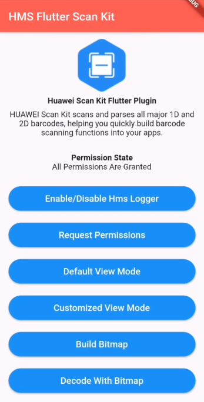

# Huawei Scan Flutter Plugin

## Table of Contents

- [Introduction](#introduction)
- [Installation Guide](#installation-guide)
  - [Creating Project in App Gallery Connect](#creating-project-in-app-gallery-connect)
  - [Configuring the Signing Certificate Fingerprint](#configuring-the-signing-certificate-fingerprint)
  - [Integrating Flutter Scan Plugin](#integrating-flutter-scan-plugin)
- [API Reference](#api-reference)
  - [HmsScanUtils](#hmsscanutils)
  - [HmsCustomizedView](#hmscustomizedview)
  - [HmsMultiProcessor](#hmsmultiprocessor)
  - [HmsScanPermissions](#hmsscanpermissions)
  - [Data Types](#data-types)
  - [Constants](#constants)
- [Configuration Description](#configuration-description)
- [Sample Project](#sample-project)
- [Questions or Issues](#questions-or-issues)
- [Licensing and Terms](#licensing-and-terms)

## Introduction

HUAWEI Scan Kit scans and parses all major 1D and 2D barcodes and generates QR codes, helping you quickly build barcode scanning functions into your apps.

Scan Kit automatically detects, magnifies, and recognizes barcodes from a distance, and is also able to scan a very small barcode in the same way. It works even in suboptimal situations, such as under dim lighting or when the barcode is reflective, dirty, blurry, or printed on a cylindrical surface. This leads to a higher scanning success rate, and an improved user experience.

Huawei Scan provides the following basic skills to enable your users to quickly use your scan and barcode creation services:

- **Scan Utils**
  - **startDefaultView**: Brings up Default Scanning UI and returns a response after scanning the barcode using the camera or from gallery.
  - **buildBitmap**: Returns your own private 1D or 2D barcode that you can create at your request.
  - **decodeWithBitmap**: Starts bitmap decoding API.
  - **enableLogger**: This method enables the HMSLogger capability which is used for sending usage analytics of Scan SDK's methods to improve the service quality.
  - **disableLogger**: This method disables the HMSLogger capability which is used for sending usage analytics of Scan SDK's methods to improve the service quality.
- **Customized View**
  - **startCustomizedView**: Brings up Customized View Scanning UI according to your preferences.
- **Multi Processor**
  - **startMultiProcessorCamera**: Brings up a scanning UI to scan multiple barcodes at the same time according to your preferences.
  - **decodeMultiSync**: Scans barcodes synchronously in Multi Processor mode.
  - **decodeMultiAsync**: Scans barcodes asynchronously in MultiProcessor mode.
- **Permissions**
  - **hasCameraAndStoragePermission**: Checks whether your app has camera and storage permissions.
  - **requestCameraAndStoragePermissions**: Requests camera and storage permissions for your app.

## Installation Guide

- Before you get started, you must register as a HUAWEI developer and complete identity verification on the [HUAWEI Developer](https://developer.huawei.com/consumer/en/) website. For details, please refer to [Register a HUAWEI ID](https://developer.huawei.com/consumer/en/doc/10104).

- Create an app in your project is required in AppGallery Connect in order to communicate with Huawei services. To create an app, perform the following steps:

### Creating Project in App Gallery Connect

**Step 1.** Sign in to [AppGallery Connect](https://developer.huawei.com/consumer/en) and select **My projects**.

**Step 2.** Click your project from the project list.

**Step 3.** Go to **Project Setting** > **General information**, and click **Add app**. If an app exists in the project, and you need to add a new one, expand the app selection area on the top of the page and click **Add app**.

**Step 4.** On the **Add app** page, enter app information, and click **OK**.

- A signing certificate fingerprint is used to verify the authenticity of an app when it attempts to access an HMS Core service through the HMS Core SDK. Before using HMS Core (APK), you must locally generate a signing certificate fingerprint and configure it in AppGallery Connect. Ensure that the JDK has been installed on your computer.

### Configuring the Signing Certificate Fingerprint

**Step 1:** Go to **Project Setting** > **General information**. In the **App information** field, click the icon next to SHA-256 certificate fingerprint, and enter the obtained **SHA256 certificate fingerprint**.

**Step 2:** After completing the configuration, click check mark.

### Integrating Flutter Scan Plugin

**Step 1:** Sign in to [AppGallery Connect](https://developer.huawei.com/consumer/en/service/josp/agc/index.html) and select **My projects**.

**Step 2:** Find your app project, and click the desired app name.

**Step 3:** Go to **Project Setting** > **General information**. In the **App information** section, click **agconnect-service.json** to download the configuration file.

**Step 4:** Create a Flutter project if you do not have one.

**Step 5:** Copy the **agconnect-service.json** file to the **android/app** directory of your Flutter project.

**Step 6:** Copy the signature file that generated in **Generating a Signature File** section, to the android/app directory of your Flutter project.

**Step 7:** Check whether the **agconnect-services.json** file and signature file are successfully added to the **android/app** directory of the Flutter project.

**Step 8:** Open the **build.gradle** file in the **android** directory of your Flutter project.

- Go to **buildscript** then configure the Maven repository address and agconnect plugin for the HMS SDK.

  ```gradle
      buildscript {
          repositories {
              google()
              jcenter()
              maven { url 'https://developer.huawei.com/repo/' }
          }

          dependencies {
              /*
               * <Other dependencies>
               */
              classpath 'com.huawei.agconnect:agcp:1.4.1.300'
          }
      }
  ```

- Go to **allprojects** then configure the Maven repository address for the HMS SDK.

  ```gradle
      allprojects {
          repositories {
              google()
              jcenter()
              maven { url 'https://developer.huawei.com/repo/' }
          }
      }
  ```

**Step 9:** Open the **build.gradle** file in the **android/app** directory.

- Add `apply plugin: 'com.huawei.agconnect'` line after the `apply` entries.

  ```gradle
      apply plugin: 'com.android.application'
      apply from: "$flutterRoot/packages/flutter_tools/gradle/flutter.gradle"
      apply plugin: 'com.huawei.agconnect'
  ```

- Set your package name in **defaultConfig** > **applicationId** and set **minSdkVersion** to **19** or **higher**.

- Package name must match with the **package_name** entry in **agconnect-services.json** file.

  ```gradle
      defaultConfig {
              applicationId "<package_name>"
              minSdkVersion 19
              /*
               * <Other configurations>
               */
          }
  ```

- Copy the signature file that generated in [Generating a Signing Certificate](https://developer.huawei.com/consumer/en/codelab/HMSPreparation/index.html#3) to **android/app** directory.

- Configure the signature in **android** according to the signature file information and configure Obfuscation Scripts.

  ```gradle
      android {
          /*
           * <Other configurations>
           */

          signingConfigs {
              config {
                  storeFile file('<keystore_file>.jks')
                  storePassword '<keystore_password>'
                  keyAlias '<key_alias>'
                  keyPassword '<key_password>'
              }
          }

          buildTypes {
              debug {
                  signingConfig signingConfigs.config
              }
              release {
                  minifyEnabled true
                  shrinkResources true
                  proguardFiles getDefaultProguardFile('proguard-android.txt'), 'proguard-rules.pro'
                  signingConfig signingConfigs.config
              }
          }
      }
  ```

- For Obfuscation Scripts, please refer to [Configuring Obfuscation Scripts](https://developer.huawei.com/consumer/en/doc/development/HMSCore-Guides/android-config-obfuscation-scripts-0000001050043957).

**Step 10:** On your Flutter project directory find and open your **pubspec.yaml** file and add library to dependencies.

- To download the package from [pub.dev](https://pub.dev/publishers/developer.huawei.com/packages).

  ```yaml
  dependencies:
    huawei_scan: { library version }
  ```

  **or**

  If you downloaded the package from the HUAWEI Developer website, specify the **library path** on your local device.

  ```yaml
  dependencies:
    huawei_scan:
      # Replace {library path} with actual library path of Huawei Scan Kit Plugin for Flutter.
      path: { library path }
  ```

  - Replace {library path} with the actual library path of Flutter Scan Plugin. The following are examples:
    - Relative path example: `path: ../huawei_scan`
    - Absolute path example: `path: D:\Projects\Libraries\huawei_scan`

**Step 11:** Run following command to update package info.

```
  [project_path]> flutter pub get
```

**Step 12:** Run following command to start the app.

```
  [project_path]> flutter run
```

## API Reference

### **HmsScanUtils**

Contains the methods for starting default view, decoding or building images in bitmap mode.

#### Public Method Summary

| Method                                       | Return Type           | Description                               |
| -------------------------------------------- | --------------------- | ----------------------------------------- |
| startDefaultView(DefaultViewRequest request) | Future\<ScanResponse> | Starts the barcode scanning UI of Huawei. |
| buildBitmap(BuildBitmapRequest request)      | Future\<Image>        | Generates 1D or 2D barcodes.              |
| decodeWithBitmap(DecodeRequest request)      | Future\<ScanResponse> | Bitmap decoding API.                      |
| disableLogger()                              | Future\<void>         | Disables HMS Logger.                      |
| enableLogger()                               | Future\<void>         | Enables HMS Logger.                       |

#### Public Methods

##### Future\<ScanResponse> startDefaultView(DefaultViewRequest request) _async_

Starts the barcode scanning UI of Huawei.

###### Parameters

| Name    | Description               |
| ------- | ------------------------- |
| request | DefaultViewRequest object |

###### Return Type

| Return Type           | Description                 |
| --------------------- | --------------------------- |
| Future\<ScanResponse> | Scanning result of barcode. |

###### Call Example

```dart
//Constructing request object.
DefaultViewRequest request = new DefaultViewRequest(scanType:HmsScanTypes.AllScanType);

//Call startDefaultView API with request object.
ScanResponse response = await HmsScanUtils.startDefaultView(request);
```

##### Future\<Image> buildBitmap(BuildBitmapRequest request) _async_

Generates 1D or 2D barcodes.

###### Parameters

| Name    | Description                |
| ------- | -------------------------- |
| request | BuildBitmapRequest object. |

###### Return Type

| Return Type    | Description      |
| -------------- | ---------------- |
| Future\<Image> | Created barcode. |

###### Call Example

```dart
//Constructing request object.
BuildBitmapRequest request = new BuildBitmapRequest(content: "Content of your barcode");

//Call buildBitmap API with request object.
Image image = await HmsScanUtils.buildBitmap(request);
```

##### Future\<ScanResponse> decodeWithBitmap(DecodeRequest request) _async_

Bitmap decoding API.

###### Parameters

| Name    | Description          |
| ------- | -------------------- |
| request | DecodeRequest object |

###### Return Type

| Return Type    | Description      |
| -------------- | ---------------- |
| Future\<Image> | Created barcode. |

###### Call Example

```dart
//Constructing request object.
DecodeRequest request = new DecodeRequest(data: YOUR_BITMAP_DATA, scanType: HmsScanTypes.AllScanType);

//Call decodeWithBitmap API with request object.
ScanResponse response = await HmsScanUtils.decodeWithBitmap(request);
```

##### Future\<void> disableLogger() _async_

Disables HMS Logger.

###### Parameters

None.

###### Return Type

| Return Type   | Description                                          |
| ------------- | ---------------------------------------------------- |
| Future\<void> | Future result of an execution that returns no value. |

###### Call Example

```dart
//Call disableLogger API.
await HmsScanUtils.disableLogger();
```

##### Future\<void> enableLogger() _async_

Enables HMS Logger.

###### Parameters

None.

###### Return Type

| Return Type   | Description                                          |
| ------------- | ---------------------------------------------------- |
| Future\<void> | Future result of an execution that returns no value. |

###### Call Example

```dart
//Call enableLogger API.
await HmsScanUtils.enableLogger();
```

### **HmsCustomizedView**

Contains the methods for Customized View operations, including starting a camera in Customized View mode.

#### Public Method Summary

| Method | Return Type | Description |
| ------ | ----------- | ----------- |
| startCustomizedView(CustomizedViewRequest request) | Future\<ScanResponse> | Controls views of camera preview and barcode scanning in Customized View mode. |

#### Public Methods

##### Future\<ScanResponse> startCustomizedView(CustomizedViewRequest request) _async_

Controls views of camera preview and barcode scanning in Customized View mode.

###### Parameters

| Name    | Description                  |
| ------- | ---------------------------- |
| request | CustomizedViewRequest object |

###### Return Type

| Return Type           | Description                 |
| --------------------- | --------------------------- |
| Future\<ScanResponse> | Scanning result of barcode. |

###### Call Example

```dart
//Constructing request object.
CustomizedViewRequest request = new CustomizedViewRequest(
     scanType: HmsScanTypes.AllScanType,
);

//Call startCustomizedView API with request object.
ScanResponse response = await HmsCustomizedView.startCustomizedView(request);
```

### **HmsMultiProcessor**

Contains the methods for starting a camera or decoding an image in Multi Processor modes.

#### Public Method Summary

| Method | Return Type | Description |
| ------ | ----------- | ----------- |
| decodeMultiSync(DecodeRequest request) | Future\<ScanResponseList> | Scans barcodes synchronously in MultiProcessor mode. |
| decodeMultiAsync(DecodeRequest request) | Future\<ScanResponseList> | Scans barcodes asynchronously in MultiProcessor mode. |
| startMultiProcessorCamera(MultiCameraRequest request) | Future\<ScanResponseList> | Starts multi processor barcode scanning UI of Huawei Flutter Scan Plugin. |

#### Public Methods

##### Future\<ScanResponseList> decodeMultiSync(DecodeRequest request) _async_

Scans barcodes synchronously in MultiProcessor mode.

###### Parameters

| Name    | Description          |
| ------- | -------------------- |
| request | DecodeRequest object |

###### Return Type

| Return Type               | Description       |
| ------------------------- | ----------------- |
| Future\<ScanResponseList> | Scanning results. |

###### Call Example

```dart
//Constructing request object.
DecodeRequest request = new DecodeRequest(data: YOUR_BITMAP_DATA, scanType: HmsScanTypes.AllScanType);

//Call decodeMultiSync API with request object.
ScanResponseList response = await HmsMultiProcessor.decodeMultiSync(request);
```

##### Future\<ScanResponseList> decodeMultiAsync(DecodeRequest request) _async_

Scans barcodes asynchronously in MultiProcessor mode.

###### Parameters

| Name    | Description          |
| ------- | -------------------- |
| request | DecodeRequest object |

###### Return Type

| Return Type               | Description       |
| ------------------------- | ----------------- |
| Future\<ScanResponseList> | Scanning results. |

###### Call Example

```dart
//Constructing request object.
DecodeRequest request = new DecodeRequest(data: YOUR_BITMAP_DATA, scanType: HmsScanTypes.AllScanType);

//Call decodeMultiAsync API with request object.
ScanResponseList response = await HmsMultiProcessor.decodeMultiAsync(request);
```

##### Future\<ScanResponseList> startMultiProcessorCamera(MultiCameraRequest request) _async_

Starts multi processor barcode scanning UI of Huawei Flutter Scan Plugin.

###### Parameters

| Name    | Description               |
| ------- | ------------------------- |
| request | MultiCameraRequest object |

###### Return Type

| Return Type               | Description       |
| ------------------------- | ----------------- |
| Future\<ScanResponseList> | Scanning results. |

###### Call Example

```dart
//Constructing request object.
MultiCameraRequest request = new MultiCameraRequest(scanType: HmsScanTypes.AllScanType, scanMode: HmsMultiProcessor.MPSyncMode);

//Call startMultiProcessorCamera API with request object.
ScanResponseList response = await HmsMultiProcessor.startMultiProcessorCamera(request);
```

### **HmsScanPermissions**

Contains the methods for requesting and checking the camera and storage permissions.

#### Public Method Summary

| Method                              | Return Type   | Description                                                 |
| ----------------------------------- | ------------- | ----------------------------------------------------------- |
| hasCameraAndStoragePermission()     | Future\<bool> | Checks whether your app has camera and storage permissions. |
| requestCameraAndStoragePermission() | Future\<bool> | Requests camera and storage permissions for your app.       |

#### Public Methods

##### Future\<bool> hasCameraAndStoragePermission() _async_

Checks whether your app has camera and storage permissions.

###### Parameters

None.

###### Return Type

| Return Type   | Description                            |
| ------------- | -------------------------------------- |
| Future\<bool> | Indicates grant status of permissions. |

###### Call Example

```dart
//Call hasCameraAndStoragePermission API.
bool permissionStatus = await HmsScanPermissions.hasCameraAndStoragePermission();
```

##### Future\<bool> requestCameraAndStoragePermission()  _async_

Requests camera and storage permissions for your app.

###### Parameters

None.

###### Return Type

| Return Type   | Description                            |
| ------------- | -------------------------------------- |
| Future\<bool> | Indicates grant status of permissions. |

###### Call Example

```dart
//Call requestCameraAndStoragePermission API.
await HmsScanPermissions.requestCameraAndStoragePermission();
```

### Data Types

#### Data Types Summary

| Class                 | Description                                                                                   |
| --------------------- | --------------------------------------------------------------------------------------------- |
| AddressInfo           | Object that contains address details.                                                         |
| HmsBorderRect         | Object that contains barcode rectangle details.                                               |
| ContactDetail         | Object that contains contact details.                                                         |
| CornerPoint           | Object that contains corner point coordinates.                                                |
| DriverInfo            | Object that contains driver details.                                                          |
| EmailContent          | Object that contains email details.                                                           |
| EventInfo             | Object that contains event details.                                                           |
| EventTime             | Object that containt event time details.                                                      |
| LinkUrl               | Object that contains url details.                                                             |
| LocationCoordinate    | Object that contains location coordinates.                                                    |
| PeopleName            | Object that contains person details.                                                          |
| SmsContent            | Object that contains sms details.                                                             |
| TelPhoneNumber        | Object that contains phone number details.                                                    |
| WifiConnectionInfo    | Object that contains wifi connection details.                                                 |
| ScanResponse          | Information returned when the *startDefaultView*, *startCustomizedView* and *decodeWithBitmap* APIs are succesfully called and scanned a barcode. |
| ScanResponseList      | Information returned when the *decodeMultiSync*, *decodeMultiAsync*, *startCustomizedView* and *startMultiProcessorCamera* APIs are succesfully called and scanned multiple barcodes. |
| ScanTextOptions       | Represent text options for *startMultiProcessorCamera* API.                                   |
| CustomizedViewEvent   | Enumarated object that represents Customized View's lifecycle events.                         |
| BuildBitmapRequest    | Request information of the *buildBitmap API*.                                                 |
| CustomizedViewRequest | Request information of the *startCustomizedView* API.                                         |
| DecodeRequest         | Request information of the *decodeWithBitmap*, *decodeMultiAysnc* and *decodeMultiSync* APIs. |
| DefaultViewRequest    | Request information of the *startDefaultView* API.                                            |
| MultiCameraRequest    | Request information of the *startMultiProcessorCamera* API.                                   |
| HmsScanError          | Represents an error class for *HmsScanErrors*.                                                |
| HmsScanErrors         | Represents error informations including error codes and error messages.                       |
| HmsScanForm           | Represents scan form types.                                                                   |
| HmsScanTypes          | Represents barcode types.                                                                     |

#### AddressInfo

Object that contains address details.

##### Public Properties

| Name           |     Type      | Description                |
| -------------- | ------------- | -------------------------- |
| addressDetails | List\<String> | Address information array. |
| addressType    |      int      | Address type.              |

##### Public Constants

| Constants          | Type | Description                       |
| ------------------ | ---- | --------------------------------- |
| ResidentialUseType | int  | Family address. Original value: *0* |
| OtherUseType       | int  | Unknown type. Original value: *-1*  |
| OfficeType         | int  | Work address. Original value: *1*   |

##### Public Constructor Summary

| Constructor                                                  | Description                                           |
| ------------------------------------------------------------ | ----------------------------------------------------- |
| AddressInfo({List\<String> addressDetails, int addressType}) | Default constructor.                                  |
| AddressInfo.fromJson(String source)                          | Creates an *AddressInfo* object from a JSON string.   |

##### Public Constructors

###### AddressInfo({List\<String> addressDetails, int addressType})

Constructor for *AddressInfo* object.

| Parameter      | Type    | Description               |
| -------------- | ------- | ------------------------- |
| addressDetails | String  | Address information array.|
| addressType    | int     | Address type.             |

###### AddressInfo.fromJson(String source)

Creates an *AddressInfo* object from JSON String.

| Parameter | Type   | Description            |
| --------- | ------ | ---------------------- |
| source    | String |JSON string as a source.|

#### HmsBorderRect

Object that contains barcode rectangle details.

##### Public Properties

| Name         | Type   | Description                           |
| ------------ | ------ | ------------------------------------- |
| left         | int    | Left x coordinate.                    |
| top          | int    | Top y coordinate.                     |
| right        | int    | Right x coordinate.                   |
| bottom       | int    | Bottom y coordinate.                  |
| exactCenterX | double | Exact value of x coordinate center.   |
| exactCenterY | double | Exact value of y coordinate center.   |
| centerX      | int    | Rounded value of x coordinate center. |
| centerY      | int    | Rounded value of y coordinate center. |

##### Public Constructor Summary

| Constructor                                              | Description          |
| -------------------------------------------------------- | -------------------- |
| HmsBorderRect({List\<*CornerPoint*> cornerPointsList})   | Default constructor. |

##### Public Constructors

###### HmsBorderRect({List\<CornerPoint> cornerPointsList})

Constructor for *HmsBorderRect* object.

| Parameter       | Type                   | Description                           |
| --------------- | ---------------------- | ------------------------------------- |
| cornerPointList | List\<*CornerPoint*>   | Corner point list of scanned barcode. |

#### ContactDetail

Object that contains contact details.

##### Public Properties

| Properties      | Type                      | Description          |
| --------------- | ------------------------- | -------------------- |
| addressesInfos  | List\<*AddressInfo*>      | Address information. |
| company         | String                    | Company information. |
| contactLinks    | List\<String>             | URL information.     |
| eMailContents   | List\<*EmailContent*>     | Email content.       |
| note            | String                    | Note.                |
| peopleName      | PeopleName                | Contact information. |
| telPhoneNumbers | List\<*TelPhoneNumber*>   | Phone number list.   |
| title           | String                    | Title.               |

##### Public Constructor Summary

| Constructor | Description |
| ----------- | ----------- |
| ContactDetail({List\<*AddressInfo*> addressesInfos, String company, List\<String> contacatLinks, List\<*EmailContent*> eMailContents, String note, PeopleName peopleName, List\<*TelPhoneNumber*> telPhoneNumbers, String title}) | Default constructor. |
| ContactDetail.fromJson(String source) | Creates a *ContactDetail* object from a JSON string. |

##### Public Constructors

###### ContactDetail({List\<AddressInfo> addressesInfos, String company, List\<String> contactLinks, List<EmailContent> eMailContents, String note, PeopleName peopleName, List\<TelPhoneNumber> telPhoneNumbers, String title})

Constructor for *ContactDetail* object

| Parameter       | Type                      | Description          |
| --------------- | ------------------------- | -------------------- |
| addressesInfos  | List\<*AddressInfo*>      | Address information. |
| company         | String                    | Company information. |
| contactLinks    | List\<String>             | URL information.     |
| eMailContents   | List<*EmailContent*>      | Email content.       |
| note            | String                    | Note.                |
| peopleName      | *PeopleName*              | Contact information. |
| telPhoneNumbers | List\<*TelPhoneNumber*>   | Phone number list.   |
| title           | String                    | Title.               |

###### ContactDetail.fromJson(String source)

Creates a *ContactDetail* object from a JSON string.

| Parameter | Type   | Description              |
| --------- | ------ | ------------------------ |
| source    | String | JSON string as a source. |

#### CornerPoint

Object that contains corner point coordinates.

##### Public Properties

| Name | Type   | Description   |
| ---- | ------ | ------------- |
| x    | int    | X coordinate. |
| y    | int    | Y coordinate. |

##### Public Constructor Summary

| Constructor                         | Description                                          |
| ----------------------------------- | ---------------------------------------------------- |
| CornerPoint({int x, int y})         | Default constructor.                                 |
| CornerPoint.fromJson(String source) | Creates a *CornerPoint* object from a JSON string.   |

##### Public Constructors

###### CornerPoint({int x, int y})

Constructor for *CornerPoint* object.

| Parameter | Type   | Description   |
| --------- | ------ | ------------- |
| x         | int    | X coordinate. |
| y         | int    | Y coordinate. |

###### CornerPoint.fromJson(String source)

Creates a *CornerPoint* object from a JSON string.

| Parameter | Type   | Description              |
| --------- | ------ | ------------------------ |
| source    | String | JSON string as a source. |

#### DriverInfo

Object that contains driver details.

##### Public Properties

| Name              | Type   | Description                                 |
| ----------------- | ------ | ------------------------------------------- |
| avenue            | String | Street.                                     |
| certificateNumber | String | Driver license number.                      |
| certificateType   | String | Driver license type.                        |
| city              | String | City.                                       |
| countryOfIssue    | String | Country where the driver license is issued. |
| dateOfBirth       | String | Birth date.                                 |
| dateOfExpire      | String | Expiration date of the driver license.      |
| dateOfIssue       | String | Issue date of the driver license.           |
| familyName        | String | Last name.                                  |
| givenName         | String | First name.                                 |
| middleName        | String | Middle name.                                |
| province          | String | Province or state in the address.           |
| sex               | String | Gender.                                     |
| zipCode           | String | ZIP code.                                   |

##### Public Constructor Summary

| Constructor | Description |
| ----------- | ----------- |
| DriverInfo({String avenue, String certificateNumber, String certificateType, String city, String countryOfIssue, String dateOfBirth, String dateOfExpire, String dateOfIssue, String familyName, String givenName, String middleName, String province, String sex, String zipCode}) | Default constructor. |
| DriverInfo.fromJson(String source) | Creates a *DriverInfo* object from a JSON string. |

##### Public Constructors

###### DriverInfo({String avenue, String certificateNumber, String certificateType, String city, String countryOfIssue, String dateOfBirth, String dateOfExpire, String dateOfIssue, String familyName, String givenName, String middleName, String province, String sex, String zipCode})

Constructor for *DriverInfo* object.

| Parameter         | Type   | Description                                 |
| ----------------- | ------ | ------------------------------------------- |
| avenue            | String | Street.                                     |
| certificateNumber | String | Driver license number.                      |
| certificateType   | String | Driver license type.                        |
| city              | String | City.                                       |
| countryOfIssue    | String | Country where the driver license is issued. |
| dateOfBirth       | String | Birth date.                                 |
| dateOfExpire      | String | Expiration date of the driver license.      |
| dateOfIssue       | String | Issue date of the driver license.           |
| familyName        | String | Last name.                                  |
| givenName         | String | First name.                                 |
| middleName        | String | Middle name.                                |
| province          | String | Province or state in the address.           |
| sex               | String | Gender.                                     |
| zipCode           | String | ZIP code.                                   |

###### DriverInfo.fromJson(String source)

Creates a *DriverInfo* object from a JSON string.

| Parameter | Type   | Description              |
| --------- | ------ | ------------------------ |
| source    | String | JSON string as a source. |

#### EmailContent

Object that contains email details.

##### Public Properties

| Name        | Type   | Description          |
| ----------- | ------ | -------------------- |
| addressType | int    | Email address type.  |
| addressInfo | String | Email address.       |
| bodyInfo    | String | Email content.       |
| subjectInfo | String | Subject of an email. |

##### Public Constants

| Constants          | Type   | Description                         |
| ------------------ | ------ | ----------------------------------- |
| ResidentialUseType | int    | Family address. Original value: *0* |
| OtherUseType       | int    | Unknown type. Original value: *-1*  |
| OfficeType         | int    | Work address. Original value: *1*   |

##### Public Constructor Summary

| Constructor | Description |
| ----------- | ----------- |
| EmailContent({int addressType, String addressInfo, String bodyInfo, String subjectInfo}) | Default constructor. |
| EmailContent.fromJson(String source) | Creates an *EmailContent* object from a JSON string. |

##### Public Constructors

###### EmailContent({int addressType, String addressInfo, String bodyInfo, String subjectInfo})

Constructor for *EmailContent* object.

| Parameter   | Type   | Description          |
| ----------- | ------ | -------------------- |
| addressType | int    | Email address type.  |
| addressInfo | String | Email address.       |
| bodyInfo    | String | Email content.       |
| subjectInfo | String | Subject of an email. |

###### EmailContent.fromJson(String source)

Creates an *EmailContent* object from JSON String.

| Parameter | Type   | Description              |
| --------- | ------ | ------------------------ |
| source    | String | JSON string as a source. |

#### EventInfo

Object that contains event details.

##### Public Properties

| Name         | Type          | Description                           |
| ------------ | ------------- | ------------------------------------- |
| abstractInfo | String        | Calendar event description.           |
| beginTime    | *EventTime*   | Start date of a calendar event.       |
| closeTime    | *EventTime*   | End date of a calendar event.         |
| condition    | String        | Calendar event status information.    |
| placeInfo    | String        | Calendar event location information.  |
| sponsor      | String        | Calendar event organizer information. |
| theme        | String        | Calendar event summary.               |

##### Public Constructor Summary

| Constructor | Description |
| ----------- | --------------------------------------------------- |
| EventInfo({String abstractInfo, *EventTime* beginTime, *EventTime* closeTime, String condition, String placeInfo, String sponsor, String theme}) | Default constructor. |
| EventInfo.fromJson(String source) | Creates an *EventInfo* object from a JSON string. |

##### Public Constructors

###### EventInfo({String abstractInfo, EventTime beginTime, EventTime closeTime, String condition, String placeInfo, String sponsor, String theme})

Constructor for *EventInfo* object.

| Parameter    | Type          | Description                           |
| ------------ | ------------- | ------------------------------------- |
| abstractInfo | String        | Calendar event description.           |
| beginTime    | *EventTime*   | Start date of a calendar event.       |
| closeTime    | *EventTime*   | End date of a calendar event.         |
| condition    | String        | Calendar event status information.    |
| placeInfo    | String        | Calendar event location information.  |
| sponsor      | String        | Calendar event organizer information. |
| theme        | String        | Calendar event summary.               |

###### EventInfo.fromJson(String source)

Creates an *EventInfo* object from JSON String.

| Parameter | Type   | Description              |
| --------- | ------ | ------------------------ |
| source    | String | JSON string as a source. |

#### **EventTime**

Object that contains event details.

##### Public Properties

| Name          | Type   | Description                                                               |
| ------------- | ------ | ------------------------------------------------------------------------- |
| day           | int    | Day.                                                                      |
| hours         | int    | Hour.                                                                     |
| isUTCTime     | bool   | Determines whether the time is in UTC format. *false:* no *true:* yes     |
| minutes       | int    | Minutes.                                                                  |
| month         | int    | Month.                                                                    |
| originalValue | String | Barcode value.                                                            |
| seconds       | int    | Seconds.                                                                  |
| year          | int    | Year.                                                                     |

##### Public Constructor Summary

| Constructor | Description |
| ----------- | ----------- |
| EventTime({int day, int hours, bool isUTCTime, int minutes, int month, String originalValue, int seconds, int year}) | Default constructor. |
| EventTime.fromJson(String source) | Creates an *EventTime* object from a JSON string. |

##### Public Constructors

###### EventTime({int day, int hours, bool isUTCTime, int minutes, int month, String originalValue, int seconds, int year})

Constructor for *EventTime* object.

| Parameter     | Type   | Description                                                               |
| ------------- | ------ | ------------------------------------------------------------------------- |
| day           | int    | Day.                                                                      |
| hours         | int    | Hour.                                                                     |
| isUTCTime     | bool   | Determines whether the time is in UTC format. *false*: no *true*: yes |
| minutes       | int    | Minutes.                                                                  |
| month         | int    | Month.                                                                    |
| originalValue | String | Barcode value.                                                            |
| seconds       | int    | Seconds.                                                                  |
| year          | int    | Year.                                                                     |

###### EventTime.fromJson(String source)

Creates an *EventTime* object from JSON String.

| Parameter | Type   | Description              |
| --------- | ------ | ------------------------ |
| source    | String | JSON string as a source. |

#### LinkUrl

Object that contains url details.

##### Public Properties

| Name      | Type   | Description |
| --------- | ------ | ----------- |
| linkvalue | String | URL.        |
| theme     | String | Title.      |

##### Public Constructor Summary

| Constructor                               | Description                                      |
| ----------------------------------------- | ------------------------------------------------ |
| LinkUrl({String linkvalue, String theme}) | Default constructor.                             |
| LinkUrl.fromJson(String source)           | Creates a *LinkUrl* object from a JSON string. |

##### Public Constructors

###### LinkUrl({String linkvalue, String theme})

Constructor for *LinkUrl* object.

| Parameter | Type   | Description |
| --------- | ------ | ----------- |
| linkvalue | String | URL.        |
| theme     | String | Title.      |

###### LinkUrl.fromJson(String source)

Creates an *LinkUrl* object from JSON String.

| Parameter | Type   | Description              |
| ------    | ------ | ------------------------ |
| source    | String | JSON string as a source. |

#### LocationCoordinate

Object that contains location coordinates.

##### Public Properties

| Name      | Type   | Description |
| --------- | ------ | ----------- |
| latitude  | double | Latitude.   |
| longitude | double | Longitude.  |

##### Public Constructor Summary

| Constructor                                          | Description                                                 |
| ---------------------------------------------------- | ----------------------------------------------------------- |
| LocationCoordinate({String linkValue, String theme}) | Default constructor.                                        |
| LocationCoordinate.fromJson(String source)           | Creates a *LocationCoordinate* object from a JSON string.   |

##### Public Constructors

###### LocationCoordinate({String linkValue, String theme})

Constructor for *LocationCoordinate* object.

| Parameter | Type   | Description |
| --------- | ------ | ----------- |
| latitude  | double | Latitude.   |
| longitude | double | Longitude.  |

###### LocationCoordinate.fromJson(String source)

Creates an *LocationCoordinate* object from JSON String.

| Parameter | Type   | Description              |
| --------- | ------ | ------------------------ |
| source    | String | JSON string as a source. |

#### PeopleName

Object that contains person details.

##### Public Properties

| Name       | Type   | Description               |
| ---------- | ------ | ------------------------- |
| familyName | String | Last name.                |
| fullName   | String | Full name of a contact.   |
| givenName  | String | First name.               |
| middleName | String | Middle name.              |
| namePrefix | String | Prefix of a contact name. |
| nameSuffix | String | Suffix of a contact name. |
| spelling   | String | Contact name spelling.    |

##### Public Constructor Summary

| Constructor | Description |
| ----------- | ----------- |
| PeopleName({String familyName, String fullName, String givenName, String middleName, String namePrefix, String nameSuffix, String spelling}) | Default constructor. |
| PeopleName.fromJson(String source) | Creates a *PeopleName* object from a JSON string. |

##### Public Constructors

###### PeopleName({String familyName, String fullName, String givenName, String middleName, String namePrefix, String nameSuffix, String spelling})

Constructor for *PeopleName* object.

| Parameter  | Type   | Description               |
| ---------- | ------ | ------------------------- |
| familyName | String | Last name.                |
| fullName   | String | Full name of a contact.   |
| givenName  | String | First name.               |
| middleName | String | Middle name.              |
| namePrefix | String | Prefix of a contact name. |
| nameSuffix | String | Suffix of a contact name. |
| spelling   | String | Contact name spelling.    |

###### PeopleName.fromJson(String source)

Creates a *PeopleName* object from JSON String.

| Parameter | Type   | Description              |
| --------- | ------ | ------------------------ |
| source    | String | JSON string as a source. |

#### SmsContent

Object that contains sms details.

##### Public Properties

| Name            | Type   | Description      |
| --------------- | ------ | ---------------- |
| msgContent      | String | SMS information. |
| destPhoneNumber | String | Phone number.    |

##### Public Constructor Summary

| Constructor                                             | Description                                         |
| ------------------------------------------------------- | --------------------------------------------------- |
| SmsContent({String msgContent, String destPhoneNumber}) | Default constructor.                                |
| SmsContent.fromJson(String source)                      | Creates a *SmsContent* object from a JSON string.   |

##### Public Constructors

###### SmsContent({String msgContent, String destPhoneNumber})

Constructor for *SmsContent* object.

| Parameter       | Type   | Description      |
| --------------- | ------ | ---------------- |
| msgContent      | String | SMS information. |
| destPhoneNumber | String | Phone number.    |

###### SmsContent.fromJson(String source)

Creates a *SmsContent* object from JSON String.

| Parameter | Type   | Description             |
| --------- | ------ | ----------------------- |
| source    | String | JSON string as a source.|

#### TelPhoneNumber

Object that contains phone number details.

##### Public Properties

| Name           | Type   | Description        |
| -------------- | ------ | ------------------ |
| telPhoneNumber | String | Phone number.      |
| useType        | int    | Phone number type. |

##### Public Constants

| Constant               | Type   | Description                               |
| ---------------------- | ------ | ----------------------------------------- |
| FaxUseType             | int    | Fax number. Original value: *0*           |
| ResidentialUseType     | int    | Home phone number. Originalvalue: *1*     |
| CellphoneNumberUseType | int    | Mobile number. Originalvalue: *2*         |
| OtherUseType           | int    | Unknown phone number. Originalvalue: *-1* |
| OfficeUseType          | int    | Work phone number. Originalvalue: *3*     |

##### Public Constructor Summary

| Constructor                                          | Description                                             |
| ---------------------------------------------------- | ------------------------------------------------------- |
| TelPhoneNumber({String telPhoneNumber, int useType}) | Default constructor.                                    |
| TelPhoneNumber.fromJson(String source)               | Creates a *TelPhoneNumber* object from a JSON string.   |

##### Public Constructors

###### TelPhoneNumber({String telPhoneNumber, int useType})

Constructor for *TelPhoneNumber* object.

| Parameter      | Type   | Description        |
| ------         | ------ | ------------------ |
| telPhoneNumber | String | Phone number.      |
| useType        | int    | Phone number type. |

###### TelPhoneNumber.fromJson(String source)

Creates a *TelPhoneNumber* object from JSON String.

| Parameter | Type   | Description              |
| --------- | ------ | ------------------------ |
| source    | String | JSON string as a source. |

#### WiFiConnectionInfo

Object that contains wifi connection details.

##### Public Properties

| Name       | Type   | Description            |
| ---------- | ------ | ---------------------- |
| password   | String | Wi-Fi password.        |
| ssidNumber | String | SSID.                  |
| cipherMode | int    | Wi-Fi encryption mode. |

##### Public Constants

| Constant           | Type   | Description                             |
| ------------------ | ------ | --------------------------------------- |
| NoPasswordModeType | int    | Open Wi-Fi. Original value: *0*         |
| WepModeType        | int    | Wi-Fi in WEP mode. Originalvalue: *1*   |
| WpaModeType        | int    | Wi-Fi in WPA mode. Originalvalue: *2*   |

##### Public Constructor Summary

| Constructor                                                              | Description                                                 |
| ------------------------------------------------------------------------ | ----------------------------------------------------------- |
| WiFiConnectionInfo({String password, String ssidNumber, int cipherMode}) | Default constructor.                                        |
| WiFiConnectionInfo.fromJson(String source)                               | Creates a *WiFiConnectionInfo* object from a JSON string.   |

##### Public Constructors

###### WiFiConnectionInfo({String password, String ssidNumber, int cipherMode})

Constructor for *WiFiConnectionInfo* object.

| Parameter  | Type   | Description           |
| ---------- | ------ | --------------------- |
| password   | String | Wi-Fi password.       |
| ssidNumber | String | SSID.                 |
| cipherMode | int    | Wi-Fi encryption mode.|

###### WiFiConnectionInfo.fromJson(String source)

Creates a *WiFiConnectionInfo* object from JSON String.

| Parameter | Type   | Description              |
| --------- | ------ | ------------------------ |
| source    | String | JSON string as a source. |

#### ScanResponse

Information returned when the **startDefaultView**, **startCustomizedView** and **decodeWithBitmap** APIs are succesfully called.

##### Public Properties

| Name               | Type                   | Description                       |
| ------------------ | ---------------------- | --------------------------------- |
| hmsScanVersion     | int                    | HMS Scan Version.                 |
| cornerPoints       | List\<*CornerPoint*>   | Barcode corner point information. |
| originValueByte    | List\<int>             | Byte array.                       |
| originalValue      | String                 | Barcode information.              |
| scanType           | int                    | Barcode format.                   |
| scanTypeForm       | int                    | Barcode content type.             |
| showResult         | String                 | Barcode value.                    |
| zoomValue          | double                 | Barcode zoom ratio.               |
| smsContent         | *SmsContent*           | SMS information.                  |
| emailContent       | *EmailContent*         | Email content.                    |
| telPhoneNumber     | *TelPhoneNumber*       | Phone number.                     |
| linkUrl            | *LinkUrl*              | URL bookmark.                     |
| wifiConnectionInfo | *WiFiConnectionInfo*   | Wi-Fi connection info.            |
| locationCoordinate | *LocationCoordinate*   | Location information.             |
| driverInfo         | *DriverInfo*           | Driver license information.       |
| contactDetail      | *ContactDetail*        | Contact information.              |
| eventInfo          | *EventInfo*            | Calendar event.                   |
| borderRect         | *HmsBorderRect*        | Barcode rectangle information.    |

##### Public Constructor Summary

| Constructor | Description                                           |
| ----------- | ----------------------------------------------------- |
| ScanResponse({int hmsScanVersion, List\<*CornerPoint*> cornerPoints, List\<int> originValueByte, String originalValue, int scanType, int scanTypeForm, String showResult, double zomValue, *SmsContent* smsContent, *EmailContent* emailContent, *TelPhoneNumber* telPhoneNumber, *LinkUrl* linkUrl, *WiFiConnectionInfo* wifiConnectionInfo, *LocationCoordinate* locationCoordinate, *DriverInfo* driverInfo, *ContactDetail* contactDetail, *EventInfo* eventInfo}) | Default constructor. |
| ScanResponse.fromMap(Map\<String, dynamic> map) | Creates a *ScanResponse* object from Map. |
| ScanResponse.fromJson(String source) | Creates a *ScanResponse* object from a JSON string. |

##### Public Constructors

###### ScanResponse({int hmsScanVersion, List\<CornerPoint> cornerPoints, List\<int> originValueByte, String originalValue, int scanType, int scanTypeForm, String showResult, double zomValue, SmsContent smsContent, EmailContent emailContent, TelPhoneNumber telPhoneNumber, LinkUrl linkUrl, WiFiConnectionInfo wifiConnectionInfo, LocationCoordinate locationCoordinate, DriverInfo driverInfo, ContactDetail contactDetail, EventInfo eventInfo})

Constructor for *ScanResponse* object.

| Parameter          | Type                 | Description                       |
| ------------------ | -------------------- | --------------------------------- |
| hmsScanVersion     | int                  | HMS Scan Version.                 |
| cornerPoints       | List\<*CornerPoint*> | Barcode corner point information. |
| originValueByte    | List\<int>           | Byte array.                       |
| originalValue      | String               | Barcode information.              |
| scanType           | int                  | Barcode format.                   |
| scanTypeForm       | int                  | Barcode content type.             |
| showResult         | String               | Barcode value.                    |
| zoomValue          | double               | Barcode zoom ratio.               |
| smsContent         | *SmsContent*         | SMS information.                  |
| emailContent       | *EmailContent*       | Email content.                    |
| telPhoneNumber     | *TelPhoneNumber*     | Phone number.                     |
| linkUrl            | *LinkUrl*            | URL bookmark.                     |
| wifiConnectionInfo | *WiFiConnectionInfo* | Wi-Fi connection info.            |
| locationCoordinate | *LocationCoordinate* | Location information.             |
| driverInfo         | *DriverInfo*         | Driver license information.       |
| contactDetail      | *ContactDetail*      | Contact information.              |
| eventInfo          | *EventInfo*          | Calendar event.                   |

###### ScanResponse.fromMap(Map\<String, dynamic> map)

Creates a *ScanResponse* object from Map.

| Parameter | Type                  | Description      |
| --------- | --------------------- | ---------------- |
| map       | Map\<String, dynamic> | Map as a source. |

###### ScanResponse.fromJson(String source)

Creates a *ScanResponse* object from a JSON string.

| Parameter | Type   | Description              |
| --------- | ------ | ------------------------ |
| map       | String | JSON string as a source. |

#### ScanResponseList

Information returned when the **decodeMultiSync**, **decodeMultiAsync** and **startMultiProcessorCamera** APIs are succesfully called.

##### Public Properties

| Name             | Type                   | Description                     |
| ---------------- | ---------------------- | ------------------------------- |
| scanResponseList | List\<*ScanResponse*>  | List of *ScanResponse* objects. |

##### Public Constructor Summary

| Constructor                                                | Description                                               |
| ---------------------------------------------------------- | --------------------------------------------------------- |
| ScanResponseList({List\<*ScanResponse*> scanResponseList}) | Default constructor.                                      |
| ScanResponseList.fromMap(Map\<String, dynamic> map)        | Creates a *ScanResponseList* object from Map.             |
| ScanResponseList.fromJson(String source)                   | Creates a *ScanResponseList* object from a JSON string.   |

##### Public Constructors

###### ScanResponseList({List<ScanResponse> scanResponseList})

Constructor for *ScanResponseList* object.

| Parameter        | Type                   | Description                       |
| ---------------- | ---------------------- | --------------------------------- |
| scanResponseList | List\<*ScanResponse*>  | List of *ScanResponse* objects.   |

###### ScanResponseList.fromMap(Map\<String, dynamic> map)

Creates a *ScanResponseList* object from Map.

| Parameter | Type                  | Description      |
| --------- | --------------------- | ---------------- |
| map       | Map\<String, dynamic> | Map as a source. |

###### ScanResponseList.fromMap(Map\<String, dynamic> map)

Creates a *ScanResponseList* object from a JSON string.

| Parameter | Type   | Description              |
| --------- | ------ | ------------------------ |
| source    | String | JSON string as a source. |

#### ScanTextOptions

Text options for *MultiCameraRequest* object.

##### Public Properties

| Name                | Type   | Description                                                                     |
| ------------------- | ------ | ------------------------------------------------------------------------------- |
| textColor           | Color  | Text color. Default value: *Colors.black*                                       |
| textSize            | double | Text size. Default value: *35.0*                                                |
| showText            | bool   | Indicates whether the text is visible. Default value: *true*                    |
| showTextOutBounds   | bool   | Indicates whether to limit the text in rectangle bounds. Default value: *false* |
| textBackgroundColor | Color  | Text background color. Default value: *Colors.transparent*                      |
| autoSizeText        | bool   | Indicates whether the text auto size itself. Default value: *false*             |
| minTextSize         | int    | Minimum text size. Default value: *24*                                          |
| granularity         | int    | Granularity. Default value: *2*                                                 |

##### Public Constructor Summary

| Constructor | Description                                              |
| ----------- | -------------------------------------------------------- |
| ScanTextOptions({Color textColor, double textSize, bool showText, bool showTextOutBounds, Color textBackgroundColor, bool autoSizeText, int minTextSize, int granularity}) | Default constructor. |
| ScanTextOptions.fromJson(String source) | Creates a *ScanTextOptions* object from a JSON string. |

##### Public Constructors

###### ScanTextOptions({Color textColor, double textSize, bool showText, bool showTextOutBounds, Color textBackgroundColor, bool autoSizeText, int minTextSize, int granularity})

Constructor for *ScanTextOptions* object.

| Parameter           | Type   | Description                                                                     |
| ------------------- | ------ | ------------------------------------------------------------------------------- |
| textColor           | Color  | Text color. Default value: *Colors.black*                                       |
| textSize            | double | Text size. Default value: *35.0*                                                |
| showText            | bool   | Indicates whether the text is visible. Default value: *true*                    |
| showTextOutBounds   | bool   | Indicates whether to limit the text in rectangle bounds. Default value: *false* |
| textBackgroundColor | Color  | Text background color. Default value: *Colors.transparent*                      |
| autoSizeText        | bool   | Indicates whether the text auto size itself. Default value: *false*             |
| minTextSize         | int    | Minimum text size. Default value: *24*                                          |
| granularity         | int    | Granularity. Default value: *2*                                                 |

###### ScanTextOptions.fromJson(String source)

Creates a *ScanTextOptions* object from a JSON string.

| Parameter | Type   | Description             |
| --------- | ------ | ----------------------- |
| source    | String | JSON string as a source.|

#### CustomizedViewEvent

Enumarated object that represents Customized View's lifecycle events.

##### Values

| Name      | Description                                       | 
| --------- | ------------------------------------------------- |
| onStart   | Customized View's onStart function initialized.   |
| onResume  | Customized View's onResume function initialized.  |
| onPause   | Customized View's onPause function initialized.   |
| onDestroy | Customized View's onDestroy function initialized. |
| onStop    | Customized View's onStop function initialized.    |

#### BuildBitmapRequest

Request information of the buildBitmap API.

##### Public Properties

| Name            | Type   | Description               |
| --------------- | ------ | ------------------------- |
| content         | String | Barcode content.          |
| type            | int    | Barcode type.             |
| width           | int    | Barcode witdth.           |
| height          | int    | Barcode height.           |
| bitmapColor     | Color  | Barcode color.            |
| margin          | int    | Barcode margin.           |
| backgroundColor | Color  | Barcode background color. |

##### Public Constructor Summary

| Constructor | Description                  |
| ----------- |----------------------------- |
| BuildBitmapRequest({String content, int type, int width, int height, Color bitmapColor, int margin, Color backgroundColor}) | Default constructor. |
| BuildBitmapRequest.fromJson(String source) | Creates an *BuildBitmapRequest* object from a JSON string. |

##### Public Constructors

###### BuildBitmapRequest({String content, int type, int width, int height, Color bitmapColor, int margin, Color backgroundColor})

Constructor for *BuildBitmapRequest* object.

| Parameter       | Type   | Description               |
| --------------- | ------ | ------------------------- |
| content         | String | Barcode content.          |
| type            | int    | Barcode type.             |
| width           | int    | Barcode witdth.           |
| height          | int    | Barcode height.           |
| bitmapColor     | Color  | Barcode color.            |
| margin          | int    | Barcode margin.           |
| backgroundColor | Color  | Barcode background color. |

###### BuildBitmapRequest.fromJson(String source)

Creates an *BuildBitmapRequest* object from JSON String.

| Parameter | Type   | Description              |
| --------- | ------ | ------------------------ |
| source    | String | JSON string as a source. |

#### CustomizedViewRequest

Request information of the startCustomizedView API.

##### Public Properties

| Name                        | Type                        | Description                                                             |
| --------------------------- | --------------------------- | ----------------------------------------------------------------------- |
| scanType                    | int                         | Barcode type.                                                           |
| additionalScanTypes         | List\<int>                  | List of additional barcode types.                                       |
| rectHeight                  | int                         | Height of scan area.                                                    |
| rectWidth                   | int                         | Barcode height.                                                         |
| flashOnLightChange          | bool                        | Barcode color.                                                          |
| isFlashAvailable            | bool                        | Barcode margin.                                                         |
| isGalleryAvailable          | bool                        | Barcode background color.                                               |
| continuouslyScan            | bool                        | Start customized view in continuous scan mode.                          |
| costomizedCameraListener    | CustomizedCameraListener    | Indicates a function to be performed when a barcode is scanned.         |
| customizedLifeCycleListener | CustomizedLifeCycleListener | Indicates a function to be performed when a barcodes lifecycle changed. |

##### Public Constructor Summary

| Constructor | Description                          |
| ----------- | ------------------------------------ |
| CustomizedViewRequest({int scanType, List\<int> additionalScanTypes, int rectHeight, int rectWidth, bool flashOnLightChange, bool isFlashAvailable, bool isGalleryAvailable, bool continuouslyScan, CustomizedCameraListener customizedCameraListener, CustomizedLifeCycleListener customizedLifeCycleListener}) | Default constructor. |
| CustomizedViewRequest.fromJson(String source)      | Creates an *CustomizedViewRequest* object from a JSON string. |

##### Public Constructors

###### CustomizedViewRequest({int scanType, List\<int> additionalScanTypes, int rectHeight, int rectWidth, bool flashOnLightChange, bool isFlashAvailable, bool isGalleryAvailable, bool continuouslyScan, CustomizedCameraListener customizedCameraListener, CustomizedLifeCycleListener customizedLifeCycleListener})

Constructor for *CustomizedViewRequest* object.

| Parameter                   | Type                        | Description                                                             |
| --------------------------- | --------------------------- | ----------------------------------------------------------------------- |
| scanType                    | int                         | Barcode type.                                                           |
| additionalScanTypes         | List\<int>                  | List of additional barcode types.                                       |
| rectHeight                  | int                         | Height of scan area.                                                    |
| rectWidth                   | int                         | Barcode height.                                                         |
| flashOnLightChange          | bool                        | Barcode color.                                                          |
| isFlashAvailable            | bool                        | Barcode margin.                                                         |
| isGalleryAvailable          | bool                        | Barcode background color.                                               |
| continuouslyScan            | bool                        | Start customized view in continuous scan mode.                          |
| costomizedCameraListener    | CustomizedCameraListener    | Indicates a function to be performed when a barcode is scanned.         |
| customizedLifeCycleListener | CustomizedLifeCycleListener | Indicates a function to be performed when a barcodes lifecycle changed. |

###### CustomizedViewRequest.fromJson(String source)

Creates an *CustomizedViewRequest* object from JSON String.

| Parameter | Type   | Description              |
| --------- | ------ | ------------------------ |
| source    | String | JSON string as a source. |

#### DecodeRequest

Request information of the **decodeWithBitmap**, **decodeMultiSync** and **decodeMultiAsync** APIs.

##### Public Properties

| Name                | Type       | Description                       |
| ------------------- | ---------- | --------------------------------- |
| data                | Uint8List  | Uint8List of image.               |
| scanType            | int        | Barcode type.                     |
| additionalScanTypes | List\<int> | List of additional barcode types. |

##### Public Constructor Summary

| Constructor                                                                   | Description                                             |
| ----------------------------------------------------------------------------- | ------------------------------------------------------- |
| DecodeRequest({Uint8List data, int scanType, List\<int> additionalScanTypes}) | Default constructor.                                    |
| DecodeRequest.fromJson(String source)                                         | Creates an *DecodeRequest* object from a JSON string.   |

##### Public Constructors

###### DecodeRequest({Uint8List data, int scanType, List\<int> additionalScanTypes})

Constructor for *DecodeRequest* object.

| Parameter           | Type       | Description                       |
| ------------------- | ---------- | --------------------------------- |
| data                | Uint8List  | Uint8List of image.               |
| scanType            | int        | Barcode type.                     |
| additionalScanTypes | List\<int> | List of additional barcode types. |

###### DecodeRequest.fromJson(String source)

Creates an *DecodeRequest* object from JSON String.

| Parameter | Type   | Description              |
| --------- | ------ | ------------------------ |
| source    | String | JSON string as a source. |

#### DefaultViewRequest

Request information of the **startDefaultView** API.

##### Public Properties

| Name                | Type       | Description                       |
| ------------------- | ---------- | --------------------------------- |
| scanType            | int        | Barcode type.                     |
| additionalScanTypes | List\<int> | List of additional barcode types. |

##### Public Constructor Summary

| Constructor                                                        | Description                                                  |
| ------------------------------------------------------------------ | ------------------------------------------------------------ |
| DefaultViewRequest({int scanType, List\<int> additionalScanTypes}) | Default constructor.                                         |
| DefaultViewRequest.fromJson(String source)                         | Creates an *DefaultViewRequest* object from a JSON string.   |

##### Public Constructors

###### DefaultViewRequest({int scanType, List\<int> additionalScanTypes})

Constructor for *DefaultViewRequest* object.

| Name                | Type       | Description                       |
| ------------------- | ---------- | --------------------------------- |
| scanType            | int        | Barcode type.                     |
| additionalScanTypes | List\<int> | List of additional barcode types. |

###### DefaultViewRequest.fromJson(String source)

Creates an *DefaultViewRequest* object from JSON String.

| Parameter | Type   | Description              |
| --------- | ------ | ------------------------ |
| source    | String | JSON string as a source. |

#### MultiCameraRequest

Request information of the **startMultiProcessorCamera** API.

##### Public Properties

| Name                | Type                | Description                              |
| ------------------- | ------------------- | ---------------------------------------- |
| scanMode            | int                 | Scan mode.                               |
| scanType            | int                 | Barcode type.                            |
| additionalScanTypes | List\<int>          | List of additional barcode types.        |
| colorList           | List\<Color>        | Color list.                              |
| strokeWidth         | double              | Stroke width of rectangles.              |
| isGalleryAvailable  | bool                | Availability of gallery button.          |
| multiCameraListener | MultiCameraListener | Camera listener for scan responses.      |
| scanTextOptions     | *ScanTextOptions*   | Text options for Multi Processor Camera. |

##### Public Constructor Summary

| Constructor | Description                  |
| ----------- | ---------------------------- |
| MultiCameraRequest({int scanMode, int scanType, List\<int> additionalScanTypes, List\<Color> colorList, double strokeWidth, bool isGalleryAvailable, MultiCameraListener multiCameraListener, *ScanTextOptions* scanTextOptions}) | Default constructor. |
| MultiCameraRequest.fromJson(String source) | Creates an *MultiCameraRequest* object from a JSON string. |

##### Public Constructors

###### MultiCameraRequest({int scanMode, int scanType, List\<int> additionalScanTypes, List\<Color> colorList, double strokeWidth, bool isGalleryAvailable, MultiCameraListener multiCameraListener, ScanTextOptions scanTextOptions})

Constructor for *MultiCameraRequest* object.

| Name                | Type                | Description                              |
| ------------------- | ------------------- | ---------------------------------------- |
| scanMode            | int                 | Scan mode.                               |
| scanType            | int                 | Barcode type.                            |
| additionalScanTypes | List\<int>          | List of additional barcode types.        |
| colorList           | List\<Color>        | Color list.                              |
| strokeWidth         | double              | Stroke width of rectangles.              |
| isGalleryAvailable  | bool                | Availability of gallery button.          |
| multiCameraListener | MultiCameraListener | Camera listener for scan responses.      |
| scanTextOptions     | *ScanTextOptions*   | Text options for Multi Processor Camera. |

###### MultiCameraRequest.fromJson(String source)

Creates an *MultiCameraRequest* object from JSON String.

| Parameter | Type   | Description              |
| --------- | ------ | ------------------------ |
| source    | String | JSON string as a source. |

#### HmsScanError

Represents an error class for HmsScanErrors.

##### Public Properties

| Name         | Type   | Description    |
| ------------ | ------ | -------------- |
| errorCode    | String | Error code.    |
| errorMessage | String | Error message. |

##### Public Constructor Summary

| Constructor                                           | Description          |
| ----------------------------------------------------- | -------------------- |
| HmsScanError({String errorCode, String errorMessage}) | Default constructor. |

##### Public Constructors

###### HmsScanError({String errorCode, String errorMessage})

Constructor for *HmsScanError* object.

| Name         | Type   | Description    |
| ------------ | ------ | -------------- |
| errorCode    | String | Error code.    |
| errorMessage | String | Error message. |

### Constants

#### HmsScanErrors

| Constant                    | Type           | Error Code | Error Message                                  | Possible Solution |
| --------------------------- | :------------: | :--------: | ---------------------------------------------- | ----------------- |
| scanUtilNoCameraPermission  | *HmsScanError* |     1      | No Camera Permission                           | Call requestCameraAndStoragePermission API. |
| scanUtilNoReadPermission    | *HmsScanError* |     2      | No Read Permission                             | Call requestCameraAndStoragePermission API. |
| decodeMultiAsyncCouldntFind | *HmsScanError* |     13     | Multi Async - Couldn't find anything.          | Analyzer couldn't find any suitable barcode from the provided image. Try changing scanType to proper HmsScanTypes. |
| decodeMultiAsyncOnFailure   | *HmsScanError* |     14     | Multi Async - On Failure                       | Analyzer failed to respond. Try recalling the API. |
| decodeMultiSyncCouldntFind  | *HmsScanError* |     15     | Multi Sync - Couldn't find anything.           | Analyzer couldn't find any suitable barcode from the provided image. Try changing scanType to proper HmsScanTypes. |
| mpCameraScanModeError       | *HmsScanError* |     16     | Please check your scan mode.                   | Provided scan mode is not suitable for analyzer. Try to use HmsMultiProcessor's Constant Values. |
| decodeWithBitmapError       | *HmsScanError* |     17     | Please check your barcode and scan type.       | Analyzer couldn't find any suitable barcode from the provided image. Try changing scanType to proper HmsScanTypes. |
| buildBitmap                 | *HmsScanError* |     18     | Barcode generation failed.                     | Try changing barcode content according to your error logs. |
| hmsScanAnalyzerError        | *HmsScanError* |     19     | Analyzer is not available.                     | Try recalling the API. |
| remoteViewError             | *HmsScanError* |     20     | Remote View is not initialized.                | Try recalling the API. |
| mpChannelError              | *HmsScanError* |     21     | Multi Processor Channel cannot be initialized. | Try recalling the API. |

#### HmsScanForm

| Constant               | Type | Value | Description                 |
| ---------------------- | :--: | :---: | --------------------------- |
| OtherForm              | int  |  -1   | Unknown barcode content.    |
| ContactDetailForm      | int  | 1009  | Contact information.        |
| EmailContentForm       | int  | 1002  | Email information.          |
| ISBNNumberForm         | int  | 1012  | ISBN.                       |
| TelPhoneNumberForm     | int  | 1003  | Phone number.               |
| ArticleNumberForm      | int  | 1001  | Product information.        |
| SmsForm                | int  | 1005  | SMS content.                |
| PureTextForm           | int  | 1004  | Text.                       |
| UrlForm                | int  | 1006  | URL.                        |
| WIFIConnectInfoForm    | int  | 1007  | Wi-Fi.                      |
| LocationCoordinateForm | int  | 1011  | Location.                   |
| EventInfoForm          | int  | 1008  | Calender event.             |
| DriverInfoForm         | int  | 1010  | Driver license information. |

#### HmsScanTypes

| Constant      | Type | Value | Description                    |
| ------------- | :--: | :---: | ------------------------------ |
| OtherScanType | int  |  -1   | Unknown barcode format.        |
| AllScanType   | int  |   0   | All supported barcode formats. |
| Code128       | int  |  64   | Code 128.                      |
| Code39        | int  |  16   | Code 39.                       |
| Code93        | int  |  32   | Code 93.                       |
| Codabar       | int  | 4096  | Codabar.                       |
| DataMatrix    | int  |   4   | Data Matrix.                   |
| EAN13         | int  |  128  | EAN-13.                        |
| EAN8          | int  |  256  | EAN-8.                         |
| ITF14         | int  |  512  | ITF-14.                        |
| QRCode        | int  |   1   | QR code.                       |
| UPCCodeA      | int  | 1024  | UPC-A.                         |
| UPCCodeE      | int  | 2048  | UPC-E.                         |
| Pdf417        | int  |   8   | PDF-417.                       |
| Aztec         | int  |   2   | Aztec barcode.                 |

You can read more and get detailed information about the interfaces described above from [developer.huawei.com](https://developer.huawei.com).

## Configuration Description

### Preparing for Release

Before building a release version of your app you may need to customize the <span>**proguard-rules</span>.pro** obfuscation configuration file to prevent the HMS Core SDK from being obfuscated. Add the configurations below to exclude the HMS Core SDK from obfuscation. For more information on this topic refer to [this Android developer guide](https://developer.android.com/studio/build/shrink-code).

**<flutter_project>/android/app/proguard-rules&#46; pro**

```
-ignorewarnings
-keepattributes *Annotation*
-keepattributes Exceptions
-keepattributes InnerClasses
-keepattributes Signature
-keepattributes SourceFile,LineNumberTable
-keep class com.hianalytics.android.**{*;}
-keep class com.huawei.updatesdk.**{*;}
-keep class com.huawei.hms.**{*;}

```

**<flutter_project>/android/app/build.gradle**

```gradle
buildTypes {
    debug {
        signingConfig signingConfigs.config
    }
    release {
        signingConfig signingConfigs.config
        // Enables code shrinking, obfuscation and optimization for release builds
        minifyEnabled true
        // Unused resources will be removed, resources defined in the res/raw/keep.xml will be kept.
        shrinkResources true
        proguardFiles getDefaultProguardFile('proguard-android.txt'), 'proguard-rules.pro'
    }
}
```

## Sample Project
This plugin includes a demo project in the **example** folder, there you can find more usage examples.



## Questions or Issues

If you have questions about how to use HMS samples, try the following options:

- [Stack Overflow](https://stackoverflow.com/questions/tagged/huawei-mobile-services) is the best place for any programming questions. Be sure to tag your question with **huawei-mobile-services**.
- [Github](https://github.com/HMS-Core/hms-flutter-plugin) is the official repository for these plugins, You can open an issue or submit your ideas.
- [Huawei Developer Forum](https://forums.developer.huawei.com/forumPortal/en/home?fid=0101187876626530001) HMS Core Module is great for general questions, or seeking recommendations and opinions.
- [Huawei Developer Docs](https://developer.huawei.com/consumer/en/doc/overview/HMS-Core-Plugin) is place to official documentation for all HMS Core Kits, you can find detailed documentations in there.

If you run into a bug in our samples, please submit an issue to the Github Repository.

## Licensing and Terms

Huawei Scan Flutter Plugin uses the Apache 2.0 license.