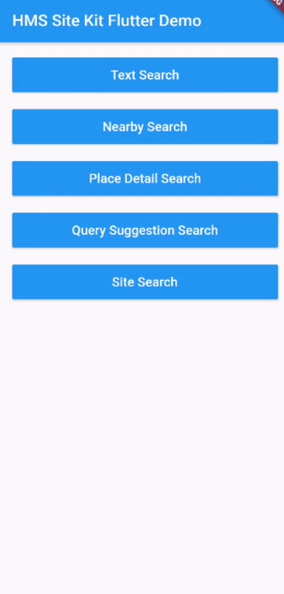

# Huawei Site Kit Flutter Plugin

## Table of Contents
* [Introduction](#introduction)
* [Installation Guide](#installation-guide)
    * [Creating Project in App Gallery Connect](#creating-project-in-app-gallery-connect)
    * [Configuring the Signing Certificate Fingerprint](#configuring-the-signing-certificate-fingerprint)
    * [Integrating Flutter Site Plugin](#integrating-flutter-site-plugin)
* [API Reference](#api-reference)
	* [SearchService](#searchservice)
    * [Data Types](#data-types)
        * [Overview](#overview)
        * [AddressDetail](#addressdetail)
        * [Coordinate](#coordinate)
        * [CoordinateBounds](#coordinatebounds)
        * [DetailSearchRequest](#detailsearchrequest)
        * [DetailSearchResponse](#detailsearchresponse)
        * [LocationType](#locationtype)
        * [HwLocationType](#hwlocationtype)
        * [NearbySearchRequest](#nearbysearchrequest)
        * [NearbySearchResponse](#nearbysearchresponse)
        * [OpeningHours](#openinghours)
        * [Period](#period)
        * [POI](#poi)
        * [QuerySuggestionRequest](#querysuggestionrequest)
        * [QuerySuggestionResponse](#querysuggestionresponse)
        * [Site](#site)
        * [SearchStatus](#searchstatus)
        * [SearchFilter](#searchfilter)
        * [SearchIntent](#searchintent)
        * [TextSearchRequest](#textsearchrequest) 
        * [TextSearchResponse](#textsearchresponse) 
        * [TimeOfWeek](#timeofweek)
* [Configuration Description](#configuration-description)
* [Sample Project](#sample-project)
* [Questions or Issues](questions-or-issues)
* [Licensing and Terms](#licensing-and-terms)

## Introduction

This plugin enables communication between Huawei Site SDK and Flutter platform. With Huawei Site Kit, your app can provide users with convenient and secure access to diverse, place-related services.


## Installation Guide

- Before you get started, you must register as a HUAWEI developer and complete identity verification on the [HUAWEI Developer](https://developer.huawei.com/consumer/en/) website. For details, please refer to [Register a HUAWEI ID](https://developer.huawei.com/consumer/en/doc/10104).

- Create an app in your project is required in AppGallery Connect in order to communicate with Huawei services. To create an app, perform the following steps:

### Creating Project in App Gallery Connect

**Step 1.** Sign in to [AppGallery Connect](https://developer.huawei.com/consumer/en)  and select My projects.

**Step 2.** Click your project from the project list.

**Step 3.** Go to **Project Setting** > **General information**, and click **Add app**.
If an app exists in the project, and you need to add a new one, expand the app selection area on the top of the page and click **Add app**.↵

**Step 4.** On the **Add app** page, enter app information, and click **OK**.

- A signing certificate fingerprint is used to verify the authenticity of an app when it attempts to access an HMS Core service through the HMS Core SDK. Before using HMS Core (APK), you must locally generate a signing certificate fingerprint and configure it in AppGallery Connect. Ensure that the JDK has been installed on your computer.

### Configuring the Signing Certificate Fingerprint
**Step 1:** Go to **Project Setting** > **General information**. In the **App information** field, click the  icon next to SHA-256 certificate fingerprint, and enter the obtained **SHA256 certificate fingerprint**.

**Step 2:**  After completing the configuration, click OK.

For details, please refer to [Generating a Signing Certificate](https://developer.huawei.com/consumer/en/codelab/HMSPreparation/index.html#3).

-To use Huawei Site Kit, you need to enable the Site Service first. For more information, please refer to [Enabling Services](https://developer.huawei.com/consumer/en/doc/distribution/app/agc-enable_service#h1-1574822945685).

### Integrating Flutter Site Plugin
**Step 1:** Sign in [AppGallery Connect](https://developer.huawei.com/consumer/en/service/josp/agc/index.html) to AppGallery Connect and select **My projects**.

**Step 2:** Find your app project, and click the desired app name.

**Step 3:** Go to **Project Setting >  > General information**. In the **App information** field, click **agconnect-service.json** to download configuration file.

**Step 4:** Create a Flutter project if you do not have one.

**Step 5:** Copy the **agconnect-service.json** file to the **android/app** directory of your Flutter project.

**Step 6:** Copy the signature file that is generated in **Generating a Signature File** to the android/app directory of your Flutter project.

**Step 7:** Check whether the **agconnect-services.json** file and signature file are successfully added to the **android/app** directory of the Flutter project.

**Step 8:** Open the **build.gradle** file in the **android** directory of your project.

- Go to **buildscript** then configure the Maven repository address and agconnect plugin for the  HMS SDK.

    ```gradle
        buildscript {
            repositories {
                google()
                jcenter()
                maven { url 'https://developer.huawei.com/repo/' }
            }

            dependencies {
                /* 
                 * <Other dependencies>
                 */
                classpath 'com.huawei.agconnect:agcp:1.4.1.300'
            }
        }
    ```

- Go to **allprojects** then configure the Maven repository address for the HMS SDK.

    ```gradle
        allprojects {
            repositories {
                google()
                jcenter()
                maven { url 'https://developer.huawei.com/repo/' }
            }
        }
     ```

**Step 9:** Open the **build.gradle** file in the **android/app** directory.

- Add `apply plugin: 'com.huawei.agconnect'` line after other `apply` entries.

    ```gradle
        apply plugin: 'com.android.application'
        apply from: "$flutterRoot/packages/flutter_tools/gradle/flutter.gradle"
        apply plugin: 'com.huawei.agconnect'
    ```

- Set your package name in **defaultConfig** > **applicationId** and set **minSdkVersion** to **19** or **higher**.

- Package name must match with the **package_name** entry in **agconnect-services.json** file.
    ```gradle
        defaultConfig {
                applicationId "<package_name>"
                minSdkVersion 19
                /*
                 * <Other configurations>
                 */
            }
     ```

- Copy the signature file that generated in [Generating a Signing Certificate](https://developer.huawei.com/consumer/en/codelab/HMSPreparation/index.html#3) to **android/app** directory.

- Configure the signature in **android** according to the signature file information.

    ```gradle
        android {
            /*
             * <Other configurations>
             */

            signingConfigs {
                config {
                    storeFile file('<keystore_file>.jks')
                    storePassword '<keystore_password>'
                    keyAlias '<key_alias>'
                    keyPassword '<key_password>'
                }
            }

            buildTypes {
                debug {
                    signingConfig signingConfigs.config
                }
                release {
                    minifyEnabled true
                    shrinkResources true
                    proguardFiles getDefaultProguardFile('proguard-android.txt'), 'proguard-rules.pro'
                    signingConfig signingConfigs.config
                }
            }
        }
    ```

- For Obfuscation Scripts, please refer to [Configuring Obfuscation Scripts](https://developer.huawei.com/consumer/en/doc/development/HMSCore-Guides/android-config-obfuscation-scripts-0000001050043957).

**Step 10:** On your Flutter project directory find and open your **pubspec.yaml** file and add library to dependencies. For more details please refer the [Using packages](https://flutter.dev/docs/development/packages-and-plugins/using-packages#dependencies-on-unpublished-packages) document.

```yaml
    dependencies:
        huawei_site:
            # Replace {library path} with actual library path of Huawei Site Kit Flutter Plugin.
            path: {library path}
```

- Replace {library path} with the actual library path of Flutter Site Plugin. The following are examples:
    - Relative path example: 
        `path: ../huawei_site`
    - Absolute path example: 
        `path: D:\Projects\Libraries\huawei_site`

**or**

Download the package from [pub.dev](https://pub.dev/publishers/developer.huawei.com/packages) and add it to dependencies in **pubspec.yaml** file.

```yaml
      dependencies:
        huawei_site: {library version}
```

**Step 11:** Run following command to update package info.

```
    [project_path]> flutter pub get
```

**Step 12:** Run following command to start the app.

```
    [project_path]> flutter run
```

## API Reference

### SearchService

Entry class of HUAWEI Site Kit.

#### Public Constructor Summary

|Constructor    |Function            |
|---------------|--------------------|
|SearchService()|Default constructor.|

#### Public Method Summary

|Method                         |Return Type                  |Description                                         |
|------------------------------|-----------------------------|---------------------------------------------------|
|textSearch(TextSearchRequest request)           |Future\<TextSearchResponse> |Returns a place list based on keywords entered by the user. |
|nearbySearch(NearbySearchRequest request)       |Future\<NearbySearchResponse> |Searches for nearby places based on the current location of the user's device. |
|detailSearch(DetailSearchRequest request)       |Future\<DetailSearchResponse> |Searches for details about a place. |
|querySuggestion(QuerySuggestionRequest request) Ffuture\<QuerySuggestionResponse> |Returns a list of place suggestions. |
|startSiteSearchActivity(SearchIntent searchIntent)  |Future\<Site> |Returns a Site object and obtains details about this place. |
|enableLogger()                      |Future\<void>               |Enables HMS Logger. |
|disableLogger()                     |Future\<void>               |Disables HMS Logger. |                

#### Public Constructors

##### SearchService()

Constructor for **SearchService** object.

#### Public Methods

##### Future\<TextSearchResponse> textSearch(TextSearchRequest request) *async*

Searches for places such as tourist attractions, enterprises, and schools based on a request object.

###### Parameters

|Name   |Description|
|-------|-----------|
|request|TextSearchRequest object.|

###### Return Type

|Return Type    |Description    |
|---------------|---------------|
|Future\<TextSearchResponse>|Result of places.|

###### Call Example
```dart
// Declare a SearchService object and instantiate it.
SearchService searchService = new SearchService();

// Create TextSearchRequest and its body.
TextSearchRequest request = new TextSearchRequest();
request.query = "Eiffel Tower";
request.location = Coordinate(  
     lat: 48.893478,  
     lng: 2.334595
  );
request.language = "en";
request.countryCode = "FR";
request.pageIndex = 1;
request.pageSize = 20;
request.radius = 5000;

// Create TextSearchResponse object.
// Call textSearch method.
// Assign the results.
TextSearchResponse response = await searchService.textSearch(request);
```

##### Future\<NearbySearchResponse> nearbySearch(NearbySearchRequest request) *async*

Searches for nearby places based on a request object.

###### Parameters

|Name   |Description|
|-------|-----------|
|request|NearbySearchRequest object.|

###### Return Type

|Return Type    |Description    |
|---------------|---------------|
|Future\<NearbySearchResponse>|Result of nearby places.|

###### Call Example
```dart
// Declare a SearchService object and instantiate it.
SearchService searchService = new SearchService();

// Create NearbySearchRequest and its body.
NearbySearchRequest request = NearbySearchRequest();
request.query = "Eiffel Tower";
request.location = Coordinate(
     lat: 48.893478,
     lng: 2.334595
  );
request.language = "en";
request.pageIndex = 1;
request.pageSize = 20;
request.radius = 5000;

// Create NearbySearchResponse object.
// Call nearbySearch method.
// Assign the results.
NearbySearchResponse response = await searchService.nearbySearch(request);
```

##### Future\<DetailSearchResponse> detailSearch(DetailSearchRequest request) *async*

Searches for details of a place based on a request object.

###### Parameters

|Name   |Description|
|-------|-----------|
|request|DetailSearchRequest object.|

###### Return Type

|Return Type    |Description    |
|---------------|---------------|
|Future\<DetailSearchResponse>|Details of a place.|

###### Call Example
```dart
// Declare a SearchService object and instantiate it.
SearchService searchService = new SearchService();

// Create DetailSearchRequest and its body.
DetailSearchRequest request = DetailSearchRequest();
request.siteId = "977B75943A9F01D561FF2073AE1D9353";
request.language = "en";

// Create DetailSearchResponse object.
// Call detailSearch method.
// Assign the results.
DetailSearchResponse response = await searchService.detailSearch(request);
```

##### Future\<QuerySuggestionResponse> querySuggestion(QuerySuggestionRequest request) *async*

Returns search suggestions during user input based on a request object.

###### Parameters

|Name   |Description|
|-------|-----------|
|request|QuerySuggestionRequest object.|

###### Return Type

|Return Type    |Description    |
|---------------|---------------|
|Future\<QuerySuggestionResponse>|Result of places.|

###### Call Example
```dart
// Declare a SearchService object and instantiate it.
SearchService searchService = new SearchService();

// Create QuerySuggestionRequest and its body.
QuerySuggestionRequest request = QuerySuggestionRequest();
request.query = "Paris";
request.location = Coordinate(  
     lat: 48.893478,  
     lng: 2.334595
  );
request.language = "en";
request.countryCode = "FR";
request.radius = 5000;

// Create QuerySuggestionResponse object.
// Call querySuggestion method.
// Assign the results.
QuerySuggestionResponse response = await searchService.querySuggestion(request);
```

##### Future\<Site> startSiteSearchActivity(SearchIntent searchIntent) *async*

Returns a Site object and obtains details about this place.

###### Parameters

|Name        |Description|
|------------|-----------|
|searchIntent|SearchIntent object.|

###### Return Type

|Return Type  |Description    |
|-------------|---------------|
|Future\<Site>|Details of chosen place.|

###### Call Example
```dart
// Declare a SearchService object and instantiate it.
SearchService searchService = new SearchService();

// Create SearchIntent and its body.
SearchIntent intent = SearchIntent();
intent.hint = "Enter search term";

// Create Site object.
// Call startSiteSearchActivity method.
// Assign the results.
Site site = await searchService.startSiteSearchActivity(intent);
```

##### Future\<void> enableLogger() *async*

This method enables HMSLogger capability which is used for sending usage analytics of Site SDK's methods to improve the service quality.

###### Return Type

|Return Type  |Description    |
|-------------|---------------|
|Future\<void>|Future result of an execution that returns no value.|

###### Call Example
```dart
// Declare a SearchService object and instantiate it.
SearchService searchService = new SearchService();

//call enableLogger() method.
searchService.enableLogger();
```

##### Future\<void> disableLogger() *async*

This method disables HMSLogger capability which is used for sending usage analytics of Site SDK's methods to improve the service quality.

###### Return Type

|Return Type  |Description    |
|-------------|---------------|
|Future\<void>|Future result of an execution that returns no value.|

###### Call Example
```dart
// Declare a SearchService object and instantiate it.
SearchService searchService = new SearchService();

//call disableLogger() method.
searchService.disableLogger();
```

##### Note

> HMS Logger is used for sending usage analytics of Site SDK's methods in order to improve the service quality. HMSLogger is enabled by default on the Huawei Site Kit Plugin for Flutter, it can be disabled with the `disableLogger()` method.

### Data Types

#### Overview

The following table describes detailed information about data types for interaction with Huawei Site Kit APIs.

|          Class          |                                   Description                                    |
|-------------------------|----------------------------------------------------------------------------------|
|      SearchService      |                      An entry interface of HUAWEI Site Kit.                      |
|      AddressDetail      |                        Represents details about a place.                         |
|       Coordinate        | Represents the location (that is, the latitude and longitude object) of a place. |
|    CoordinateBounds     |                          Represents coordinate bounds.                           |
|   DetailSearchRequest   |          Represents a request object used to search for place details.           |
|  DetailSearchResponse   |     Represents a response object containing the place details search result.     |
|      HwLocationType     |                          Enumerates Huawei place types.                          |
|      LocationType       |                             Enumerates place types.                              |
|   NearbySearchRequest   |          Represents a request object used to search for nearby places.           |
|  NearbySearchResponse   |     Represents a response object containing search results of nearby places.     |
|      OpeningHours       |                    Describes weekly opening hours of a place.                    |
|         Period          |                              Represents a period.                                |
|           Poi           |           Represents a POI object containing detailed POI information.           |
| QuerySuggestionRequest  |         Represents a request object used to provide search suggestions.          |
| QuerySuggestionResponse |           Represents a response object containing search suggestions.            |
|       SearchFilter      |                    Represents the criteria for Widget search.                    |
|       SearchIntent      |        Represents a search intent to start the search suggestion widget.         |
|       SearchStatus      |           Represents an object indicating the API call error status.             |
|          Site           |                    A model class representing a place object.                    |
|    TextSearchRequest    |        Represents a request object used to search for places by keyword.         |
|   TextSearchResponse    |      Represents a response object containing keyword-based search results.       |
|       TimeOfWeek        |                  Represents a time point on a day of the week.                   |

#### AddressDetail

An object that contains place details.

##### Public Properties

|Name       |Type   |Decription     |
|-----------|-------|---------------|
|adminArea  |String |Level-1 administrative region in a country, which is generally a province or state.|
|country    |String |Country name.  |
|countryCode|String |Country code, which complies with the ISO 3166-1 alpha-2 standards.|
|locality   |String |Level-3 administrative region in a country, which is generally a county or district.|
|postalCode |String |Postal code.   |
|streetNumber |String |Street number. |
|subAdminArea |String |Level-2 administrative region in a country, which is generally a city. |
|subLocality |String |Level-4 administrative region in a country, which is generally a town. |
|thoroughfare |String |Street. |

##### Public Constructor Summary

|Constructor |Description |
|------------|------------|
|AddressDetail({ String adminArea, String country, String countryCode, String locality, String postalCode, String streetNumber, String subAdminArea,  String subLocality, String thoroughfare}) |Default constructor. |
|AddressDetail.fromJson(String source) |Creates a AddressDetail object from a JSON string. |
|AddressDetail.fromMap(Map\<String, dynamic> map) |Creates a AddressDetail object from a Map. |

##### Public Constructors 

###### AddressDetail({String adminArea, String country, String countryCode, String locality, String postalCode, String streetNumber, String subAdminArea, String subLocality, String thoroughfare})

Constructor for AdressDetail object.

- For parameter descriptions, see [public properties](#public-properties).

###### AddressDetail.fromJson(String source)

Creates a AdressDetail object from a JSON string.

|Parameter |Type   |Description              |
|----------|-----  |-------------------------|
|source    |String |JSON string as a source. |

###### AddressDetail.fromMap(Map\<String, dynamic> map)

Creates a AddressDetail object from a map.

|Parameter |Type                  |Description      |
|----------|----------------------|-----------------|
|map       |Map\<String, dynamic> |Map as a source. |

#### Coordinate

Location, that is, the latitude and longitude, of a place.

##### Public Properties 

|Name |Type   |Description |
|-----|-------|------------|
|lat  |double |Latitude. |
|lng  |double |Longitude. |

##### Public Constructor Summary

|Constructor |Description |
|------------|------------|
|Coordinate({double lat, double lng}) |Default constructor. |
|Coordinate.fromJson(String source) |Creates a Coordinate object from a JSON string. |
|Coordinate.fromMap(Map\<String, dynamic> map) |Creates a Coordinate object from a Map. |

##### Public Constructors

###### Coordinate({double lat, double lng})

Constructor for Coordinate object.

- For parameter descriptions, see [public properties](#public-properties-1).

###### Coordinate.fromJson(String source)

Creates a Coordinate object from a JSON string.

|Parameter |Type   |Description              |
|----------|-----  |-------------------------|
|source    |String |JSON string as a source. |

###### Coordinate.fromMap(Map\<String, dynamic> map)

Creates a Coordinate object from a map.

|Parameter |Type                  |Description      |
|----------|----------------------|-----------------|
|map       |Map\<String, dynamic> |Map as a source. |

#### CoordinateBounds

Coordinate bounds.

##### Public Properties

|Name   |Type   |Description    |
|-------|-------|---------------|
|northeast |Coordinate |Coordinates of the northeast corner. |
|southwest |Coordinate |Coordinates of the southwest corner. |

##### Public Constructor Summary

|Constructor |Description |
|------------|------------|
|CoordinateBounds({Coordinate northeast, Coordinate southwest}) |Default constructor. |
|CoordinateBounds.fromJson(String source) |Creates a CoordinateBounds object from a JSON string. |
|CoordinateBounds.fromMap(Map\<String, dynamic> map) |Creates a CoordinateBounds object from a Map. |

##### Public Constructors

###### CoordinateBounds({Coordinate northeast, Coordinate southwest})

Constructor for CoordinateBounds object.

- For parameter descriptions, see [public properties](#public-properties-2).

###### CoordinateBounds.fromJson(String source)

Creates a CoordinateBounds object from a JSON string.

|Parameter |Type   |Description              |
|----------|-----  |-------------------------|
|source    |String |JSON string as a source. |

###### CoordinateBounds.fromMap(Map\<String, dynamic> map)

Creates a CoordinateBounds object from a map.

|Parameter |Type                  |Description      |
|----------|----------------------|-----------------|
|map       |Map\<String, dynamic> |Map as a source. |

#### DetailSearchRequest

Request object used to search for place details.

##### Public Properties

|Name   |Type   |Description    |
|-------|-------|---------------|
|siteId |String |Place ID. |
|language |String |Language in which search results are returned. If this parameter is not passed, the local language is used. |
|politicalView |String |Political view. The value is a two-digit country code that complies with the ISO 3166-1 alpha-2 standards. |

##### Public Constructor Summary

|Constructor    |Function   |
|---------------|-----------|
|DetailSearchRequest({String siteId, String language, String politicalView}) |Default constructor. |
|DetailSearchRequest.fromJson(String source) |Creates a DetailSearchRequst object from a JSON string. |
|DetailSearchRequest.fromMap(Map\<String, dynamic> map) |Creates a DetailSearchRequest object from a Map. |

##### Public Constructors

###### DetailSearchRequest({String siteId, String language, String politicalView})

Constructor for DetailSearchRequest object.

- For parameter descriptions, see [public properties](#public-properties-3).

###### DetailSearchRequest.fromJson(String source)

Creates a DetailSearchRequest object from a JSON string.

|Parameter |Type   |Description              |
|----------|-----  |-------------------------|
|source    |String |JSON string as a source. |

###### DetailSearchRequest.fromMap(Map\<String, dynamic> map)

Creates a DetailSearchRequest object from a map.

|Parameter |Type                  |Description      |
|----------|----------------------|-----------------|
|map       |Map\<String, dynamic> |Map as a source. |

#### DetailSearchResponse

Response object containing the place details search result.

##### Public Properties

|Name   |Type   |Description    |
|-------|-------|---------------|
|site   |Site   |Place object.  |

##### Public Constructor Summary

|Constructor    |Function   |
|---------------|-----------|
|DetailSearchResponse({Site site}) |Default constructor. |
|DetailSearchResponse.fromJson(String source) |Creates a DetailSearchResponse object from a JSON string. |
|DetailSearchResponse.fromMap(Map\<String, dynamic> map) |Creates a DetailSearchResponse object from a Map. |

##### Public Constructors 

###### DetailSearchResponse({Site site})

Constructor for DetailSearchResponse object.

- For parameter descriptions, see [public properties](#public-properties-4).

###### DetailSearchResponse.fromJson(String source)

Creates a DetailSearchResponse object from a JSON string.

|Parameter |Type   |Description              |
|----------|-----  |-------------------------|
|source    |String |JSON string as a source. |

###### DetailSearchResponse.fromMap(Map\<String, dynamic> map)

Creates a DetailSearchResponse object from a map.

|Parameter |Type                  |Description      |
|----------|----------------------|-----------------|
|map       |Map\<String, dynamic> |Map as a source. |

#### LocationType

Place types.

##### Public Constants
<details>
  <summary>Click to expand/collapse table</summary>

|Name   |Type   |Description    |
|-------|-------|---------------|
|ACCOUNTING|	LocationType|	Accounting firm.|
|ADDRESS|	LocationType|	Address.|
|ADMINISTRATIVE_AREA_LEVEL_1|	LocationType|	Level-1 administrative region.|
|ADMINISTRATIVE_AREA_LEVEL_2|	LocationType|	Level-2 administrative region.|
|ADMINISTRATIVE_AREA_LEVEL_3|	LocationType|	Level-3 administrative region.|
|ADMINISTRATIVE_AREA_LEVEL_4|	LocationType|	Level-4 administrative region.|
|ADMINISTRATIVE_AREA_LEVEL_5|	LocationType|	Level-5 administrative region.|
|AIRPORT|	LocationType|	Airport.|
|AMUSEMENTPARK|	LocationType|	Amusement park.|
|AQUARIUM|	LocationType|	Aquarium.|
|ARCHIPELAGO|	LocationType|	Archipelago.|
|ART_GALLERY|	LocationType|	Art gallery.|
|ATM|	LocationType|	Automatic teller machine (ATM).|
|BAKERY|	LocationType|	Bakery.|
|BANK|	LocationType|	Bank.|
|BAR|	LocationType|	Bar.|
|BEAUTY_SALON|	LocationType|	Beauty salon.|
|BICYCLE_STORE|	LocationType|	Bicycle store.|
|BOOK_STORE|	LocationType|	Bookstore.|
|BOWLING_ALLEY|	LocationType|	Bowling alley.|
|BUS_STATION|	LocationType|	Bus station.|
|CAFE|	LocationType|	Cafe.|
|CAMPGROUND|	LocationType|	Campsite.|
|CAPITAL|	LocationType|	Capital.|
|CAPITAL_CITY|	LocationType|	Capital city.|
|CAR_DEALER|	LocationType|	Automobile dealer.|
|CAR_RENTAL|	LocationType|	Car rental company.|
|CAR_REPAIR|	LocationType|	Vehicle repair plant.|
|CAR_WASH|	LocationType|	Car wash facility.|
|CASINO|	LocationType|	Casino.|
|CEMETERY|	LocationType|	Cemetery.|
|CHURCH|	LocationType|	Church.|
|CITIES|	LocationType|	Cities.|
|CITY_HALL|	LocationType|	City hall.|
|CLOTHING_STORE|	LocationType|	Clothing store.|
|COLLOQUIAL_AREA|	LocationType|	Colloquial area.|
|CONTINENT|	LocationType|	Continent.|
|CONVENIENCE_STORE|	LocationType|	Convenience store.|
|COUNTRY|	LocationType|	Country.|
|COURTHOUSE|	LocationType|	Court.|
|DENTIST|	LocationType|	Dentist.|
|DEPARTMENT_STORE|	LocationType|	Department store.|
|DOCTOR|	LocationType|	Doctor.|
|DRUGSTORE|	LocationType|	Drugstore.|
|ELECTRICIAN|	LocationType|	Electrician.|
|ELECTRONICS_STORE|	LocationType|	E-commerce store.|
|EMBASSY|	LocationType|	Embassy.|
|ESTABLISHMENT|	LocationType|	Establishment.|
|FINANCE|	LocationType|	Financial institution.|
|FIRE_STATION|	LocationType|	Fire station.|
|FLOOR|	LocationType|	Floor.|
|FLORIST|	LocationType|	Florist.|
|FOOD|	LocationType|	Food.|
|FUNERAL_HOME|	LocationType|	Funeral home.|
|FURNITURE_STORE|	LocationType|	Furniture store.|
|GAS_STATION|	LocationType|	Gas station.|
|GENERAL_CITY|	LocationType|	City.|
|GENERAL_CONTRACTOR|	LocationType|	General contractor.|
|GEOCODE|	LocationType|	Geocode.|
|GROCERY_OR_SUPERMARKET|	LocationType|	Grocery or supermarket.|
|GYM|	LocationType|	Gym.|
|HAIR_CARE|	LocationType|	Hair care.|
|HAMLET|	LocationType|	Hamlet.|
|HARDWARE_STORE|	LocationType|	Hardware store.|
|HEALTH|	LocationType|	Health care.|
|HINDU_TEMPLE|	LocationType|	Hindu temple.|
|HOME_GOODS_STORE|	LocationType|	Household goods store.|
|HOSPITAL|	LocationType|	Hospital.|
|INSURANCE_AGENCY|	LocationType|	Insurance company.|
|INTERSECTION|	LocationType|	Intersection.|
|JEWELRY_STORE|	LocationType|	Jewelry store.|
|LAUNDRY|	LocationType|	Laundry room.|
|LAWYER|	LocationType|	Law office.|
|LIBRARY|	LocationType|	Library.|
|LIGHT_RAIL_STATION|	LocationType|	Light rail station.|
|LIQUOR_STORE|	LocationType|	Liquor store.|
|LOCAL_GOVERNMENT_OFFICE|	LocationType|	Local government office.|
|LOCALITY|	LocationType|	Locality.|
|LOCKSMITH|	LocationType|	Locksmith.|
|LODGING|	LocationType|	Lodging.|
|MEAL_DELIVERY|	LocationType|	Food delivery.|
|MEAL_TAKEAWAY|	LocationType|	Takeout.|
|MOSQUE|	LocationType|	Mosque.|
|MOVIE_RENTAL|	LocationType|	Movie rental store.|
|MOVIE_THEATER|	LocationType|	Movie theater.|
|MOVING_COMPANY|	LocationType|	Moving company.|
|MUSEUM|	LocationType|	Museum.|
|NATURAL_FEATURE|	LocationType|	Natural feature.|
|NEIGHBORHOOD|	LocationType|	Neighborhood.|
|NIGHT_CLUB|	LocationType|	Nightclub.|
|OTHER|	LocationType|	Others.|
|PAINTER|	LocationType|	Painter.|
|PARK|	LocationType|	Park.|
|PARKING|	LocationType|	Parking lot.|
|PET_STORE|	LocationType|	Pet store.|
|PHARMACY|	LocationType|	Pharmacy.|
|PHYSIOTHERAPIST|	LocationType|	Physical therapist.|
|PLACE_OF_WORSHIP|	LocationType|	Place of worship.|
|PLUMBER|	LocationType|	Plumber.|
|POINT_OF_INTEREST|	LocationType|	Point of interest (POI).|
|POLICE|	LocationType|	Police.|
|POLITICAL|	LocationType|	Political place.|
|POSTAL_CODE|	LocationType|	Postal code.|
|POSTAL_CODE_PREFIX|	LocationType|	Postal code prefix.|
|POSTAL_CODE_SUFFIX|	LocationType|	Postal code suffix.|
|POSTAL_TOWN|	LocationType|	Postal town.|
|POST_BOX|	LocationType|	Mailbox.|
|POST_OFFICE|	LocationType|	Post office.|
|PREMISE|	LocationType|	Premises.|
|PRIMARY_SCHOOL|	LocationType|	Primary school.|
|REAL_ESTATE_AGENCY|	LocationType|	Real estate agency.|
|REGION|	LocationType|	Region.|
|REGIONS|	LocationType|	Regions.|
|RESTAURANT|	LocationType|	Restaurant.|
|ROOFING_CONTRACTOR|	LocationType|	Roofing contractor.|
|ROOM|	LocationType|	Room.|
|ROUTE|	LocationType|	Route.|
|RV_PARK|	LocationType|	Recreational vehicle park.|
|SCHOOL|	LocationType|	School.|
|SECONDARY_SCHOOL|	LocationType|	Secondary school.|
|SHOE_STORE|	LocationType|	Shoe store.|
|SHOPPING_MALL|	LocationType|	Shopping mall.|
|SPA|	LocationType|	Spa.|
|STADIUM|	LocationType|	Stadium.|
|STORAGE|	LocationType|	Storage.|
|STORE|	LocationType|	Store.|
|STREET_ADDRESS|	LocationType|	Street address.|
|STREET_NUMBER|	LocationType|	Street number.|
|SUBLOCALITY|	LocationType|	Sub-locality.|
|SUBLOCALITY_LEVEL_1|	LocationType|	Level-1 sub-locality.|
|SUBLOCALITY_LEVEL_2|	LocationType|	Level-2 sub-locality.|
|SUBLOCALITY_LEVEL_3|	LocationType|	Level-3 sub-locality.|
|SUBLOCALITY_LEVEL_4|	LocationType|	Level-4 sub-locality.|
|SUBLOCALITY_LEVEL_5|	LocationType|	Level-5 sub-locality.|
|SUBPREMISE|	LocationType|	Sub-premises.|
|SUBWAY_STATION|	LocationType|	Subway station.|
|SUPERMARKET|	LocationType|	Supermarket.|
|SYNAGOGUE|	LocationType|	Synagogue.|
|TAXI_STAND|	LocationType|	Taxi stand.|
|TOURIST_ATTRACTION|	LocationType|	Tourist attraction.|
|TOWN|	LocationType|	Town.|
|TOWN_SQUARE|	LocationType|	Town square.|
|TRAIN_STATION|	LocationType|	Railway station.|
|TRANSIT_STATION|	LocationType|	Transit station.|
|TRAVEL_AGENCY|	LocationType|	Travel agency.|
|UNIVERSITY|	LocationType|	University.|
|VETERINARY_CARE|	LocationType|	Veterinary care.|
|ZOO|	LocationType|	Zoo.|
</details>

#### HwLocationType

Huawei place types.

##### Public Constants

<details>
  <summary>Click to expand/collapse table</summary>

|Name   |Type   |Description    |
|-------|-------|---------------|
|ACCESS_GATEWAY|	HwLocationType|	Access gateway.|
|ADDRESS|	HwLocationType|	Address.|
|ADMIN_FEATURE|	HwLocationType|	Admin feature.|
|ADMINISTRATIVE_AREA_LEVEL_1|	HwLocationType|	Level-1 administrative region.|
|ADMINISTRATIVE_AREA_LEVEL_2|	HwLocationType|	Level-2 administrative region.|
|ADMINISTRATIVE_AREA_LEVEL_3|	HwLocationType|	Level-3 administrative region.|
|ADMINISTRATIVE_AREA_LEVEL_4|	HwLocationType|	Level-4 administrative region.|
|ADVENTURE_SPORTS_VENUE|	HwLocationType|	Adventure sports venue.|
|ADVENTURE_VEHICLE_TRAIL|	HwLocationType|	Adventure vehicle trail.|
|ADVERTISING_AND_MARKETING_COMPANY|	HwLocationType|	Advertising and marketing company.|
|AFGHAN_RESTAURANT|	HwLocationType|	Afghan restaurant.|
|AFRICAN_RESTAURANT|	HwLocationType|	African restaurant.|
|AGRICULTURAL_SUPPLY_STORE|	HwLocationType|	Agricultural supply store.|
|AGRICULTURAL_TECHNOLOGY_COMPANY|	HwLocationType|	Agricultural technology company.|
|AGRICULTURE_BUSINESS|	HwLocationType|	Agriculture business.|
|AIRFIELD|	HwLocationType|	Airfield.|
|AIRLINE|	HwLocationType|	Airline.|
|AIRLINE_ACCESS|	HwLocationType|	Airline access.|
|AIRPORT|	HwLocationType|	Airport.|
|ALGERIAN_RESTAURANT|	HwLocationType|	Algerian restaurant.|
|AMBULANCE_UNIT|	HwLocationType|	Ambulance unit.|
|AMERICAN_RESTAURANT|	HwLocationType|	American restaurant.|
|AMPHITHEATER|	HwLocationType|	Amphitheater.|
|AMUSEMENT_ARCADE|	HwLocationType|	Amusement arcade.|
|AMUSEMENT_PARK|	HwLocationType|	Amusement park.|
|AMUSEMENT_PLACE|	HwLocationType|	Amusement place.|
|ANIMAL_SERVICE_STORE|	HwLocationType|	Animal service store.|
|ANIMAL_SHELTER|	HwLocationType|	Animal shelter.|
|ANTIQUE_ART_STORE|	HwLocationType|	Antique art store.|
|APARTMENT|	HwLocationType|	Apartment.|
|AQUATIC_ZOO_MARINE_PARK|	HwLocationType|	Aquatic zoo marine park.|
|ARABIAN_RESTAURANT|	HwLocationType|	Arabian restaurant.|
|ARBORETA_BOTANICAL_GARDENS|	HwLocationType|	Arboreta botanical gardens.|
|ARCH|	HwLocationType|	Arch.|
|ARGENTINEAN_RESTAURANT|	HwLocationType|	Argentinean restaurant.|
|ARMENIAN_RESTAURANT|	HwLocationType|	Armenian restaurant.|
|ART_MUSEUM|	HwLocationType|	Art museum.|
|ART_SCHOOL|	HwLocationType|	Art school.|
|ASHRAM|	HwLocationType|	Ashram.|
|ASIAN_RESTAURANT|	HwLocationType|	Asian restaurant.|
|ATHLETIC_STADIUM|	HwLocationType|	Athletic stadium.|
|ATV_SNOWMOBILE_DEALER|	HwLocationType|	Atv snowmobile dealer.|
|AUSTRALIAN_RESTAURANT|	HwLocationType|	Australian restaurant.|
|AUSTRIAN_RESTAURANT|	HwLocationType|	Austrian restaurant.|
|AUTOMATIC_TELLER_MACHINE|	HwLocationType|	Automatic teller machine.|
|AUTOMOBILE_ACCESSORIES_SHOP|	HwLocationType|	Automobile accessories shop.|
|AUTOMOBILE_COMPANY|	HwLocationType|	Automobile company.|
|AUTOMOBILE_MANUFACTURING_COMPANY|	HwLocationType|	Automobile manufacturing company.|
|AUTOMOTIVE|	HwLocationType|	Automotive.|
|AUTOMOTIVE_DEALER|	HwLocationType|	Automotive dealer.|
|AUTOMOTIVE_GLASS_REPLACEMENT_SHOP|	HwLocationType|	Automotive glass replacement shop.|
|AUTOMOTIVE_REPAIR_SHOP|	HwLocationType|	Automotive repair shop.|
|BADMINTON_COURT|	HwLocationType|	Badminton court.|
|BAGS_LEATHERWEAR_SHOP|	HwLocationType|	Bags leatherwear shop.|
|BAKERY|	HwLocationType|	Bakery.|
|BANK|	HwLocationType|	Bank.|
|BANQUET_ROOM|	HwLocationType|	Banquet room.|
|BAR|	HwLocationType|	Bar.|
|BARBECUE_RESTAURANT|	HwLocationType|	Barbecue restaurant.|
|BASEBALL_FIELD|	HwLocationType|	Baseball field.|
|BASKETBALL_COURT|	HwLocationType|	Basketball court.|
|BASQUE_RESTAURANT|	HwLocationType|	Basque restaurant.|
|BATTLEFIELD|	HwLocationType|	Battlefield.|
|BAY|	HwLocationType|	Bay.|
|BEACH|	HwLocationType|	Beach.|
|BEACH_CLUB|	HwLocationType|	Beach club.|
|BEAUTY_SALON|	HwLocationType|	Beauty salon.|
|BEAUTY_SUPPLY_SHOP|	HwLocationType|	Beauty supply shop.|
|BED_BREAKFAST_GUEST_HOUSES|	HwLocationType|	Bed breakfast guest houses.|
|BELGIAN_RESTAURANT|	HwLocationType|	Belgian restaurant.|
|BETTING_STATION|	HwLocationType|	Betting station.|
|BICYCLE_PARKING_PLACE|	HwLocationType|	Bicycle parking place.|
|BICYCLE_SHARING_LOCATION|	HwLocationType|	Bicycle sharing location.|
|BILLIARDS_POOL_HALL|	HwLocationType|	Billiards pool hall.|
|BISTRO|	HwLocationType|	Bistro.|
|BLOOD_BANK|	HwLocationType|	Blood bank.|
|BOAT_DEALER|	HwLocationType|	Boat dealer.|
|BOAT_FERRY|	HwLocationType|	Boat ferry.|
|BOAT_LAUNCHING_RAMP|	HwLocationType|	Boat launching ramp.|
|BOATING_EQUIPMENT_ACCESSORIES_STORE|	HwLocationType|	Boating equipment accessories store.|
|BODYSHOPS|	HwLocationType|	Bodyshops.|
|BOLIVIAN_RESTAURANT|	HwLocationType|	Bolivian restaurant.|
|BOOKSTORE|	HwLocationType|	Bookstore.|
|BORDER_POST|	HwLocationType|	Border post.|
|BOSNIAN_RESTAURANT|	HwLocationType|	Bosnian restaurant.|
|BOWLING_FIELD|	HwLocationType|	Bowling field.|
|BRAZILIAN_RESTAURANT|	HwLocationType|	Brazilian restaurant.|
|BRIDGE|	HwLocationType|	Bridge.|
|BRIDGE_TUNNEL_ENGINEERING_COMPANY|	HwLocationType|	Bridge tunnel engineering company.|
|BRITISH_RESTAURANT|	HwLocationType|	British restaurant.|
|BUDDHIST_TEMPLE|	HwLocationType|	Buddhist temple.|
|BUFFET|	HwLocationType|	Buffet.|
|BUILDING|	HwLocationType|	Building.|
|BULGARIAN_RESTAURANT|	HwLocationType|	Bulgarian restaurant.|
|BUNGALOW|	HwLocationType|	Bungalow.|
|BURMESE_RESTAURANT|	HwLocationType|	Burmese restaurant.|
|BUS_CHARTER_RENTAL_COMPANY|	HwLocationType|	Bus charter rental company.|
|BUS_COMPANY|	HwLocationType|	Bus company.|
|BUS_DEALER|	HwLocationType|	Bus dealer.|
|BUS_STOP|	HwLocationType|	Bus stop.|
|BUSINESS|	HwLocationType|	Business.|
|BUSINESS_PARK|	HwLocationType|	Business park.|
|BUSINESS_SERVICES_COMPANY|	HwLocationType|	Business services company.|
|CABARET|	HwLocationType|	Cabaret.|
|CABINS_LODGES|	HwLocationType|	Cabins lodges.|
|CABLE_TELEPHONE_COMPANY|	HwLocationType|	Cable telephone company.|
|CAFE|	HwLocationType|	Cafe.|
|CAFE_PUB|	HwLocationType|	Cafe pub.|
|CAFETERIA|	HwLocationType|	Cafeteria.|
|CALIFORNIAN_RESTAURANT|	HwLocationType|	Californian restaurant.|
|CAMBODIAN_RESTAURANT|	HwLocationType|	Cambodian restaurant.|
|CAMPING_GROUND|	HwLocationType|	Camping ground.|
|CANADIAN_RESTAURANT|	HwLocationType|	Canadian restaurant.|
|CAPE|	HwLocationType|	Cape.|
|CAPITAL|	HwLocationType|	Capital.|
|CAPITAL_CITY|	HwLocationType|	Capital city.|
|CAR_CLUB|	HwLocationType|	Car club.|
|CAR_DEALER|	HwLocationType|	Car dealer.|
|CAR_RENTAL|	HwLocationType|	Car rental.|
|CAR_RENTAL_COMPANY|	HwLocationType|	Car rental company.|
|CAR_WASH|	HwLocationType|	Car wash.|
|CAR_WASH_SUB|	HwLocationType|	Car wash sub.|
|CARAVAN_SITE|	HwLocationType|	Caravan site.|
|CARGO_CENTER|	HwLocationType|	Cargo center.|
|CARIBBEAN_RESTAURANT|	HwLocationType|	Caribbean restaurant.|
|CARPET_FLOOR_COVERING_STORE|	HwLocationType|	Carpet floor covering store.|
|CASINO|	HwLocationType|	Casino.|
|CATERING_COMPANY|	HwLocationType|	Catering company.|
|CAVE|	HwLocationType|	Cave.|
|CD_DVD_VIDEO_RENTAL_STORE|	HwLocationType|	Cd-dvd video rental store.|
|CD_DVD_VIDEO_STORE|	HwLocationType|	Cd-dvd video store.|
|CD_DVD_VIDEO_STORE_SUB|	HwLocationType|	Cd-dvd video store sub.|
|CEMETERY|	HwLocationType|	Cemetery.|
|CHALET|	HwLocationType|	Chalet.|
|CHEMICAL_COMPANY|	HwLocationType|	Chemical company.|
|CHICKEN_RESTAURANT|	HwLocationType|	Chicken restaurant.|
|CHILD_CARE_FACILITY|	HwLocationType|	Child care facility.|
|CHILDRENS_MUSEUM|	HwLocationType|	Childrens museum.|
|CHILEAN_RESTAURANT|	HwLocationType|	Chilean restaurant.|
|CHINESE_MEDICINE_HOSPITAL|	HwLocationType|	Chinese medicine hospital.|
|CHINESE_RESTAURANT|	HwLocationType|	Chinese restaurant.|
|CHRISTMAS_HOLIDAY_STORE|	HwLocationType|	Christmas holiday store.|
|CHURCH|	HwLocationType|	Church.|
|CINEMA|	HwLocationType|	Cinema.|
|CINEMA_SUB|	HwLocationType|	Cinema sub.|
|CITIES|	HwLocationType|	Cities.|
|CITY_CENTER|	HwLocationType|	City center.|
|CITY_HALL|	HwLocationType|	City hall.|
|CIVIC_COMMUNITY_CENTER|	HwLocationType|	Civic community center.|
|CLEANING_SERVICE_COMPANY|	HwLocationType|	Cleaning service company.|
|CLOTHING_ACCESSORIES_STORE|	HwLocationType|	Clothing accessories store.|
|CLUB_ASSOCIATION|	HwLocationType|	Club association.|
|COACH_PARKING_AREA|	HwLocationType|	Coach parking area.|
|COACH_STATION|	HwLocationType|	Coach station.|
|COCKTAIL_BAR|	HwLocationType|	Cocktail bar.|
|COFFEE_SHOP|	HwLocationType|	Coffee shop.|
|COLLEGE_UNIVERSITY|	HwLocationType|	College university.|
|COLOMBIAN_RESTAURANT|	HwLocationType|	Colombian restaurant.|
|COMEDY_CLUB|	HwLocationType|	Comedy club.|
|COMMERCIAL_BUILDING|	HwLocationType|	Commercial building.|
|COMMUNITY_CENTER|	HwLocationType|	Community center.|
|COMPANY|	HwLocationType|	Company.|
|COMPUTER_AND_DATA_SERVICES_CORPORATION|	HwLocationType|	Computer and data services corporation.|
|COMPUTER_SOFTWARE_COMPANY|	HwLocationType|	Computer software company.|
|COMPUTER_STORE|	HwLocationType|	Computer store.|
|CONCERT_HALL|	HwLocationType|	Concert hall.|
|CONDOMINIUM_COMPLEX|	HwLocationType|	Condominium complex.|
|CONSTRUCTION_COMPANY|	HwLocationType|	Construction company.|
|CONSTRUCTION_MATERIAL_EQUIPMENT_SHOP|	HwLocationType|	Construction material equipment shop.|
|CONSUMER_ELECTRONICS_STORE|	HwLocationType|	Consumer electronics store.|
|CONTINENT|	HwLocationType|	Continent.|
|CONVENIENCE_STORE|	HwLocationType|	Convenience store.|
|CORSICAN_RESTAURANT|	HwLocationType|	Corsican restaurant.|
|COTTAGE|	HwLocationType|	Cottage.|
|COUNTRY|	HwLocationType|	Country.|
|COUNTY|	HwLocationType|	County.|
|COUNTY_COUNCIL|	HwLocationType|	County council.|
|COURIER_DROP_BOX|	HwLocationType|	Courier drop box.|
|COURTHOUSE|	HwLocationType|	Courthouse.|
|COVE|	HwLocationType|	Cove.|
|CREOLE_CAJUN_RESTAURANT|	HwLocationType|	Creole cajun restaurant.|
|CREPERIE|	HwLocationType|	Creperie.|
|CRICKET_GROUND|	HwLocationType|	Cricket ground.|
|CUBAN_RESTAURANT|	HwLocationType|	Cuban restaurant.|
|CULINARY_SCHOOL|	HwLocationType|	Culinary school.|
|CULTURAL_CENTER|	HwLocationType|	Cultural center.|
|CURRENCY_EXCHANGE|	HwLocationType|	Currency exchange.|
|CURTAIN_TEXTILE_STORE|	HwLocationType|	Curtain textile store.|
|CYPRIOT_RESTAURANT|	HwLocationType|	Cypriot restaurant.|
|CZECH_RESTAURANT|	HwLocationType|	Czech restaurant.|
|DAM|	HwLocationType|	Dam.|
|DANCE_STUDIO_SCHOOL|	HwLocationType|	Dance studio school.|
|DANCING_CLUB|	HwLocationType|	Dancing club.|
|DANISH_RESTAURANT|	HwLocationType|	Danish restaurant.|
|DELICATESSEN_STORE|	HwLocationType|	Delicatessen store.|
|DELIVERY_ENTRANCE|	HwLocationType|	Delivery entrance.|
|DENTAL_CLINIC|	HwLocationType|	Dental clinic.|
|DEPARTMENT_STORE|	HwLocationType|	Department store.|
|DHARMA_TEMPLE|	HwLocationType|	Dharma temple.|
|DINNER_THEATER|	HwLocationType|	Dinner theater.|
|DISCOTHEQUE|	HwLocationType|	Discotheque.|
|DIVERSIFIED_FINANCIAL_SERVICE_COMPANY|	HwLocationType|	Diversified financial service company.|
|DIVING_CENTER|	HwLocationType|	Diving center.|
|DO_IT_YOURSELF_CENTERS|	HwLocationType|	Do it yourself centers.|
|DOCK|	HwLocationType|	Dock.|
|DOMINICAN_RESTAURANT|	HwLocationType|	Dominican restaurant.|
|DONGBEI_RESTAURANT|	HwLocationType|	Dongbei restaurant.|
|DOUGHNUT_SHOP|	HwLocationType|	Doughnut shop.|
|DRIVE_IN_CINEMA|	HwLocationType|	Drive in cinema.|
|DRIVE_THROUGH_BOTTLE_SHOP|	HwLocationType|	Drive through bottle shop.|
|DRIVING_SCHOOL|	HwLocationType|	Driving school.|
|DRUGSTORE|	HwLocationType|	Drugstore.|
|DRY_CLEANERS|	HwLocationType|	Dry cleaners.|
|DUNE|	HwLocationType|	Dune.|
|DUTCH_RESTAURANT|	HwLocationType|	Dutch restaurant.|
|EARTHQUAKE_ASSEMBLY_POINT_|	HwLocationType|	Earthquake assembly point.|
|EATING_DRINKING|	HwLocationType|	Eating drinking.|
|EDUCATION_INSTITUTION|	HwLocationType|	Education institution.|
|EGYPTIAN_RESTAURANT|	HwLocationType|	Egyptian restaurant.|
|ELECTRIC_VEHICLE_CHARGING_STATION|	HwLocationType|	Electric vehicle charging station.|
|ELECTRICAL_APPLIANCE_STORE|	HwLocationType|	Electrical appliance store.|
|ELECTRICAL_APPLIANCE_STORE_SUB|	HwLocationType|	Electrical appliance store sub.|
|ELECTRONICS_COMPANY|	HwLocationType|	Electronics company.|
|ELECTRONICS_STORE|	HwLocationType|	Electronics store.|
|EMBASSY|	HwLocationType|	Embassy.|
|EMERGENCY_ASSEMBLY_POINT|	HwLocationType|	Emergency assembly point.|
|EMERGENCY_MEDICAL_SERVICE_CENTER|	HwLocationType|	Emergency medical service center.|
|EMERGENCY_ROOM|	HwLocationType|	Emergency room.|
|ENGLISH_RESTAURANT|	HwLocationType|	English restaurant.|
|ENTERTAINMENT_CABARET_LIVE|	HwLocationType|	Entertainment cabaret live.|
|ENTERTAINMENT_PLACE|	HwLocationType|	Entertainment place.|
|EQUIPMENT_RENTAL_COMPANY|	HwLocationType|	Equipment rental company.|
|EROTIC_RESTAURANT|	HwLocationType|	Erotic restaurant.|
|ESTABLISHMENT|	HwLocationType|	Establishment.|
|ETHIOPIAN_RESTAURANT|	HwLocationType|	Ethiopian restaurant.|
|EXCHANGE|	HwLocationType|	Exchange.|
|EXHIBITION_CONVENTION_CENTER|	HwLocationType|	Exhibition convention center.|
|EXOTIC_RESTAURANT|	HwLocationType|	Exotic restaurant.|
|FACTORY_OUTLETS|	HwLocationType|	Factory outlets.|
|FAIRGROUND|	HwLocationType|	Fairground.|
|FARM|	HwLocationType|	Farm.|
|FARMER_MARKET|	HwLocationType|	Farmer market.|
|FAST_FOOD_RESTAURANT|	HwLocationType|	Fast food restaurant.|
|FERRY_TERMINAL|	HwLocationType|	Ferry terminal.|
|FILIPINO_RESTAURANT|	HwLocationType|	Filipino restaurant.|
|FINNISH_RESTAURANT|	HwLocationType|	Finnish restaurant.|
|FIRE_ASSEMBLY_POINT|	HwLocationType|	Fire assembly point.|
|FIRE_STATION_BRIGADE|	HwLocationType|	Fire station brigade.|
|FISH_STORE|	HwLocationType|	Fish store.|
|FISHING_HUNTING_AREA|	HwLocationType|	Fishing hunting area.|
|FITNESS_CLUB_CENTER|	HwLocationType|	Fitness club center.|
|FIVE_STAR_HOTEL|	HwLocationType|	Five star hotel.|
|FLATS_APARTMENT_COMPLEX|	HwLocationType|	Flats apartment complex.|
|FLOOD_ASSEMBLY_POINT|	HwLocationType|	Flood assembly point.|
|FLORISTS|	HwLocationType|	Florists.|
|FLYING_CLUB|	HwLocationType|	Flying club.|
|FONDUE_RESTAURANT|	HwLocationType|	Fondue restaurant.|
|FOOD_DRINK_SHOP|	HwLocationType|	Food drink shop.|
|FOOD_MARKET|	HwLocationType|	Food market.|
|FOOTBALL_FIELD|	HwLocationType|	Football field.|
|FOREST_AREA|	HwLocationType|	Forest area.|
|FOUR_STAR_HOTEL|	HwLocationType|	Four star hotel.|
|FRENCH_RESTAURANT|	HwLocationType|	French restaurant.|
|FUNERAL_SERVICE_COMPANY|	HwLocationType|	Funeral service company.|
|FURNITURE_ACCESSORIES_STORE|	HwLocationType|	Furniture accessories store.|
|FURNITURE_STORE|	HwLocationType|	Furniture store.|
|FUSION_RESTAURANT|	HwLocationType|	Fusion restaurant.|
|GALLERY|	HwLocationType|	Gallery.|
|GARDENING_CERVICE_CENTER|	HwLocationType|	Gardening cervice center.|
|GENERAL_AUTO_REPAIR_SERVICE_CENTER|	HwLocationType|	General auto repair service center.|
|GENERAL_CITY|	HwLocationType|	General city.|
|GENERAL_CLINIC|	HwLocationType|	General clinic.|
|GENERAL_HOSPITAL|	HwLocationType|	General hospital.|
|GENERAL_POST_OFFICE|	HwLocationType|	General post office.|
|GEOCODE|	HwLocationType|	Geocode.|
|GEOGRAPHIC_FEATURE|	HwLocationType|	Geographic feature.|
|GERMAN_RESTAURANT|	HwLocationType|	German restaurant.|
|GIFT_STORE|	HwLocationType|	Gift store.|
|GLASS_WINDOW_STORE|	HwLocationType|	Glass window store.|
|GLASSWARE_CERAMIC_SHOP|	HwLocationType|	Glassware ceramic shop.|
|GOLD_EXCHANGE|	HwLocationType|	Gold exchange.|
|GOLF_COURSE|	HwLocationType|	Golf course.|
|GOVERNMENT_OFFICE|	HwLocationType|	Government office.|
|GOVERNMENT_PUBLIC_SERVICE|	HwLocationType|	Government public service.|
|GREEK_RESTAURANT|	HwLocationType|	Greek restaurant.|
|GREENGROCERY|	HwLocationType|	Greengrocery.|
|GRILL|	HwLocationType|	Grill.|
|GROCERY|	HwLocationType|	Grocery.|
|GUANGDONG_RESTAURANT|	HwLocationType|	Guangdong restaurant.|
|GURUDWARA|	HwLocationType|	Gurudwara.|
|HAIR_SALON_BARBERSHOP|	HwLocationType|	Hair salon barbershop.|
|HAMBURGER_RESTAURANT|	HwLocationType|	Hamburger restaurant.|
|HAMLET|	HwLocationType|	Hamlet.|
|HARBOR|	HwLocationType|	Harbor.|
|HARDWARE_STORE|	HwLocationType|	Hardware store.|
|HEALTH_CARE|	HwLocationType|	Health care.|
|HEALTHCARE_SERVICE_CENTER|	HwLocationType|	Healthcare service center.|
|HELIPAD_HELICOPTER_LANDING|	HwLocationType|	Helipad helicopter landing.|
|HIGH_SCHOOL|	HwLocationType|	High school.|
|HIGHWAY__ENTRANCE|	HwLocationType|	Highway entrance.|
|HIGHWAY_EXIT|	HwLocationType|	Highway exit.|
|HIKING_TRAIL|	HwLocationType|	Hiking trail.|
|HILL|	HwLocationType|	Hill.|
|HINDU_TEMPLE|	HwLocationType|	Hindu temple.|
|HISTORIC_SITE|	HwLocationType|	Historic site.|
|HISTORICAL_PARK|	HwLocationType|	Historical park.|
|HISTORY_MUSEUM|	HwLocationType|	History museum.|
|HOBBY_SHOP|	HwLocationType|	Hobby shop.|
|HOCKEY_CLUB|	HwLocationType|	Hockey club.|
|HOCKEY_FIELD|	HwLocationType|	Hockey field.|
|HOLIDAY_HOUSE_RENTAL|	HwLocationType|	Holiday house rental.|
|HOME_APPLIANCE_REPAIR_COMPANY|	HwLocationType|	Home appliance repair company.|
|HOME_GOODS_STORE|	HwLocationType|	Home goods store.|
|HORSE_RACING_TRACK|	HwLocationType|	Horse racing track.|
|HORSE_RIDING_FIELD|	HwLocationType|	Horse riding field.|
|HORSE_RIDING_TRAIL|	HwLocationType|	Horse riding trail.|
|HORTICULTURE_COMPANY|	HwLocationType|	Horticulture company.|
|HOSPITAL_FOR_WOMEN_AND_CHILDREN|	HwLocationType|	Hospital for women and children.|
|HOSPITAL_POLYCLINIC|	HwLocationType|	Hospital polyclinic.|
|HOSTEL|	HwLocationType|	Hostel.|
|HOT_POT_RESTAURANT|	HwLocationType|	Hot pot restaurant.|
|HOTEL|	HwLocationType|	Hotel.|
|HOTEL_MOTEL|	HwLocationType|	Hotel motel.|
|HOTELS_WITH_LESS_THAN_TWO_STARS|	HwLocationType|	Hotels with less than two stars.|
|HOUSEHOLD_APPLIANCE_STORE|	HwLocationType|	Household appliance store.|
|HUNAN_RESTAURANT|	HwLocationType|	Hunan restaurant.|
|HUNGARIAN_RESTAURANT|	HwLocationType|	Hungarian restaurant.|
|ICE_CREAM_PARLOR|	HwLocationType|	Ice cream parlor.|
|ICE_HOCKEY_RINK|	HwLocationType|	Ice hockey rink.|
|ICE_SKATING_RINK|	HwLocationType|	Ice skating rink.|
|IMPORT_AND_EXPORT_DISTRIBUTION_COMPANY|	HwLocationType|	Import and export distribution company.|
|IMPORTANT_TOURIST_ATTRACTION|	HwLocationType|	Important tourist attraction.|
|INDIAN_RESTAURANT|	HwLocationType|	Indian restaurant.|
|INDONESIAN_RESTAURANT|	HwLocationType|	Indonesian restaurant.|
|INDUSTRIAL_BUILDING|	HwLocationType|	Industrial building.|
|INFORMAL_MARKET|	HwLocationType|	Informal market.|
|INSURANCE_COMPANY|	HwLocationType|	Insurance company.|
|INTERCITY_RAILWAY_STATION|	HwLocationType|	Intercity railway station.|
|INTERNATIONAL_ORGANIZATION|	HwLocationType|	International organization.|
|INTERNATIONAL_RAILWAY_STATION|	HwLocationType|	International railway station.|
|INTERNATIONAL_RESTAURANT|	HwLocationType|	International restaurant.|
|INTERNET_CAFE|	HwLocationType|	Internet cafe.|
|INVESTMENT_CONSULTING_FIRM|	HwLocationType|	Investment consulting firm.|
|IRANIAN_RESTAURANT|	HwLocationType|	Iranian restaurant.|
|IRISH_RESTAURANT|	HwLocationType|	Irish restaurant.|
|ISLAND|	HwLocationType|	Island.|
|ISRAELI_RESTAURANT|	HwLocationType|	Israeli restaurant.|
|ITALIAN_RESTAURANT|	HwLocationType|	Italian restaurant.|
|JAIN_TEMPLE|	HwLocationType|	Jain temple.|
|JAMAICAN_RESTAURANT|	HwLocationType|	Jamaican restaurant.|
|JAPANESE_RESTAURANT|	HwLocationType|	Japanese restaurant.|
|JAZZ_CLUB|	HwLocationType|	Jazz club.|
|JEWELRY_CLOCK_AND_WATCH_SHOP|	HwLocationType|	Jewelry clock and watch shop.|
|JEWISH_RESTAURANT|	HwLocationType|	Jewish restaurant.|
|JUNIOR_COLLEGE_COMMUNITY_COLLEGE|	HwLocationType|	Junior college community college.|
|KARAOKE_CLUB|	HwLocationType|	Karaoke club.|
|KITCHEN_AND_SANITATION_STORE|	HwLocationType|	Kitchen and sanitation store.|
|KOREAN_RESTAURANT|	HwLocationType|	Korean restaurant.|
|KOSHER_RESTAURANT|	HwLocationType|	Kosher restaurant.|
|LAGOON|	HwLocationType|	Lagoon.|
|LAKESHORE|	HwLocationType|	Lakeshore.|
|LANGUAGE_SCHOOL|	HwLocationType|	Language school.|
|LATIN_AMERICAN_RESTAURANT|	HwLocationType|	Latin american restaurant.|
|LAUNDRY|	HwLocationType|	Laundry.|
|LEBANESE_RESTAURANT|	HwLocationType|	Lebanese restaurant.|
|LEGAL_SERVICE_COMPANY|	HwLocationType|	Legal service company.|
|LEISURE|	HwLocationType|	Leisure.|
|LEISURE_CENTER|	HwLocationType|	Leisure center.|
|LIBRARY|	HwLocationType|	Library.|
|LIGHTING_STORE|	HwLocationType|	Lighting store.|
|LOADING_ZONE|	HwLocationType|	Loading zone.|
|LOCAL_POST_OFFICE|	HwLocationType|	Local post office.|
|LOCAL_SPECIALTY_STORE|	HwLocationType|	Local specialty store.|
|LODGING_LIVING_ACCOMMODATION|	HwLocationType|	Lodging living accommodation.|
|LOTTERY_SHOP|	HwLocationType|	Lottery shop.|
|LUXEMBOURGIAN_RESTAURANT|	HwLocationType|	Luxembourgian restaurant.|
|MACROBIOTIC_RESTAURANT|	HwLocationType|	Macrobiotic restaurant.|
|MAGHRIB_RESTAURANT|	HwLocationType|	Maghrib restaurant.|
|MAIL_PACKAGE_FREIGHT_DELIVERY_COMPANY|	HwLocationType|	Mail package freight delivery company.|
|MALTESE_RESTAURANT|	HwLocationType|	Maltese restaurant.|
|MANUFACTURING_COMPANY|	HwLocationType|	Manufacturing company.|
|MANUFACTURING_FACTORY|	HwLocationType|	Manufacturing factory.|
|MARINA|	HwLocationType|	Marina.|
|MARINA_SUB|	HwLocationType|	Marina sub.|
|MARINE_ELECTRONIC_EQUIPMENT_STORE|	HwLocationType|	Marine electronic equipment store.|
|MARKET|	HwLocationType|	Market.|
|MARSH_SWAMP_VLEI|	HwLocationType|	Marsh swamp vlei.|
|MAURITIAN_RESTAURANT|	HwLocationType|	Mauritian restaurant.|
|MAUSOLEUM_GRAVE|	HwLocationType|	Mausoleum grave.|
|MEAT_STORE|	HwLocationType|	Meat store.|
|MECHANICAL_ENGINEERING_COMPANY|	HwLocationType|	Mechanical engineering company.|
|MEDIA_COMPANY|	HwLocationType|	Media company.|
|MEDICAL_CLINIC|	HwLocationType|	Medical clinic.|
|MEDICAL_SUPPLIES_EQUIPMENT_STORE|	HwLocationType|	Medical supplies equipment store.|
|MEDITERRANEAN_RESTAURANT|	HwLocationType|	Mediterranean restaurant.|
|MEMORIAL|	HwLocationType|	Memorial.|
|MEMORIAL_PLACE|	HwLocationType|	Memorial place.|
|METRO|	HwLocationType|	Metro.|
|MEXICAN_RESTAURANT|	HwLocationType|	Mexican restaurant.|
|MICROBREWERY_BEER_GARDEN|	HwLocationType|	Microbrewery beer garden.|
|MIDDLE_EASTERN_RESTAURANT|	HwLocationType|	Middle eastern restaurant.|
|MIDDLE_SCHOOL|	HwLocationType|	Middle school.|
|MILITARY_AUTHORITY|	HwLocationType|	Military authority.|
|MILITARY_BASE|	HwLocationType|	Military base.|
|MINERAL_COMPANY|	HwLocationType|	Mineral company.|
|MINERAL_HOT_SPRINGS|	HwLocationType|	Mineral hot springs.|
|MISCELLANEOUS|	HwLocationType|	Miscellaneous.|
|MOBILE_PHONE_STORE|	HwLocationType|	Mobile phone store.|
|MONGOLIAN_RESTAURANT|	HwLocationType|	Mongolian restaurant.|
|MONUMENT|	HwLocationType|	Monument.|
|MORMON_CHURCH|	HwLocationType|	Mormon church.|
|MOROCCAN_RESTAURANT|	HwLocationType|	Moroccan restaurant.|
|MOSQUE|	HwLocationType|	Mosque.|
|MOTEL|	HwLocationType|	Motel.|
|MOTORCYCLE_DEALER|	HwLocationType|	Motorcycle dealer.|
|MOTORCYCLE_REPAIR_SHOP|	HwLocationType|	Motorcycle repair shop.|
|MOTORING_ORGANIZATION_OFFICE|	HwLocationType|	Motoring organization office.|
|MOTORSPORT_VENUE|	HwLocationType|	Motorsport venue.|
|MOUNTAIN_BIKE_TRAIL|	HwLocationType|	Mountain bike trail.|
|MOUNTAIN_PASS|	HwLocationType|	Mountain pass.|
|MOUNTAIN_PEAK|	HwLocationType|	Mountain peak.|
|MOVING_STORAGE_COMPANY|	HwLocationType|	Moving storage company.|
|MULTIPURPOSE_STADIUM|	HwLocationType|	Multipurpose stadium.|
|MUSEUM|	HwLocationType|	Museum.|
|MUSIC_CENTER|	HwLocationType|	Music center.|
|MUSICAL_INSTRUMENT_STORE|	HwLocationType|	Musical instrument store.|
|MUSSEL_RESTAURANT|	HwLocationType|	Mussel restaurant.|
|NAIL_SALON|	HwLocationType|	Nail salon.|
|NAMED_INTERSECTION|	HwLocationType|	Named intersection.|
|NATIONAL_ORGANIZATION|	HwLocationType|	National organization.|
|NATIONAL_RAILWAY_STATION|	HwLocationType|	National railway station.|
|NATIVE_RESERVATION|	HwLocationType|	Native reservation.|
|NATURAL_ATTRACTION|	HwLocationType|	Natural attraction.|
|NATURAL_ATTRACTION_TOURIST|	HwLocationType|	Natural attraction tourist.|
|NEIGHBORHOOD|	HwLocationType|	Neighborhood.|
|NEPALESE_RESTAURANT|	HwLocationType|	Nepalese restaurant.|
|NETBALL_COURT|	HwLocationType|	Netball court.|
|NEWSAGENTS_AND_TOBACCONISTS|	HwLocationType|	Newsagents and tobacconists.|
|NIGHT_CLUB|	HwLocationType|	Night club.|
|NIGHTLIFE|	HwLocationType|	Nightlife.|
|NON_GOVERNMENTAL_ORGANIZATION|	HwLocationType|	Non governmental organization.|
|NORWEGIAN_RESTAURANT|	HwLocationType|	Norwegian restaurant.|
|NURSING_HOME|	HwLocationType|	Nursing home.|
|OASIS|	HwLocationType|	Oasis.|
|OBSERVATION_DECK|	HwLocationType|	Observation deck.|
|OBSERVATORY|	HwLocationType|	Observatory.|
|OEM|	HwLocationType|	Original equipment manufacturer (OEM).|
|OFFICE_EQUIPMENT_STORE|	HwLocationType|	Office equipment store.|
|OFFICE_SUPPLY_SERVICES_STORE|	HwLocationType|	Office supply services store.|
|OIL_NATURAL_GAS_COMPANY|	HwLocationType|	Oil natural gas company.|
|OPERA|	HwLocationType|	Opera.|
|OPTICIANS|	HwLocationType|	Opticians.|
|ORDER_1_AREA_GOVERNMENT_OFFICE|	HwLocationType|	Order-1 area government office.|
|ORDER_1_AREA_POLICE_STATION|	HwLocationType|	Order-1 area police station.|
|ORDER_2_AREA_GOVERNMENT_OFFICE|	HwLocationType|	Order-2 area government office.|
|ORDER_3_AREA_GOVERNMENT_OFFICE|	HwLocationType|	Order-3 area government office.|
|ORDER_4_AREA_GOVERNMENT_OFFICE|	HwLocationType|	Order-4 area government office.|
|ORDER_5_AREA_GOVERNMENT_OFFICE|	HwLocationType|	Order-5 area government office.|
|ORDER_6_AREA_GOVERNMENT_OFFICE|	HwLocationType|	Order-6 area government office.|
|ORDER_7_AREA_GOVERNMENT_OFFICE|	HwLocationType|	Order-7 area government office.|
|ORDER_8_AREA_GOVERNMENT_OFFICE|	HwLocationType|	Order-8 area government office.|
|ORDER_8_AREA_POLICE_STATION|	HwLocationType|	Order-8 area police station.|
|ORDER_9_AREA_GOVERNMENT_OFFICE|	HwLocationType|	Order-9 area government office.|
|ORDER_9_AREA_POLICE_STATION|	HwLocationType|	Order-9 area police station.|
|ORGANIC_RESTAURANT|	HwLocationType|	Organic restaurant.|
|ORGANIZATION|	HwLocationType|	Organization.|
|ORIENTAL_RESTAURANT|	HwLocationType|	Oriental restaurant.|
|OUTLETS|	HwLocationType|	Outlets.|
|PAGODA|	HwLocationType|	Pagoda.|
|PAINTING_DECORATING_STORE|	HwLocationType|	Painting decorating store.|
|PAKISTANI_RESTAURANT|	HwLocationType|	Pakistani restaurant.|
|PAN|	HwLocationType|	Pan.|
|PARK|	HwLocationType|	Park.|
|PARK_AND_RECREATION_AREA|	HwLocationType|	Park and recreation area.|
|PARK_RIDE|	HwLocationType|	Park ride.|
|PARKING_GARAGE|	HwLocationType|	Parking garage.|
|PARKING_LOT|	HwLocationType|	Parking lot.|
|PARKING_LOT_SUB|	HwLocationType|	Parking lot sub.|
|PARKWAY|	HwLocationType|	Parkway.|
|PASSENGER_TRANSPORT_TICKET_OFFICE|	HwLocationType|	Passenger transport ticket office.|
|PAWN_SHOP|	HwLocationType|	Pawn shop.|
|PEDESTRIAN_SUBWAY|	HwLocationType|	Pedestrian subway.|
|PERSONAL_CARE_INSTITUTION|	HwLocationType|	Personal care institution.|
|PERSONAL_SERVICE_CENTER|	HwLocationType|	Personal service center.|
|PERUVIAN_RESTAURANT|	HwLocationType|	Peruvian restaurant.|
|PET_STORE|	HwLocationType|	Pet store.|
|PET_SUPPLY_STORE|	HwLocationType|	Pet supply store.|
|PETROL_STATION|	HwLocationType|	Petrol station.|
|PHARMACEUTICAL_COMPANY|	HwLocationType|	Pharmaceutical company.|
|PHARMACY|	HwLocationType|	Pharmacy.|
|PHOTO_SHOP|	HwLocationType|	Photo shop.|
|PHOTOCOPY_SHOP|	HwLocationType|	Photocopy shop.|
|PHOTOGRAPHIC_EQUIPMENT_STORE|	HwLocationType|	Photographic equipment store.|
|PHYSIOTHERAPY_CLINIC|	HwLocationType|	Physiotherapy clinic.|
|PICK_UP_AND_RETURN_POINT|	HwLocationType|	Pick up and return point.|
|PICNIC_AREA|	HwLocationType|	Picnic area.|
|PIZZA_RESTAURANT|	HwLocationType|	Pizza restaurant.|
|PLACE_OF_WORSHIP|	HwLocationType|	Place of worship.|
|PLAIN_FLAT|	HwLocationType|	Plain flat.|
|PLANETARIUM|	HwLocationType|	Planetarium.|
|PLATEAU|	HwLocationType|	Plateau.|
|POLICE_STATION|	HwLocationType|	Police station.|
|POLISH_RESTAURANT|	HwLocationType|	Polish restaurant.|
|POLYNESIAN_RESTAURANT|	HwLocationType|	Polynesian restaurant.|
|PORT_WAREHOUSE|	HwLocationType|	Port warehouse.|
|PORTUGUESE_RESTAURANT|	HwLocationType|	Portuguese restaurant.|
|POST_OFFICE|	HwLocationType|	Post office.|
|POSTAL_CODE|	HwLocationType|	Postal code.|
|PRESCHOOL|	HwLocationType|	Preschool.|
|PRESERVED_AREA|	HwLocationType|	Preserved area.|
|PRIMARY_SCHOOL|	HwLocationType|	Primary school.|
|PRISON|	HwLocationType|	Prison.|
|PRIVATE_AUTHORITY|	HwLocationType|	Private authority.|
|PRIVATE_CLUB|	HwLocationType|	Private club.|
|PRODUCER_COMPANY|	HwLocationType|	Producer company.|
|PROTECTED_AREA|	HwLocationType|	Protected area.|
|PROVENÇAL_RESTAURANT|	HwLocationType|	Provençal restaurant.|
|PUB|	HwLocationType|	Pub.|
|PUB_FOOD|	HwLocationType|	Pub food.|
|PUBLIC_AMENITY|	HwLocationType|	Public amenity.|
|PUBLIC_AUTHORITY|	HwLocationType|	Public authority.|
|PUBLIC_CALL_BOX|	HwLocationType|	Public call box.|
|PUBLIC_HEALTH_TECHNOLOGY_COMPANY|	HwLocationType|	Public health technology company.|
|PUBLIC_MARKET|	HwLocationType|	Public market.|
|PUBLIC_RESTROOM|	HwLocationType|	Public restroom.|
|PUBLIC_TRANSPORT_STOP|	HwLocationType|	Public transport stop.|
|PUBLISHING_TECHNOLOGY_COMPANY|	HwLocationType|	Publishing technology company.|
|QUARRY|	HwLocationType|	Quarry.|
|RACE_TRACK|	HwLocationType|	Race track.|
|RAIL_FERRY|	HwLocationType|	Rail ferry.|
|RAILWAY_SIDING|	HwLocationType|	Railway siding.|
|RAILWAY_STATION|	HwLocationType|	Railway station.|
|RAPIDS|	HwLocationType|	Rapids.|
|REAL_ESTATE_AGENCY_COMPANY|	HwLocationType|	Real estate agency company.|
|REAL_ESTATE_AGENCY_SHOP|	HwLocationType|	Real estate agency shop.|
|RECREATION_AREA|	HwLocationType|	Recreation area.|
|RECREATIONAL_SITE|	HwLocationType|	Recreational site.|
|RECREATIONAL_VEHICLE_DEALER|	HwLocationType|	Recreational vehicle dealer.|
|RECYCLING_SHOP|	HwLocationType|	Recycling shop.|
|REEF|	HwLocationType|	Reef.|
|REGIONS|	HwLocationType|	Regions.|
|REPAIR_SHOP|	HwLocationType|	Repair shop.|
|RESEARCH_INSTITUTE|	HwLocationType|	Research institute.|
|RESERVOIR|	HwLocationType|	Reservoir.|
|RESIDENTIAL_ACCOMMODATION|	HwLocationType|	Residential accommodation.|
|RESIDENTIAL_ESTATE|	HwLocationType|	Residential estate.|
|RESORT|	HwLocationType|	Resort.|
|REST_AREA|	HwLocationType|	Rest area.|
|REST_CAMPS|	HwLocationType|	Rest camps.|
|RESTAURANT|	HwLocationType|	Restaurant.|
|RESTAURANT_AREA|	HwLocationType|	Restaurant area.|
|RETAIL_OUTLETS|	HwLocationType|	Retail outlets.|
|RETIREMENT_COMMUNITY|	HwLocationType|	Retirement community.|
|RIDGE|	HwLocationType|	Ridge.|
|RIVER_CROSSING|	HwLocationType|	River crossing.|
|ROAD_RESCUE_POINT|	HwLocationType|	Road rescue point.|
|ROADSIDE|	HwLocationType|	Roadside.|
|ROCK_CLIMBING_TRAIL|	HwLocationType|	Rock climbing trail.|
|ROCKS|	HwLocationType|	Rocks.|
|ROMANIAN_RESTAURANT|	HwLocationType|	Romanian restaurant.|
|ROUTE|	HwLocationType|	Route.|
|RUGBY_GROUND|	HwLocationType|	Rugby ground.|
|RUSSIAN_RESTAURANT|	HwLocationType|	Russian restaurant.|
|SALAD_BAR|	HwLocationType|	Salad bar.|
|SANDWICH_RESTAURANT|	HwLocationType|	Sandwich restaurant.|
|SAUNA_SOLARIUM_MASSAGE_CENTER|	HwLocationType|	Sauna solarium massage center.|
|SAVINGS_INSTITUTION|	HwLocationType|	Savings institution.|
|SAVOYAN_RESTAURANT|	HwLocationType|	Savoyan restaurant.|
|SCANDINAVIAN_RESTAURANT|	HwLocationType|	Scandinavian restaurant.|
|SCENIC_RIVER_AREA|	HwLocationType|	Scenic river area.|
|SCHOOL|	HwLocationType|	School.|
|SCHOOL_BUS_SERVICE_COMPANY|	HwLocationType|	School bus service company.|
|SCIENCE_MUSEUM|	HwLocationType|	Science museum.|
|SCOTTISH_RESTAURANT|	HwLocationType|	Scottish restaurant.|
|SEAFOOD_RESTAURANT|	HwLocationType|	Seafood restaurant.|
|SEASHORE|	HwLocationType|	Seashore.|
|SECURITY_GATE|	HwLocationType|	Security gate.|
|SECURITY_STORE|	HwLocationType|	Security store.|
|SENIOR_HIGH_SCHOOL|	HwLocationType|	Senior high school.|
|SERVICE_COMPANY|	HwLocationType|	Service company.|
|SHANDONG_RESTAURANT|	HwLocationType|	Shandong restaurant.|
|SHANGHAI_RESTAURANT|	HwLocationType|	Shanghai restaurant.|
|SHINTO_SHRINE|	HwLocationType|	Shinto shrine.|
|SHOOTING_RANGE|	HwLocationType|	Shooting range.|
|SHOP|	HwLocationType|	Shop.|
|SHOPPING|	HwLocationType|	Shopping.|
|SHOPPING_CENTER|	HwLocationType|	Shopping center.|
|SHOPPING_SERVICE_CENTER|	HwLocationType|	Shopping service center.|
|SICHUAN_RESTAURANT|	HwLocationType|	Sichuan restaurant.|
|SICILIAN_RESTAURANT|	HwLocationType|	Sicilian restaurant.|
|SKI_LIFT|	HwLocationType|	Ski lift.|
|SKI_RESORT|	HwLocationType|	Ski resort.|
|SLAVIC_RESTAURANT|	HwLocationType|	Slavic restaurant.|
|SLOVAK_RESTAURANT|	HwLocationType|	Slovak restaurant.|
|SNACKS|	HwLocationType|	Snacks.|
|SNOOKER_POOL_BILLIARD_HALL|	HwLocationType|	Snooker pool billiard hall.|
|SOCCER_FIELD|	HwLocationType|	Soccer field.|
|SOUL_FOOD_RESTAURANT|	HwLocationType|	Soul food restaurant.|
|SOUP_RESTAURANT|	HwLocationType|	Soup restaurant.|
|SPA|	HwLocationType|	Spa.|
|SPANISH_RESTAURANT|	HwLocationType|	Spanish restaurant.|
|SPECIAL_SCHOOL|	HwLocationType|	Special school.|
|SPECIALIST_CLINIC|	HwLocationType|	Specialist clinic.|
|SPECIALIZED_HOSPITAL|	HwLocationType|	Specialized hospital.|
|SPECIALTY_FOOD_STORE|	HwLocationType|	Specialty food store.|
|SPECIALTY_STORE|	HwLocationType|	Specialty store.|
|SPORT|	HwLocationType|	Sport.|
|SPORTS_CENTER|	HwLocationType|	Sports center.|
|SPORTS_CENTER_SUB|	HwLocationType|	Sports center sub.|
|SPORTS_SCHOOL|	HwLocationType|	Sports school.|
|SPORTS_STORE|	HwLocationType|	Sports store.|
|SQUASH_COURT|	HwLocationType|	Squash court.|
|STADIUM|	HwLocationType|	Stadium.|
|STAMP_SHOP|	HwLocationType|	Stamp shop.|
|STATION_ACCESS|	HwLocationType|	Station access.|
|STATUE|	HwLocationType|	Statue.|
|STEAK_HOUSE|	HwLocationType|	Steak house.|
|STOCK_EXCHANGE|	HwLocationType|	Stock exchange.|
|STORE|	HwLocationType|	Store.|
|STREET_ADDRESS|	HwLocationType|	Street address.|
|SUDANESE_RESTAURANT|	HwLocationType|	Sudanese restaurant.|
|SUPERMARKET_HYPERMARKET|	HwLocationType|	Supermarket hypermarket.|
|SURINAMESE_RESTAURANT|	HwLocationType|	Surinamese restaurant.|
|SUSHI_RESTAURANT|	HwLocationType|	Sushi restaurant.|
|SWEDISH_RESTAURANT|	HwLocationType|	Swedish restaurant.|
|SWIMMING_POOL|	HwLocationType|	Swimming pool.|
|SWISS_RESTAURANT|	HwLocationType|	Swiss restaurant.|
|SYNAGOGUE|	HwLocationType|	Synagogue.|
|SYRIAN_RESTAURANT|	HwLocationType|	Syrian restaurant.|
|TABLE_TENNIS_HALL|	HwLocationType|	Table tennis hall.|
|TAILOR_SHOP|	HwLocationType|	Tailor shop.|
|TAIWANESE_RESTAURANT|	HwLocationType|	Taiwanese restaurant.|
|TAKE_AWAY_RESTAURANT|	HwLocationType|	Take away restaurant.|
|TAPAS_RESTAURANT|	HwLocationType|	Tapas restaurant.|
|TAX_SERVICE_COMPANY|	HwLocationType|	Tax service company.|
|TAXI_LIMOUSINE_SHUTTLE_SERVICE_COMPANY|	HwLocationType|	Taxi limousine shuttle service company.|
|TAXI_STAND|	HwLocationType|	Taxi stand.|
|TEA_HOUSE|	HwLocationType|	Tea house.|
|TECHNICAL_SCHOOL|	HwLocationType|	Technical school.|
|TELECOMMUNICATIONS_COMPANY|	HwLocationType|	Telecommunications company.|
|TEMPLE|	HwLocationType|	Temple.|
|TENNIS_COURT|	HwLocationType|	Tennis court.|
|TEPPANYAKKI_RESTAURANT|	HwLocationType|	Teppanyakki restaurant.|
|TERMINAL|	HwLocationType|	Terminal.|
|THAI_RESTAURANT|	HwLocationType|	Thai restaurant.|
|THEATER|	HwLocationType|	Theater.|
|THEATER_SUB|	HwLocationType|	Theater sub.|
|THEMED_SPORTS_HALL|	HwLocationType|	Themed sports hall.|
|THREE_STAR_HOTEL|	HwLocationType|	Three star hotel.|
|TIBETAN_RESTAURANT|	HwLocationType|	Tibetan restaurant.|
|TIRE_REPAIR_SHOP|	HwLocationType|	Tire repair shop.|
|TOILET|	HwLocationType|	Toilet.|
|TOLL_GATE|	HwLocationType|	Toll gate.|
|TOURISM|	HwLocationType|	Tourism.|
|TOURIST_INFORMATION_OFFICE|	HwLocationType|	Tourist information office.|
|TOWER|	HwLocationType|	Tower.|
|TOWN|	HwLocationType|	Town.|
|TOWN_GOVERNMENT|	HwLocationType|	Town government.|
|TOWNHOUSE_COMPLEX|	HwLocationType|	Townhouse complex.|
|TOYS_AND_GAMES_STORE|	HwLocationType|	Toys and games store.|
|TRAFFIC|	HwLocationType|	Traffic.|
|TRAFFIC_CONTROL_DEPARTMENT|	HwLocationType|	Traffic control department.|
|TRAFFIC_LIGHT|	HwLocationType|	Traffic light.|
|TRAFFIC_MANAGEMENT_BUREAU|	HwLocationType|	Traffic management bureau.|
|TRAFFIC_SIGN|	HwLocationType|	Traffic sign.|
|TRAFFIC_SIGNAL|	HwLocationType|	Traffic signal.|
|TRAIL_SYSTEM|	HwLocationType|	Trail system.|
|TRAILHEAD|	HwLocationType|	Trailhead.|
|TRAM_STOP|	HwLocationType|	Tram stop.|
|TRANSPORT|	HwLocationType|	Transport.|
|TRANSPORT__CENTER|	HwLocationType|	Transport center.|
|TRANSPORTATION_COMPANY|	HwLocationType|	Transportation company.|
|TRAVEL_AGENCY|	HwLocationType|	Travel agency.|
|TRUCK_DEALER|	HwLocationType|	Truck dealer.|
|TRUCK_PARKING_AREA|	HwLocationType|	Truck parking area.|
|TRUCK_REPAIR_SHOP|	HwLocationType|	Truck repair shop.|
|TRUCK_STOP|	HwLocationType|	Truck stop.|
|TRUCK_WASH|	HwLocationType|	Truck wash.|
|TSUNAMI_ASSEMBLY_POINT|	HwLocationType|	Tsunami assembly point.|
|TUNISIAN_RESTAURANT|	HwLocationType|	Tunisian restaurant.|
|TUNNEL|	HwLocationType|	Tunnel.|
|TURKISH_RESTAURANT|	HwLocationType|	Turkish restaurant.|
|UNRATED_HOTEL|	HwLocationType|	Unrated hotel.|
|URUGUAYAN_RESTAURANT|	HwLocationType|	Uruguayan restaurant.|
|USED_CAR_DEALER|	HwLocationType|	Used car dealer.|
|VALLEY|	HwLocationType|	Valley.|
|VAN_DEALER|	HwLocationType|	Van dealer.|
|VARIETY_STORE|	HwLocationType|	Variety store.|
|VEGETARIAN_RESTAURANT|	HwLocationType|	Vegetarian restaurant.|
|VENEZUELAN_RESTAURANT|	HwLocationType|	Venezuelan restaurant.|
|VETERINARY_CLINIC|	HwLocationType|	Veterinary clinic.|
|VIDEO_ARCADE_GAMING_ROOM|	HwLocationType|	Video arcade gaming room.|
|VIETNAMESE_RESTAURANT|	HwLocationType|	Vietnamese restaurant.|
|VILLA|	HwLocationType|	Villa.|
|VOCATIONAL_TRAINING_SCHOOL|	HwLocationType|	Vocational training school.|
|VOLCANIC_ERUPTION_ASSEMBLY_POINT|	HwLocationType|	Volcanic eruption assembly point.|
|WAREHOUSE_SUPERMARKET|	HwLocationType|	Warehouse supermarket.|
|WATER_HOLE|	HwLocationType|	Water hole.|
|WATER_SPORTS_CENTER|	HwLocationType|	Water sports center.|
|WEDDING_SERVICE_COMPANY|	HwLocationType|	Wedding service company.|
|WEIGH_SCALES|	HwLocationType|	Weigh scales.|
|WEIGH_STATION|	HwLocationType|	Weigh station.|
|WEIGH_STATION_SUB|	HwLocationType|	Weigh station sub.|
|WELFARE_ORGANIZATION|	HwLocationType|	Welfare organization.|
|WELL|	HwLocationType|	Well.|
|WELSH_RESTAURANT|	HwLocationType|	Welsh restaurant.|
|WESTERN_RESTAURANT|	HwLocationType|	Western restaurant.|
|WILDERNESS_AREA|	HwLocationType|	Wilderness area.|
|WILDLIFE_PARK|	HwLocationType|	Wildlife park.|
|WINE_BAR|	HwLocationType|	Wine bar.|
|WINE_SPIRITS_STORE|	HwLocationType|	Wine spirits store.|
|WINERY|	HwLocationType|	Winery.|
|WINERY_TOURIST|	HwLocationType|	Winery tourist.|
|WINTER_SPORT_AREA|	HwLocationType|	Winter sport area.|
|YACHT_BASIN|	HwLocationType|	Yacht basin.|
|YOGURT_JUICE_BAR|	HwLocationType|	Yogurt juice bar.|
|ZOO|	HwLocationType|	Zoo.|
|ZOO_ARBORETA_BOTANICAL_GARDEN|	HwLocationType|	Zoo arboreta botanical garden.|
</details>

#### NearbySearchRequest

Request object used to search for nearby places.

##### Public Properties

|Name   |Type   |Description    |
|-------|-------|---------------|
|hwPoiType	|HwLocationType	|Huawei POI type.|
|language	|String	|Language in which search results are returned. If this parameter is not passed, the local language is used.|
|location	|Coordinate	|Current location of a user.|
|pageIndex	|int	|Number of the current page. The default value is 1. The value ranges from 1 to 60.|
|pageSize	|int	|Number of records on each page. The default value is 20. The value ranges from 1 to 20.|
|poiType	|LocationType	|POI type.|
|politicalView	|String	|Political view. The value is a two-digit country code that complies with the ISO 3166-1 alpha-2 standards.|
|query	|String	|Search keyword.|
|radius	|int	|Search radius, in meters. The default value is 1000. The value ranges from 1 to 50000.|

##### Public Constructor Summary

|Constructor    |Function   |
|---------------|-----------|
|NearbySearchRequest({HwLocationType hwPoiType, String language, Coordinate location, int pageIndex, int pageSize, LocationType poiType, String politicalView, String query, int radius}) |Default constructor. |
|NearbySearchRequest.fromJson(String source) |Creates a NearbySearchRequest object from a JSON string. |
|NearbySearchRequest.fromMap(Map <String, dynamic> map) |Creates a NearbySearchRequest object from a map.|

##### Public Constructors

###### NearbySearchRequest({HwLocationType hwPoiType, String language, Coordinate location, int pageIndex, int pageSize, LocationType poiType, String politicalView, String query, int radius})

Constructor for NearbySearchRequest object.

- For parameter descriptions, see [public properties](#public-properties-5).

###### NearbySearchRequest.fromJson(String source)

Creates a NearbySearchRequest object from a JSON string.

|Parameter |Type   |Description              |
|----------|-----  |-------------------------|
|source    |String |JSON string as a source. |


###### NearbySearchRequest.fromMap(Map\<String, dynamic> map)

Creates a NearbySearchRequest object from a map.

|Parameter |Type                  |Description      |
|----------|----------------------|-----------------|
|map       |Map\<String, dynamic> |Map as a source. |

#### NearbySearchResponse

Response object containing the search result of nearby places.

##### Public Properties

|Name   |Type   |Description    |
|-------|-------|---------------|
|totalCount |int |Total number of place records. |
|sites |List\<Site> |List of place records that are found. |

##### Public Constructor Summary

|Constructor    |Function   |
|---------------|-----------|
|NearbySearchResponse({int totalCount, List<Site> sites}) |Default constructor. |
|NearbySearchResponse.fromJson(String source) |Creates a NearbySearchResponse object from a JSON string. |
|NearbySearchResponse.fromMap(Map <String, dynamic> map) |Creates a NearbySearchResponse object from a map.|

##### Public Constructors

###### NearbySearchResponse({int totalCount, List<Site> sites})

Constructor for NearbySearchResponse object.

- For parameter descriptions, see [public properties](#public-properties-6).

###### NearbySearchResponse.fromJson(String source)

Creates a NearbySearchResponse object from a JSON string.

|Parameter |Type   |Description              |
|----------|-----  |-------------------------|
|source    |String |JSON string as a source. |

###### NearbySearchResponse.fromMap(Map\<String, dynamic> map)

Creates a NearbySearchResponse object from a map.

|Parameter |Type                  |Description      |
|----------|----------------------|-----------------|
|map       |Map\<String, dynamic> |Map as a source. |

#### OpeningHours

Weekly opening hours of a place.

##### Public Properties

|Name   |Type   |Description    |
|-------|-------|---------------|
|periods |List\<Period> |Weekly opening hours of a place. |
|texts |List\<String> |Description of weekly opening hours of a place. |

##### Public Constructor Summary

|Constructor    |Function   |
|---------------|-----------|
|OpeningHours({List\<String> texts, List\<Period> periods}) |Default constructor. |
|OpeningHours.fromJson(String source) |Creates an OpeningHours object from a JSON string. |
|OpeningHours.fromMap(Map\<String, dynamic> map) |Creates an OpeningHours object from a map.|

##### Public Constructors

###### OpeningHours({List\<String> texts, List\<Period> periods})

Constructor for OpeningHours object.

- For parameter descriptions, see [public properties](#public-properties-7).

###### OpeningHours.fromJson(String source)

Creates an OpeningHours object from a JSON string.

|Parameter |Type   |Description              |
|----------|-----  |-------------------------|
|source    |String |JSON string as a source. |

###### OpeningHours.fromMap(Map\<String, dynamic> map)

Creates an OpeningHours object from a map.

|Parameter |Type                  |Description      |
|----------|----------------------|-----------------|
|map       |Map\<String, dynamic> |Map as a source. |

#### Period

Period of time.

##### Public Properties

|Name   |Type   |Description    |
|-------|-------|---------------|
|close |TimeOfWeek |Close time of a place. |
|open |TimeOfWeek |Open time of a place. |

##### Public Constructor Summary

|Constructor    |Function   |
|---------------|-----------|
|Period({TimeOfWeek open, TimeOfWeek close}) |Default constructor. |
|Period.fromJson(String source) |Creates a Period object from a JSON string. |
|Period.fromMap(Map\<String, dynamic> map) |Creates a Period object from a map.|

##### Public Constructors

###### Period({TimeOfWeek open, TimeOfWeek close})

Constructor for Period object.

- For parameter descriptions, see [public properties](#public-properties-8).

###### Period.fromJson(String source)

Creates a Period object from a JSON string.

|Parameter |Type   |Description              |
|----------|-----  |-------------------------|
|source    |String |JSON string as a source. |

###### Period.fromMap(Map\<String, dynamic> map)

Creates a Period object from a map.

|Parameter |Type                  |Description      |
|----------|----------------------|-----------------|
|map       |Map\<String, dynamic> |Map as a source. |

#### POI

Point of interest (POI) object containing detailed POI information.

##### Public Properties

|Name   |Type   |Description    |
|-------|-------|---------------|
|internationalPhone	|String	|International phone number.|
|openingHours	|OpeningHours	|Opening hours.|
|phone	|String	|Phone number.|
|photoUrls	|List\<String>	|List of photo URLs.|
|poiTypes	|List\<String>	|List of POI types.|
|hwPoiTypes	|List\<String>	|List of Huawei POI types.|
|rating	|double	|Rating.|
|websiteUrl	|String	|Official website.|

##### Public Constructor Summary

|Constructor    |Function   |
|---------------|-----------|
|Poi({String internationalPhone, OpeningHours openingHours, String phone, List\<String> photoUrls, List\<String> poiTypes, List\<String> hwPoiTypes, double rating, String websiteUrl}) |Default constructor. |
|Poi.fromJson(String source) |Creates a Poi object from a JSON string. |
|Poi.fromMap(Map\<String, dynamic> map) |Creates a Poi object from a map.|

##### Public Constructors

###### Poi({String internationalPhone, OpeningHours openingHours, String phone, List\<String> photoUrls, List\<String> poiTypes, List\<String> hwPoiTypes, double rating, String websiteUrl})

Constructor for Poi object.

- For parameter descriptions, see [public properties](#public-properties-9).

###### Poi.fromJson(String source)

Creates a Poi object from a JSON string.

|Parameter |Type   |Description              |
|----------|-----  |-------------------------|
|source    |String |JSON string as a source. |

###### Poi.fromMap(Map\<String, dynamic> map)

Creates a Poi object from a map.

|Parameter |Type                  |Description      |
|----------|----------------------|-----------------|
|map       |Map\<String, dynamic> |Map as a source. |

#### QuerySuggestionRequest

Request object used to return search suggestions during user input.

##### Public Properties

|Name   |Type   |Description    |
|-------|-------|---------------|
|bounds	|CoordinateBounds	|Coordinate bounds on which search suggestions need to be based.|
|countryCode	|String	|Country code, which complies with the ISO 3166-1 alpha-2 standards. This parameter is used to restrict search results to a specified country.|
|language	|String	|Language in which search results are returned. If this parameter is not passed, the local language is used.|
|location	|Coordinate	|Latitude and longitude on which search suggestions need to be based.|
|poiType	|List\<LocationType>	|List of POI types.|
|politicalView	|String	|Political view. The value is a two-digit country code that complies with the ISO 3166-1 alpha-2 standards.|
|query	|String	|Search keyword.|
|radius	|int	|Search radius, in meters. The default value is 50000. The value ranges from 1 to 50000.|

##### Public Constructor Summary

|Constructor    |Function   |
|---------------|-----------|
|QuerySuggestionRequest({CoordinateBounds bounds, String countryCode, String language, Coordinate location, List\<LocationType> poiType, String politicalView, String query, int radius}) |Default constructor. |
|QuerySuggestionRequest.fromJson(String source) |Creates a QuerySuggestionRequest object from a JSON string. |
|QuerySuggestionRequest.fromMap(Map\<String, dynamic> map) |Creates a QuerySuggestionRequest object from a map.|

##### Public Constructors

###### QuerySuggestionRequest({CoordinateBounds bounds, String countryCode, String language, Coordinate location, List\<LocationType> poiType, String politicalView, String query, int radius})

Constructor for QuerySuggestionRequest object.

- For parameter descriptions, see [public properties](#public-properties-10).

###### QuerySuggestionRequest.fromJson(String source)

Creates a QuerySuggestionRequest object from a JSON string.

|Parameter |Type   |Description              |
|----------|-----  |-------------------------|
|source    |String |JSON string as a source. |

###### QuerySuggestionRequest.fromMap(Map\<String, dynamic> map)

Creates a QuerySuggestionRequest object from a map.

|Parameter |Type                  |Description      |
|----------|----------------------|-----------------|
|map       |Map\<String, dynamic> |Map as a source. |

#### QuerySuggestionResponse

Response object containing search suggestions.

##### Public Properties

|Name   |Type   |Description    |
|-------|-------|---------------|
|sites |List\<Site> |List of search suggestions. |

##### Public Constructor Summary

|Constructor    |Function   |
|---------------|-----------|
|QuerySuggestionResponse({List\<Site> sites}) |Default constructor. |
|QuerySuggestionResponse.fromJson(String source) |Creates a QuerySuggestionResponse object from a JSON string. |
|QuerySuggestionResponse.fromMap(Map\<String, dynamic> map) |Creates a QuerySuggestionResponse object from a map.|

##### Public Constructors

###### QuerySuggestionResponse({List\<Site> sites})

Constructor for QuerySuggestionResponse object.

- For parameter descriptions, see [public properties](#public-properties-11).

###### QuerySuggestionResponse.fromJson(String source)

Creates a QuerySuggestionResponse object from a JSON string.

|Parameter |Type   |Description              |
|----------|-----  |-------------------------|
|source    |String |JSON string as a source. |

###### QuerySuggestionResponse.fromMap(Map\<String, dynamic> map)

Creates a QuerySuggestionResponse object from a map.

|Parameter |Type                  |Description      |
|----------|----------------------|-----------------|
|map       |Map\<String, dynamic> |Map as a source. |

#### Site

Place object.

##### Public Properties

|Name   |Type   |Description    |
|-------|-------|---------------|
|address	|AddressDetail	|Place details.|
|distance	|double	|Linear distance between a predicted place and the location specified by the input parameter location, in meters.|
|formatAddress	|String	|Formatted detailed address of a place.|
|location	|Coordinate	|Latitude and longitude of a place.|
|name	|String	|Name of a place.|
|poi	|Poi	|POI of a place.|
|siteId	|String	|Unique ID of a place.|
|viewport	|CoordinateBounds	|Viewport of a place.|

##### Public Constructor Summary

|Constructor    |Function   |
|---------------|-----------|
|Site({String siteId, String name, String formatAddress, AddressDetail address, Coordinate location, CoordinateBounds viewport, double distance, Poi poi}) |Default constructor. |
|Site.fromJson(String source) |Creates a Site object from a JSON string. |
|Site.fromMap(Map\<String, dynamic> map) |Creates a Site object from a map.|

##### Public Constructors

###### Site({String siteId, String name, String formatAddress, AddressDetail address, Coordinate location, CoordinateBounds viewport, double distance, Poi poi})

Constructor for Site object.

- For parameter descriptions, see [public properties](#public-properties-12).

###### Site.fromJson(String source)

Creates a Site object from a JSON string.

|Parameter |Type   |Description              |
|----------|-----  |-------------------------|
|source    |String |JSON string as a source. |

###### Site.fromMap(Map\<String, dynamic> map)

Creates a Site object from a map.

|Parameter |Type                  |Description      |
|----------|----------------------|-----------------|
|map       |Map\<String, dynamic> |Map as a source. |

#### SearchStatus

Indicates the API call error status.

##### Public Properties

|Name   |Type   |Description    |
|-------|-------|---------------|
|errorCode |String |Result code. |
|errorMessage |String |Result description. |

##### Public Constructor Summary

|Constructor    |Function   |
|---------------|-----------|
|SearchStatus({String errorCode, String errorMessage}) |Default constructor. |
|SearchStatus.fromJson(String source) |Creates a SearchStatus object from a JSON string. |
|SearchStatus.fromMap(Map\<String, dynamic> map) |Creates a SearchStatus object from a map.|

##### Public Constructors

###### SearchStatus({String errorCode, String errorMessage})

Constructor for SearchStatus object.

- For parameter descriptions, see [public properties](#public-properties-13).

###### SearchStatus.fromJson(String source)

Creates a SearchStatus object from a JSON string.

|Parameter |Type   |Description              |
|----------|-----  |-------------------------|
|source    |String |JSON string as a source. |

###### SearchStatus.fromMap(Map\<String, dynamic> map)

Creates a SearchStatus object from a map.

|Parameter |Type                  |Description      |
|----------|----------------------|-----------------|
|map       |Map\<String, dynamic> |Map as a source. |

#### SearchFilter

Criteria for Site search. Used in SearchIntent object.

##### Public Properties

|Name   |Type   |Description    |
|-------|-------|---------------|
|bounds	|CoordinateBounds	|Coordinate bounds on which search suggestions need to be based.|
|countryCode	|String	|Country code, which complies with the ISO 3166-1 alpha-2 standards. This parameter is used to restrict search results to a specified country.|
|language	|String	|Language in which search results are returned. If this parameter is not passed, the local language is used.|
|location	|Coordinate	|Latitude and longitude on which search results need to be based.|
|poiType	|List\<LocationType>	|List of POI types.|
|politicalView	|String	|Political view. The value is a two-digit country code that complies with the ISO 3166-1 alpha-2 standards.|
|query	|String	|Search keyword.|
|radius	|int	|Search radius, in meters. The default value is 50000. The value ranges from 1 to 50000.|

##### Public Constructor Summary

|Constructor    |Function   |
|---------------|-----------|
|SearchFilter({CoordinateBounds bounds, String countryCode, String language, Coordinate location, List\<LocationType> poiType, String politicalView, String query, int radius}) |Default constructor. |
|SearchFilter.fromJson(String source) |Creates a SearchFilter object from a JSON string. |
|SearchFilter.fromMap(Map\<String, dynamic> map) |Creates a SearchFilter object from a map.|

##### Public Constructors

###### SearchFilter({CoordinateBounds bounds, String countryCode, String language, Coordinate location, List\<LocationType> poiType, String politicalView, String query, int radius})

Constructor for SearchFilter object.

- For parameter descriptions, see [public properties](#public-properties-14).

###### SearchFilter.fromJson(String source)

Creates a SearchFilter object from a JSON string.

|Parameter |Type   |Description              |
|----------|-----  |-------------------------|
|source    |String |JSON string as a source. |

###### SearchFilter.fromMap(Map\<String, dynamic> map)

Creates a SearchFilter object from a map.

|Parameter |Type                  |Description      |
|----------|----------------------|-----------------|
|map       |Map\<String, dynamic> |Map as a source. |

#### SearchIntent

Used to start the Site search.

##### Public Properties

|Name   |Type   |Description    |
|-------|-------|---------------|
|hint |String |Default text in the search box. |
filter |SearchFilter |SearchFilter object containing the search criteria. |

##### Public Constructor Summary

|Constructor    |Function   |
|---------------|-----------|
|SearchIntent({String hint, SearchFilter filter}) |Default constructor. |
|SearchIntent.fromJson(String source) |Creates a SearchIntent object from a JSON string. |
|SearchIntent.fromMap(Map\<String, dynamic> map) |Creates a SearchIntent object from a map.|

##### Public Constructors

###### SearchIntent({String hint, SearchFilter filter})

Constructor for SearchIntent object.

- For parameter descriptions, see [public properties](#public-properties-15).

###### SearchIntent.fromJson(String source)

Creates a SearchIntent object from a JSON string.

|Parameter |Type   |Description              |
|----------|-----  |-------------------------|
|source    |String |JSON string as a source. |

###### SearchIntent.fromMap(Map\<String, dynamic> map)

Creates a SearchIntent object from a map.

|Parameter |Type                  |Description      |
|----------|----------------------|-----------------|
|map       |Map\<String, dynamic> |Map as a source. |

#### TextSearchRequest

Request object used to search for places.

##### Public Properties

|Name   |Type   |Description    |
|-------|-------|---------------|
|countryCode	|String	|Country code, which complies with the ISO 3166-1 alpha-2 standards. This parameter is used to restrict search results to a specified country.|
|hwPoiType	|HwLocationType	|Huawei POI type.|
|language	|String	|Language in which search results are returned. If this parameter is not passed, the local language is used.|
|location	|Coordinate	|Latitude and longitude on which search results need to be based.|
|pageIndex	|int	|Number of the current page. The default value is 1. The value ranges from 1 to 60.|
|pageSize	|int	|Number of records on each page. The default value is 20. The value ranges from 1 to 20.|
|poiType	|LocationType	|POI type.|
|politicalView	|String	|Political view. The value is a two-digit country code that complies with the ISO 3166-1 alpha-2 standards.|
|query	|String	|Search keyword.|
|radius	|int	|Search radius, in meters. The default value is 50000. The value ranges from 1 to 50000.|

##### Public Constructor Summary

|Constructor    |Function   |
|---------------|-----------|
|TextSearchRequest({String countryCode, HwLocationType hwPoiType, String language, Coordinate location, int pageIndex, int pageSize, LocationType poiType, String politicalView, String query, int radius}) |Default constructor. |
|TextSearchRequest.fromJson(String source) |Creates a TextSearchRequest object from a JSON string. |
|TextSearchRequest.fromMap(Map\<String, dynamic> map) |Creates a TextSearchRequest object from a map.|

##### Public Constructors

###### TextSearchRequest({String countryCode, HwLocationType hwPoiType, String language, Coordinate location, int pageIndex, int pageSize, LocationType poiType, String politicalView, String query, int radius})

Constructor for TextSearchRequest object.

- For parameter descriptions, see [public properties](#public-properties-16).

###### TextSearchRequest.fromJson(String source)

Creates a TextSearchRequest object from a JSON string.

|Parameter |Type   |Description              |
|----------|-----  |-------------------------|
|source    |String |JSON string as a source. |

###### TextSearchRequest.fromMap(Map\<String, dynamic> map)

Creates a TextSearchRequest object from a map.

|Parameter |Type                  |Description      |
|----------|----------------------|-----------------|
|map       |Map\<String, dynamic> |Map as a source. |

#### TextSearchResponse

Response object containing the place search result.

##### Public Properties

|Name   |Type   |Description    |
|-------|-------|---------------|
|totalCount |int |Total number of place records. |
|sites |List\<Site> |List of place records that are found. |

##### Public Constructor Summary

|Constructor    |Function   |
|---------------|-----------|
|TextSearchResponse({int totalCount, List<Site> sites}) |Default constructor. |
|TextSearchResponse.fromJson(String source) |Creates a TextSearchResponse object from a JSON string. |
|TextSearchResponse.fromMap(Map\<String, dynamic> map) |Creates a TextSearchResponse object from a map.|

##### Public Constructors

###### TextSearchResponse({int totalCount, List<Site> sites})

Constructor for TextSearchResponse object.

- For parameter descriptions, see [public properties](#public-properties-17).

###### TextSearchResponse.fromJson(String source)

Creates a TextSearchResponse object from a JSON string.

|Parameter |Type   |Description              |
|----------|-----  |-------------------------|
|source    |String |JSON string as a source. |

###### TextSearchResponse.fromMap(Map\<String, dynamic> map)

Creates a TextSearchResponse object from a map.

|Parameter |Type                  |Description      |
|----------|----------------------|-----------------|
|map       |Map\<String, dynamic> |Map as a source. |

#### TimeOfWeek

Time point on a day of the week.

##### Public Properties

|Name   |Type   |Description    |
|-------|-------|---------------|
|time |String |24-hour time point on a day, in *hhmm* format. The value ranges from 0000 to 2359. |
|week |int |Day of the week. The value ranges from 0 (Sunday) to 6 (Saturday). |

##### Public Constructor Summary

|Constructor    |Function   |
|---------------|-----------|
|TimeOfWeek({String time, int week}) |Default constructor. |
|TimeOfWeek.fromJson(String source) |Creates a TimeOfWeek object from a JSON string. |
|TimeOfWeek.fromMap(Map\<String, dynamic> map) |Creates a TimeOfWeek object from a map.|

##### Public Constructors

###### TimeOfWeek({String time, int week})

Constructor for TimeOfWeek object.

- For parameter descriptions, see [public properties](#public-properties-18).

###### TimeOfWeek.fromJson(String source)

Creates a TimeOfWeek object from a JSON string.

|Parameter |Type   |Description              |
|----------|-----  |-------------------------|
|source    |String |JSON string as a source. |

###### TimeOfWeek.fromMap(Map\<String, dynamic> map)

Creates a TimeOfWeek object from a map.

|Parameter |Type                  |Description      |
|----------|----------------------|-----------------|
|map       |Map\<String, dynamic> |Map as a source. |

You can read more and get detailed information about the interfaces described above from [developer.huawei.com](https://developer.huawei.com)

## Configuration Description

### Preparing for Release

Before building a release version of your app you may need to customize the <span>**proguard-rules</span>.pro** obfuscation configuration file to prevent the HMS Core SDK from being obfuscated. Add the configurations below to exclude the HMS Core SDK from obfuscation. For more information on this topic refer to [this Android developer guide](https://developer.android.com/studio/build/shrink-code).

**<flutter_project>/android/app/proguard-rules&#46; pro**

```
-ignorewarnings
-keepattributes *Annotation*
-keepattributes Exceptions
-keepattributes InnerClasses
-keepattributes Signature
-keepattributes SourceFile,LineNumberTable
-keep class com.hianalytics.android.**{*;}
-keep class com.huawei.updatesdk.**{*;}
-keep class com.huawei.hms.**{*;}
```

**<flutter_project>/android/app/build.gradle**

```gradle
buildTypes {
    debug {
        signingConfig signingConfigs.config
    }
    release {
        signingConfig signingConfigs.config
        // Enables code shrinking, obfuscation and optimization for release builds
        minifyEnabled true
        // Unused resources will be removed, resources defined in the res/raw/keep.xml will be kept.
        shrinkResources true
        proguardFiles getDefaultProguardFile('proguard-android.txt'), 'proguard-rules.pro'
    }
}
```

## Sample Project

This plugin includes a demo project in the **example** folder, there you can find more usage examples.



## Questions or Issues

If you have questions about how to use HMS samples, try the following options:

- [Stack Overflow](https://stackoverflow.com/questions/tagged/huawei-mobile-services) is the best place for any programming questions. Be sure to tag your question with **huawei-mobile-services**.
- [Github](https://github.com/HMS-Core/hms-flutter-plugin) is the official repository for these plugins, you can open an issue or submit your ideas.
- [Huawei Developer Forum](https://forums.developer.huawei.com/forumPortal/en/home?fid=0101187876626530001) HMS Core Module is great for general questions, or seeking recommendations and opinions.
- [Huawei Developer Docs](https://developer.huawei.com/consumer/en/doc/overview/HMS-Core-Plugin) is place to official documentation for all HMS Core Kits, you can find detailed documentations in there.

If you run into a bug in our samples, please submit an issue to the Github Repository.

## Licensing and Terms

Huawei Site Kit Flutter Plugin uses the Apache 2.0 license.